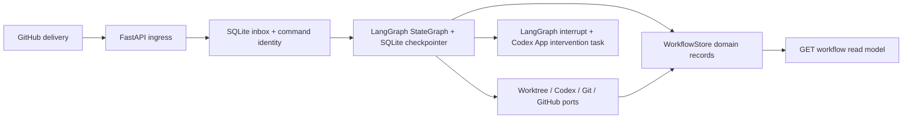

# LangGraph Pilot to Microsoft Agent Framework Mapping

Status: review draft

Source review date: 2026-09-05

Target: additional local pilot under `microsoft-agent-framework-work-package-pilot/`

## Purpose and reading rule

This document maps the executable LangGraph GitHub Issue Pilot to a separate .NET spike. It is a parallel-implementation and behavioral-reuse map, not a migration or line-by-line port plan. The existing pilot, Cloudflare relay, macOS operation, runtime data, worktrees, and ProBara CRM configuration remain unchanged and independently runnable. The additional target must preserve the applicable public contracts and direct read-back standard while introducing the distributed Work Package semantics in [`spec.md`](./spec.md).

The classification in the last column uses only the requested values:

- `reuse unchanged`: the existing artifact can be consumed as-is by the spike;
- `reuse contract/behavior only`: preserve the observable contract, fixture, or invariant but reimplement it;
- `replace with Agent Framework`: workflow graph/executor coordination becomes Agent Framework code;
- `replace with Durable Task`: durable scheduling, replay, waits, or recovery becomes Durable Task responsibility;
- `new WorkPackageControlPlane responsibility`: behavior does not belong to either framework and must be application/domain code;
- `defer/out of scope`: intentionally excluded from the local falsification slice.

Several rows have two classifications because a current module combines responsibilities that must be split in the target.

## Baseline architecture in one view

The critical observation is that LangGraph's checkpoint is not the only durable state. [`storage.py`](../../langgraph-github-issue-pilot/src/github_issue_pilot/storage.py) separately persists inbox identities, the issue run, phase records, review and repair identities, interventions, feedback, completion, and recovery events. The target therefore needs an explicit domain/event layer rather than treating either Agent Framework session state or Durable Task orchestration history as the `ImplementationRun` record.

## Source-to-target component map

| Existing element | Source and public seam | Retained behavior/contract | Proposed .NET destination | Classification |
| --- | --- | --- | --- | --- |
| LangGraph `StateGraph` | [`workflow.py`](../../langgraph-github-issue-pilot/src/github_issue_pilot/workflow.py), `WorkflowRuntime.__init__` | Typed phase graph; deterministic routing; agent work stays behind ports | `ImplementationRunWorkflow` built from typed Agent Framework executors; do not create an agent for deterministic work | `replace with Agent Framework` |
| Graph nodes | `project_claim`, `prepare_implementation`, `execute_worker`, `publish_draft_pr`, `review_draft_pr`, `repair_failed_review` in [`workflow.py`](../../langgraph-github-issue-pilot/src/github_issue_pilot/workflow.py) | Phase preconditions, bounded transitions, fail-closed outcomes | Thin Agent Framework executors calling application command handlers or Durable Task activities | `replace with Agent Framework`; `reuse contract/behavior only` |
| LangGraph SQLite checkpoints | `SqliteSaver` plus `thread_id = run_id` in [`workflow.py`](../../langgraph-github-issue-pilot/src/github_issue_pilot/workflow.py) | Restart resumes one run; completed work is not blindly repeated; checkpoint identity is readable | Durable Task orchestration instance keyed by `ImplementationRunId`; domain events remain separate | `replace with Durable Task`; `reuse contract/behavior only` |
| LangGraph `Command(resume=...)` | `reconcile_interventions` in [`workflow.py`](../../langgraph-github-issue-pilot/src/github_issue_pilot/workflow.py) | A persisted human answer resumes the exact pending operation once | Durable external event addressed to run plus pending request/attempt ID; application validates identity and fencing before raising it | `replace with Durable Task`; `new WorkPackageControlPlane responsibility` |
| LangGraph `interrupt(...)` | implementation, review, and repair paths in [`workflow.py`](../../langgraph-github-issue-pilot/src/github_issue_pilot/workflow.py), [`review.py`](../../langgraph-github-issue-pilot/src/github_issue_pilot/review.py), [`repair.py`](../../langgraph-github-issue-pilot/src/github_issue_pilot/repair.py) | Persist request before waiting; restore after restart; correlate phase, operation, role, worktree, PR, and head | Domain `HumanRequestOpened` event plus durable wait for a matching external event; never infer the target | `replace with Durable Task`; `reuse contract/behavior only` |
| SQLite transport inbox | `inbox_deliveries` and `WorkflowStore.accept` in [`storage.py`](../../langgraph-github-issue-pilot/src/github_issue_pilot/storage.py) | Persist-before-ack; delivery digest conflict detection; at-least-once delivery convergence | `ICommandInbox` backed by the spike database, with unique transport receipt and semantic command keys | `new WorkPackageControlPlane responsibility`; `reuse contract/behavior only` |
| Semantic command identities | `inbox_commands.command_key`; reconciliation commands in [`reconciliation.py`](../../langgraph-github-issue-pilot/src/github_issue_pilot/reconciliation.py) | Synthetic and delayed real deliveries for the same fact converge | Versioned command envelope with idempotency key and payload digest | `new WorkPackageControlPlane responsibility`; `reuse contract/behavior only` |
| Canonical issue run record | `issue_runs` and unique `(repository, issue_number)` in [`storage.py`](../../langgraph-github-issue-pilot/src/github_issue_pilot/storage.py) | One run per issue; one current writer per repository in the pilot | `ImplementationRun` aggregate and uniqueness constraint; repository serialization remains an MVP policy | `new WorkPackageControlPlane responsibility`; `reuse contract/behavior only` |
| Phase tables and read models | `implementation_executions`, `draft_pr_publications`, `review_*`, `repair_*`, `human_feedback_*`, `interventions`, `run_completions`, `recovery_events` in [`storage.py`](../../langgraph-github-issue-pilot/src/github_issue_pilot/storage.py) | Stable operation/attempt identities, bounded status codes, ordered attempts, restart read-back | Append-only `RunEvent` store plus transactional command model and rebuildable projections; use artifacts for large payloads | `new WorkPackageControlPlane responsibility`; `reuse contract/behavior only` |
| Startup recovery | `WorkflowRuntime.recover` and `_recover_run` in [`workflow.py`](../../langgraph-github-issue-pilot/src/github_issue_pilot/workflow.py) | Reuse completed effects and retry only missing operations | Durable Task reactivation drives orchestration; explicit effect reconciliation/adoption stays in application activities | `replace with Durable Task`; `new WorkPackageControlPlane responsibility` |
| Startup reconciliation | [`reconciliation.py`](../../langgraph-github-issue-pilot/src/github_issue_pilot/reconciliation.py), liveness tables, and `reconcile_current_state` | Missed ready/merge facts become ordinary idempotent commands; once-per-boot decision is observable | Keep as optional repository reconciliation service after the core spike; exercise the effect-adoption kernel in the spike | `reuse contract/behavior only`; `defer/out of scope` for the 24-hour macOS policy |
| Recovery audit | `recovery_events` and `GET` read-back | Bounded phase, operation key, outcome, timestamp; no sensitive payload | Domain events such as `ActivityRecovered`, `ExternalEffectAdopted`, `CommandRedelivered` | `new WorkPackageControlPlane responsibility`; `reuse contract/behavior only` |
| FastAPI webhook ingress | `POST /webhooks/github` in [`app.py`](../../langgraph-github-issue-pilot/src/github_issue_pilot/app.py) | Bounded body, signature before JSON, adapter allow-list, persist before `202`, duplicate `200`, conflict `409` | ASP.NET Core minimal API ingress; synthetic/local provider first, GitHub-compatible contract test retained | `reuse contract/behavior only`; `new WorkPackageControlPlane responsibility` |
| Workflow read-back | `GET /workflows/{owner}/{repository}/issues/{issue_number}` in [`app.py`](../../langgraph-github-issue-pilot/src/github_issue_pilot/app.py) | Direct public observation of run, activity results, head, reviews, intervention, and recovery | `GET /api/v1/runs/{runId}` plus issue lookup and `GET /events?after=`; projections sourced from domain events | `reuse contract/behavior only`; `new WorkPackageControlPlane responsibility` |
| Repository abstraction | `RepositoryAdapter` version `1` in [`github.py`](../../langgraph-github-issue-pilot/src/github_issue_pilot/github.py) | Repository-owned event/label vocabulary, backlog, issue state, PR/head reads, projections, draft PR upsert | Versioned `IRepositoryProviderV1`; add separate `IRepositoryAuthorizationV1` | `reuse contract/behavior only`; `new WorkPackageControlPlane responsibility` |
| GitHub HTTP transport | `GitHubHttpAdapter` in [`github.py`](../../langgraph-github-issue-pilot/src/github_issue_pilot/github.py) | Bounded provider reads/writes, current-head validation, idempotent draft PR lookup/update | `GitHubRepositoryProvider`; not required for the first synthetic slice, then tested with controlled HTTP transport | `reuse contract/behavior only`; initial live transport `defer/out of scope` |
| Repository-derived authorization | Not present as a team-capable port; current adapter recognizes one configured human | Provider remains the membership authority; read permits observation, write/contributor plus lease permits mutation | `IRepositoryAuthorizationV1` with fake identity/permissions in spike and provider adapters later | `new WorkPackageControlPlane responsibility` |
| Git worktree boundary | `WorktreePort` and `GitWorktreeAdapter` in [`implementation.py`](../../langgraph-github-issue-pilot/src/github_issue_pilot/implementation.py) | Run-owned branch; immutable fetched base SHA; deterministic path; adopt existing valid worktree after restart | `IWorktreeManagerV1` and self-hosted worker implementation invoking Git | `reuse contract/behavior only` |
| Source publication boundary | `SourceControlPort` and `GitSourceControl` in [`publication.py`](../../langgraph-github-issue-pilot/src/github_issue_pilot/publication.py) | Validate branch/worktree; redact/scan before commit; publish explicit branch; return exact head; no merge | `ISourcePublisherV1`; external-effect ledger wraps every commit/push/publication operation | `reuse contract/behavior only`; `new WorkPackageControlPlane responsibility` for effect adoption |
| Codex implementation worker | `WorkerPort`, `WorkerInvocation`, and `CodexCliWorker` in [`implementation.py`](../../langgraph-github-issue-pilot/src/github_issue_pilot/implementation.py) | Bounded assignment, worktree, policy, skills, sandbox, structured result, redacted observable JSONL diagnostics | Versioned `AgentSessionAdapterV1`; fake process first, bounded real Codex process second | `reuse contract/behavior only`; `new WorkPackageControlPlane responsibility` |
| External Codex process | `codex exec ... --output-schema --output-last-message --json -` in [`implementation.py`](../../langgraph-github-issue-pilot/src/github_issue_pilot/implementation.py) | Agent harness remains out-of-process; final schema result is authoritative; event stream is diagnostic | Self-hosted worker activity invokes adapter; Agent Framework coordinates it but does not replace it with a model-native agent | `reuse contract/behavior only` |
| Review workers | `ReviewWorkerPort`, `CodexCliReviewWorker`, and `ReviewCoordinator` in [`review.py`](../../langgraph-github-issue-pilot/src/github_issue_pilot/review.py) | Three fresh read-only invocations; immutable shared head; no peer verdicts; fail closed | Three fan-out activity attempts using fresh `AgentSessionAdapterV1` sessions; deterministic aggregation | `replace with Agent Framework`; `reuse contract/behavior only` |
| Repair worker and bounded loop | `WorkerPort.repair` and `ReviewRepairCoordinator` in [`repair.py`](../../langgraph-github-issue-pilot/src/github_issue_pilot/repair.py) | Same writer/worktree; max three numbered rounds; new head, deterministic check, all three reviews each round; structured handoff | Agent Framework loop/fan-out graph calling deterministic activities; round budget and transition rules in domain policy | `replace with Agent Framework`; `new WorkPackageControlPlane responsibility`; `reuse contract/behavior only` |
| Current intervention session adapter | `CodexAppServerInterventionSessions` in [`intervention.py`](../../langgraph-github-issue-pilot/src/github_issue_pilot/intervention.py) | Creates a separate read-only Codex App task, reads first later answer, archives it | Do not port the detached summary task unchanged. Operator API/Client exposes the actual run and offers targeted `Open in Codex`: same session when supported, otherwise an explicitly confirmed handoff fork with ancestry and returned Run-History events | `reuse contract/behavior only`; `new WorkPackageControlPlane responsibility` |
| Intervention request contract | [`intervention-request-v1.json`](../../langgraph-github-issue-pilot/src/github_issue_pilot/contracts/intervention-request-v1.json) | Stable repository/run/phase/operation/role/worktree/PR/head correlation plus problem/options/recommendation/preserved evidence | Consume as a baseline fixture; evolve to a versioned `HumanRequestV1` without losing fields | `reuse unchanged` for fixtures; `reuse contract/behavior only` for target model |
| Implementation assignment | [`implementation-assignment-v1.json`](../../langgraph-github-issue-pilot/src/github_issue_pilot/contracts/implementation-assignment-v1.json) | Issue, requirements, bounded repository context, evidence plan, findings | Validate the same JSON at `AgentSessionAdapterV1`; add an outer activity envelope rather than modifying silently | `reuse unchanged` |
| Worker result | [`worker-result-v3.json`](../../langgraph-github-issue-pilot/src/github_issue_pilot/contracts/worker-result-v3.json) | Completed/intervention outcome, red-green slices, changed files, verification, criterion evidence, findings | Validate unchanged in the first adapter spike; any successor is a new schema version | `reuse unchanged` |
| Review assignment/verdict | [`review-assignment-v1.json`](../../langgraph-github-issue-pilot/src/github_issue_pilot/contracts/review-assignment-v1.json), [`review-verdict-v2.json`](../../langgraph-github-issue-pilot/src/github_issue_pilot/contracts/review-verdict-v2.json) | Axis, invocation, immutable head, bounded context, verdict/findings/intervention | Reuse unchanged as fan-out/fan-in boundary fixtures | `reuse unchanged` |
| Repair assignment/result | [`repair-assignment-v1.json`](../../langgraph-github-issue-pilot/src/github_issue_pilot/contracts/repair-assignment-v1.json), [`repair-result-v2.json`](../../langgraph-github-issue-pilot/src/github_issue_pilot/contracts/repair-result-v2.json) | Round identity/limit, structured findings/prior attempts/decision policy, completion/block/escalation/intervention | Reuse unchanged for the first repair slice | `reuse unchanged` |
| Evidence qualification | `qualify_evidence` in [`evidence.py`](../../langgraph-github-issue-pilot/src/github_issue_pilot/evidence.py) | Exact criterion coverage; direct evidence phases by kind; reject operational surrogates; redact before rendering | Deterministic `IEvidenceQualifierV1`; port rules and cross-run golden fixtures | `reuse contract/behavior only`; `new WorkPackageControlPlane responsibility` |
| Redaction | `redact_text`, `redact_payload`, and outgoing diff scan | Configured secret plus recognizable token, authorization, credential, and email patterns are removed before persistence/display | Ingress/egress redaction pipeline before event/artifact writes; negative leak tests on API and files | `reuse contract/behavior only`; `new WorkPackageControlPlane responsibility` |
| Artifact handling | Inline evidence artifacts and PR body in [`evidence.py`](../../langgraph-github-issue-pilot/src/github_issue_pilot/evidence.py) | Evidence is immutable and head-correlated; large/binary data should not inflate workflow state | `IArtifactStoreV1`, local content-addressed filesystem for spike, checksum references in events | `new WorkPackageControlPlane responsibility` |
| Deterministic verification | `DeterministicVerifierPort` and `CommandDeterministicVerifier` in [`verification.py`](../../langgraph-github-issue-pilot/src/github_issue_pilot/verification.py) | Exact clean head before/after; bounded command; mutation fails; result is structured | Durable Task activity behind `IDeterministicVerifierV1`; no Agent Framework agent | `reuse contract/behavior only` |
| Three-axis qualification | `ReviewCoordinator._AXES` and `_project` in [`review.py`](../../langgraph-github-issue-pilot/src/github_issue_pilot/review.py) | Requirements always applicable; any fail blocks; current head re-read before qualification | Domain `HeadQualification` aggregate; Agent Framework performs fan-out/fan-in only | `replace with Agent Framework`; `new WorkPackageControlPlane responsibility` |
| New-head invalidation | publication/update plus review history and feedback paths | Every new writer head supersedes prior evidence/reviews and requires fresh deterministic verification and three reviews | Domain event `HeadObserved` invalidates current qualification transactionally | `reuse contract/behavior only`; `new WorkPackageControlPlane responsibility` |
| Human feedback | [`feedback.py`](../../langgraph-github-issue-pilot/src/github_issue_pilot/feedback.py) and webhook parsing in [`app.py`](../../langgraph-github-issue-pilot/src/github_issue_pilot/app.py) | Correlated human input creates a new bounded batch under the same run; old qualification is superseded | Operator command `RequestChanges`/`Resume` with authenticated identity, lease, CAS, and expected head | `reuse contract/behavior only`; `new WorkPackageControlPlane responsibility` |
| Control Lease, transfer, forced takeover, fencing | Required by spec/ADRs; absent from current pilot | Exactly one human lease for the run; connection-independent ownership; atomic request/approve or forced takeover; old commands fenced | Domain aggregate plus transactional compare-and-swap in application database; surfaced through Operator API | `new WorkPackageControlPlane responsibility` |
| `interrupt`/`queue` live command modes | Required by [`ADR 0001`](../../docs/adr/0001-live-control-commands-for-active-agent-runs.md); absent from current worker adapter | Address explicit activity attempt; interrupt current operation or queue stably; deliver exactly one next command | Durable command inbox, adapter cancellation token/process stop, per-attempt sequence, and dispatcher | `new WorkPackageControlPlane responsibility`; Durable Task supplies wake-up/recovery plumbing only |
| Operator Client | Required by [`ADR 0002`](../../docs/adr/0002-operator-clients-instead-of-human-agent-sessions.md); absent from current pilot | Stateless remote read/control, reconnect from acknowledged cursor, lease visibility | Separate CLI process using Operator API and server-sent event/stream endpoint | `new WorkPackageControlPlane responsibility` |
| Agent Evolution Loop | Required by ADRs 0004–0006; absent from pilot | Typed intervention/control/fork/retry/takeover signals; proposed repo changes never self-approved | Export projection only in MVP; proposal generation and provider-governed approval later | `defer/out of scope` for mutation; `new WorkPackageControlPlane responsibility` for event projection |
| macOS LaunchAgent and Cloudflare relay | `ops/macos`, relay package, and associated tests | Valuable current operational evidence but not the local .NET architecture hypothesis | No port in local spike; use explicit local processes and temporary resources | `defer/out of scope` |

## Canonical target ownership

| State | Canonical owner | Framework copy/projection | Recovery rule |
| --- | --- | --- | --- |
| `ImplementationRun`, activities, attempts, commands, leases, heads, approvals | Work Package domain event store and transactional command model | Agent Framework/Durable Task receive only identifiers and deterministic inputs | Rebuild projections from ordered domain events; reconcile execution history by IDs |
| Orchestration scheduling, durable waits, timers, activity completion | Durable Task orchestration history | Referenced from domain events by orchestration instance and task IDs | Replay must never itself emit an unguarded external effect |
| Agent-local conversation and observable Codex events | External Codex session through `AgentSessionAdapterV1` | Selected/redacted events copied to Run History; large outputs to Artifact Store | Resume/fork only through adapter using persisted session ID and ancestry |
| Git branch/worktree/commit/PR facts | Git and Repository Provider for external facts; domain event store for accepted observations | Head and effect receipts projected into run read model | Re-read by idempotency key and adopt matching effect before retry |
| Large logs, screenshots, diffs, binary evidence | Artifact Store | Immutable URI, checksum, media type, redaction status in Run History | Missing/corrupt artifact fails qualification; orchestration state stays small |
| Operator views | Rebuildable read projections | Client keeps only acknowledged cursor and short-lived auth session | Reconnect with `after=<cursor>`; server emits strictly greater positions |

Neither Agent Framework session history nor Durable Task orchestration history may be exposed as the canonical `ImplementationRun` history. Both are implementation evidence and recovery substrates that can be correlated and exported, not substitutes for the product's domain record.

## Contract and black-box test migration set

### Reuse unchanged as cross-language fixtures

- The six current input/output JSON Schemas named above. A .NET test should validate the same golden JSON accepted by the Python tests and reject the same mutations.
- Stable identity shapes: repository, issue, run, activity/operation, worktree, branch, PR, head, invocation, round, session.
- Evidence-kind fixtures and redaction samples from [`test_evidence_contract.py`](../../langgraph-github-issue-pilot/tests/test_evidence_contract.py).

### Re-express as language-neutral API/black-box tests

| Baseline tests | Behavior to retain | Target test seam |
| --- | --- | --- |
| [`test_workflow_interface.py`](../../langgraph-github-issue-pilot/tests/test_workflow_interface.py): `test_signed_allowed_delivery_is_durable_before_acceptance`, `test_repeated_delivery_keeps_the_same_run_checkpoint_and_claim`, `test_reused_delivery_id_with_different_body_is_rejected_without_effect` | Persist-before-ack and delivery/command idempotency | HTTP ingress plus `GET /api/v1/runs/{id}` |
| Same file: `test_real_process_exit_recovers_completed_effects_without_duplicates` | Crash after claim, worker effect, or publication produces one of each effect | Kill API/worker at named fault hooks; inspect public read model and fake-effect ledger |
| Same file: `test_real_process_exit_resumes_only_missing_review_axes`, `test_real_process_exit_reuses_persisted_repair_invocation` | Recovery runs only missing axes and does not duplicate a repair invocation | Kill worker between persisted axis/attempt boundaries; read events and invocation counts |
| Same file: `test_sufficient_evidence_publishes_one_commit_bound_draft_pr_through_http_seam` | Qualified evidence binds one draft PR to one exact head | API read-back plus controlled repository provider |
| Same file: `test_one_failed_axis_blocks_verification_after_three_independent_reviews_through_http_seam`, `test_all_applicable_axes_pass_and_project_verified_current_head_through_http_seam` | Three isolated axes, fail-closed aggregation, exact head | Public qualification projection and adapter-captured assignments |
| Same file: `test_multi_axis_review_failure_is_repaired_once_and_new_head_verifies_through_http_seam`, `test_review_failures_stop_after_exactly_three_repair_rounds_without_a_fourth_invocation` | Bounded repair, new head, deterministic verification and all reviews every round | Public attempt/event history and fake invocation ledger |
| Same file: `test_changed_head_blocks_projection_and_review_batch_survives_restart_without_new_effects` | Stale head cannot qualify | Concurrent head change followed by public rejection event |
| Same file: `test_sensitive_worker_evidence_and_diagnostics_are_redacted_before_read_back` | Secrets and personal data never persist or display | Scan API payloads, event-store rows, and artifact files for injected canaries |
| Same file: human-feedback and merge tests | Same run/worktree, fresh qualification per head, no autonomous merge | Authenticated Operator API and controlled repository provider |
| [`test_startup_reconciliation.py`](../../langgraph-github-issue-pilot/tests/test_startup_reconciliation.py) | Synthetic/real command convergence and bounded read-back | Later provider reconciliation slice; keep golden command-key tests now |
| [`test_worktree_adapter_contract.py`](../../langgraph-github-issue-pilot/tests/test_worktree_adapter_contract.py) | Immutable base, isolated branch, restart adoption | Temporary real Git repositories driven through `IWorktreeManagerV1` |
| [`test_source_publication_contract.py`](../../langgraph-github-issue-pilot/tests/test_source_publication_contract.py) | Exact branch/head publication and secret fail-closed behavior | Temporary Git plus fake remote |
| [`test_worker_adapter_contract.py`](../../langgraph-github-issue-pilot/tests/test_worker_adapter_contract.py) | CLI arguments, sandbox, JSON result authority, tolerant bounded diagnostics, failure codes | Fake executable process controlled by .NET tests |
| [`test_review_worker_adapter_contract.py`](../../langgraph-github-issue-pilot/tests/test_review_worker_adapter_contract.py) | Fresh read-only axis-specific sessions and identity validation | Three fake adapter sessions with captured prompts and session IDs |
| [`test_deterministic_verifier_contract.py`](../../langgraph-github-issue-pilot/tests/test_deterministic_verifier_contract.py) | Exact clean head and mutation rejection | Temporary Git and command process |
| [`test_intervention_persistence_contract.py`](../../langgraph-github-issue-pilot/tests/test_intervention_persistence_contract.py) | One pending request, first answer once, recover applying operation | Operator command/request API; replace Codex App delivery details |

### New tests with no current pilot equivalent

- Two authenticated clients read the same run; a read-only identity cannot claim or mutate.
- Lease claim, requested transfer, approval, forced takeover, revocation, stale fencing token, and simultaneous mutation races.
- Resume keeps `AgentSessionId`; Fork creates a new ID with `ParentSessionId`; Fresh Retry creates a new ID with no conversation import.
- Multiple `queue` commands retain accepted sequence through restart; `interrupt` stops the targeted process and exactly one next command is accepted.
- Event reconnect from an acknowledged cursor has neither gaps nor duplicates across activity/session types.
- A third identity approves only the currently qualified head; approval creates no merge, deployment, or release effect.
- Framework orchestration history, domain history, and artifact export can be correlated and independently restored.
- The installed source/package/config/contract tuple is visible and an incompatible tuple prevents issue start.
- A sequential successor cannot start until its recorded base equals the provider-authoritative merged predecessor head.
- Assignment readiness fails early when required dependencies, sandbox rights, or evidence surfaces are unavailable.
- A schema-valid but semantically incomplete evidence result is repaired through a bounded capture activity or becomes explicitly blocked without retaining the repository lock.
- A valid redacted `blocked` worker outcome remains readable when downstream parsing or qualification rejects it.
- Run age, attempt duration, process duration, heartbeat age, and host suspension are not conflated.
- A background monitor can notify about a qualified head but cannot perform interactive human approval, mark-ready, merge, deploy, or release actions.
- `Open in Codex` targets the selected activity attempt, opens the same session when safely supported, and otherwise requires explicit confirmation before creating a correlated handoff fork; write-capable interaction requires the Control Lease.

## Reimplementation warning list

1. The current pilot's `interrupt` is a wait/resume mechanism, not the new live `interrupt` delivery mode. Reusing the name must not obscure the different semantics.
2. Durable Task can retry an activity, but it cannot infer whether a Git/GitHub effect succeeded before its result was recorded. An application-owned effect identity, receipt, and reconciliation/adoption path are mandatory.
3. Agent Framework agents are not a substitute for the external Codex harness. The target workflow may use typed executors around the adapter; it must not silently move agent work to a framework-native chat agent.
4. Framework checkpoints and tracing are not the Run History. Product events need stable positions, redaction-before-write, identity correlation, export, and read projections.
5. The existing intervention adapter creates a separate human Codex task and therefore proves persistence, not the required shared Operator Client experience.
6. Existing Python tests often inspect controlled adapter call counts in addition to HTTP. The .NET spike should retain this as an external fake-effect ledger, not replace the direct public-interface assertion with internal mocks alone.

## Mapping conclusion

The pilot supplies substantial reusable behavior: contracts, fixtures, effect identities, head qualification rules, isolation policies, recovery boundaries, and public-interface tests. Almost no production Python implementation should be copied unchanged. Inside the additional .NET pilot, Agent Framework is a candidate for graph/executor composition and Durable Task for durable scheduling and waits; neither replaces the existing LangGraph application. The `ImplementationRun` history, command/effect idempotency, Agent Session semantics, Control Lease, authorization, redaction, artifacts, qualification, and Operator API remain explicit `WorkPackageControlPlane` responsibilities until the spike proves otherwise.
