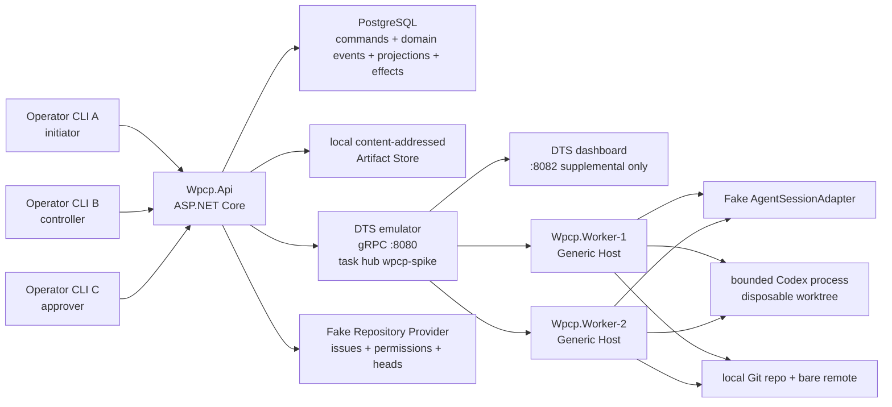

# Local Falsification Spike Plan: Microsoft Agent Framework for .NET

Status: executable plan; not implemented

Plan date: 2026-09-05

Canonical product specification: [`spec.md`](./spec.md)

Baseline map: [`langgraph-to-agent-framework-mapping.md`](./langgraph-to-agent-framework-mapping.md)

## 1. Decision this spike must enable

Determine whether one pinned Microsoft Agent Framework plus Durable Extension/Durable Task tuple can satisfy the hard behavior of the Distributed Codex Work Package Control Plane through a production-capable, self-hostable open-source path without mandatory additional framework or managed workflow-service licence fees.

The spike is successful only when the same public Operator API demonstrates recovery, human control, session identity, qualification, and redaction. Framework startup, dashboard visibility, health checks, logs, or a checkpoint alone are not acceptance evidence.

Recommended disposition before execution: **run the open-source backend gate first, then front-load the failure semantics**. Do not implement or migrate the production control plane.

The spike is an additional sibling implementation. It must not replace or modify the working LangGraph pilot, Cloudflare relay, macOS services, managed runtime database/worktrees, GitHub configuration, or ProBara CRM application. Temporal and paid managed workflow services are not candidates or fallbacks.

## 2. Evidence labels

- **Documented**: supported by current primary documentation or official source as of the plan date.
- **Inference**: proposed design that must be proved by this spike.
- **Spike result**: to be filled only by an executed test with an artifact and public read-back.
- **Unknown**: unresolved behavior with an executable test below.

No line in this plan is a claimed spike result.

## 3. Open-source backend Gate 0

Before any larger semantic slice, produce executable evidence for this question:

> Can the pinned Agent Framework Durable Extension run against a production-capable, self-hostable open-source Durable backend without a mandatory paid managed scheduler or framework licence?

Gate 0 setup and pass criteria:

1. Inventory the exact licences of Agent Framework, Durable Extension, Durable Task client/worker, backend provider, database, dashboard, and transitive runtime components.
2. Identify a production-capable self-managed backend; the in-memory DTS emulator is development-only and cannot qualify.
3. Compile and run one durable workflow through that backend with two replaceable worker processes.
4. Stop the first worker after checkpointed progress, continue on the second worker, and read the same orchestration through the public spike seam.
5. Record backend repository/version, support status, storage dependencies, process topology, and all unavoidable service charges.

**Pass:** an independently reproducible, self-hosted open-source production path exists for the pinned integration and requires no paid workflow service or framework licence.

**Fail:** only the managed Durable Task Scheduler or another paid service supplies production durability; the extension cannot use the identified open-source backend; or licence/dependency terms cannot be established. On failure, stop the Microsoft Durable candidate and leave LangGraph running while a different open-source option is evaluated separately.

## 4. Package and version assumptions

| Dependency | Planning baseline | Evidence date and source | Rule |
| --- | --- | --- | --- |
| .NET SDK | .NET 10 | 2026-09-05; [portable Durable Task quickstart](https://learn.microsoft.com/en-us/azure/azure-functions/durable/durable-task-scheduler/quickstart-portable-durable-task-sdks) currently requires .NET 10 for its C# sample | Record exact `dotnet --info`; do not install globally as part of this planning session |
| `Microsoft.Agents.AI.Workflows` | `1.16.0` for repository-aligned tuple; separately test stable `1.20.0` | 2026-09-05; [NuGet 1.20.0](https://www.nuget.org/packages/Microsoft.Agents.AI.Workflows/1.20.0) | No floating versions; do not assume stable Workflows is compatible with older Durable preview |
| `Microsoft.Agents.AI.DurableTask` | `1.16.0-preview.260730.1` | 2026-09-05; [NuGet package](https://www.nuget.org/packages/Microsoft.Agents.AI.DurableTask/1.16.0-preview.260730.1) | Treat as preview; central package management and lock file required |
| Durable Task client/worker | Start with extension-aligned `1.18.0`; separately test stable AzureManaged `1.25.0` | 2026-09-05; [extension pins](https://github.com/microsoft/agent-framework-durable-extension/blob/522e1d98afff58c251c4402578cb4d1187f91a84/dotnet/Directory.Packages.props#L139-L146), [client](https://www.nuget.org/packages/Microsoft.DurableTask.Client.AzureManaged/1.25.0), [worker](https://www.nuget.org/packages/Microsoft.DurableTask.Worker.AzureManaged/1.25.0) | Produce a compatibility table; only the fully tested resolved graph becomes baseline |
| DTS emulator | `mcr.microsoft.com/dts/dts-emulator`, pulled once then referenced by immutable image digest | 2026-09-05; [official local quickstart](https://learn.microsoft.com/en-us/azure/azure-functions/durable/durable-task-scheduler/quickstart-portable-durable-task-sdks) | Never leave `latest` in reproducible evidence; record digest after pull |
| Production OSS backend | Unresolved until Gate 0 | [Durable Task backend comparison](https://github.com/Azure/durabletask/blob/main/docs/getting-started/choosing-a-backend.md) | Do not assume that a Durable Task Framework storage provider is compatible with the MAF Durable Extension; prove the exact tuple |
| Durable endpoint/task hub | `Endpoint=http://localhost:8080;TaskHub=wpcp-spike;Authentication=None`; dashboard `http://localhost:8082` | 2026-09-05; [self-hosted Durable Extension](https://learn.microsoft.com/en-us/agent-framework/hosting/azure-functions#bring-your-own-compute--self-hosted-hosting) | Bind locally; no cloud resources |
| Domain/Event Store | Local PostgreSQL container, version pinned at execution time | Architecture inference | Needed to test process-independent unique constraints, CAS, sequence, and fencing; not a production choice |
| Artifact Store | Temporary content-addressed local directory | Architecture inference | Store only redacted content; checksum every object |
| Codex | Record exact installed runtime; fake executable first; real invocation only if local capability/sandbox checks pass | 2026-09-05; [non-interactive mode](https://learn.chatgpt.com/docs/non-interactive-mode), [app-server](https://learn.chatgpt.com/docs/app-server) | No irreversible remote effects; stable surfaces preferred; experimental capabilities negotiated and fail closed |

Two dependency tuples are compared, never mixed ad hoc:

1. **Aligned tuple:** Durable Extension `1.16.0-preview.260730.1`, Agent Framework/Workflows `1.16.0`, Durable Task dependencies as resolved from the extension's `1.18.0` baseline.
2. **Current tuple:** the same Durable Extension with Workflows `1.20.0` and AzureManaged Durable Task `1.25.0`, only if NuGet resolution and runtime tests permit it.

The published Durable graph runner currently has a reported 100-superstep incomplete-work risk. Add a regression that fails the run when unfinished work remains; never treat a normal return alone as success. [Runner source](https://github.com/microsoft/agent-framework-durable-extension/blob/522e1d98afff58c251c4402578cb4d1187f91a84/dotnet/src/Microsoft.Agents.AI.DurableTask/Workflows/DurableWorkflowRunner.cs#L173-L228), [issue 71](https://github.com/microsoft/agent-framework-durable-extension/issues/71)

## 5. Exact local topology



### Process responsibilities

| Component | Responsibility | Must survive independently? |
| --- | --- | --- |
| `Wpcp.Api` | Authenticated commands, authorization, lease/CAS, event reads/stream, projections, outbox to Durable Task | Yes; kill/restart without losing accepted state |
| `Wpcp.Worker` | Registers durable workflow/executors/activities, owns child processes while active, commits fenced results | Yes; use two instances to prove replacement |
| DTS emulator | Durable Task scheduling/history for local development | Keep alive for worker/API recovery tests; emulator restart is explicitly destructive backend loss |
| PostgreSQL | Canonical domain event/command/effect state | Keep alive during recovery tests; back up/restore separately |
| Artifact directory | Redacted large event/evidence payloads | Keep stable across API/worker restart; verify checksums |
| Fake provider | Synthetic issue, effective permissions for A/B/C/read-only identity, head/approval facts, external-effect counts | Persist in PostgreSQL or deterministic local fixture |
| Local Git | Disposable repository/worktree effects; no production remote | Keep across worker restart to test adoption |
| Fake/real Codex adapters | First deterministic session/process behavior, then bounded real capability proof | Session mappings persist in domain store, never only worker memory |

The official DTS emulator uses in-memory scheduler/entity state and is not production suitable. Worker/API recovery is valid only while it remains alive. A separate experiment may demonstrate that killing the emulator loses local state; that is evidence of the hosting limitation, not a product failure. [DTS emulator](https://learn.microsoft.com/en-us/azure/durable-task/durable-task-scheduler/durable-task-scheduler#emulator-for-local-development)

## 6. Planned solution structure

This names seams for the future spike; it does not authorize creating them now.

```text
microsoft-agent-framework-work-package-pilot/
  Directory.Packages.props
  packages.lock.json
  docker-compose.yml
  src/
    Wpcp.Domain/
    Wpcp.Application/
    Wpcp.AgentFramework/
    Wpcp.Api/
    Wpcp.Worker/
    Wpcp.Adapters.Codex/
    Wpcp.Adapters.Git/
    Wpcp.Adapters.Repository.Fake/
    Wpcp.Storage.Postgres/
    Wpcp.OperatorCli/
  tests/
    Wpcp.Contracts.Tests/
    Wpcp.Component.Tests/
    Wpcp.BlackBox.Tests/
  evidence/
```

This is a new top-level sibling of `langgraph-github-issue-pilot/`. It owns separate configuration, ports, process names, databases, artifact roots, worktrees, and temporary Git fixtures. Shared behavior is copied or referenced as versioned test fixtures; no pilot shares writable runtime state.

## 7. Vertical slices in dependency order

| Slice | Deliverable | Primary uncertainty retired |
| --- | --- | --- |
| Gate 0 — production OSS backend | Licence inventory, exact compatible backend tuple, two-worker recovery, cost/dependency record | Is there a viable self-hosted open-source production path at all? |
| V0 — reproducible bootstrap | Separate sibling directory, locked packages, emulator digest, Postgres/artifact temp resources, runtime/config/contract provenance, one client/worker orchestration, cleanup | Does a supported local tuple compile and run without touching LangGraph? |
| V1 — canonical run and public seam | Domain events/projection, authenticated fake identities, unique run start, cursor reads | Can framework histories remain subordinate to product history? |
| V2 — durable graph and fake session | Typed MAF graph, deterministic executors, fake `AgentSessionAdapter/v1`, two workers | Can external agents be clean activities without model-native MAF agents? |
| V3 — effect gap and restart | Effect ledger, operation IDs, Git/fake effects, crash hooks, adoption | Can at-least-once activities avoid duplicate business effects? |
| V4 — HITL and live control | Pending requests, Control Lease/epoch, transfer/takeover, `interrupt`, `queue`, stale checks | Can remote human commands be exactly-one accepted and correctly fenced? |
| V5 — sessions and real Codex | Fresh/Resume/Fork/Fresh Retry/read/interrupt plus targeted `Open in Codex` capability matrix | Is Codex controllable and handoff-capable behind a versioned adapter without unsafe private APIs? |
| V6 — qualification | Exact-head verification, three isolated reviewers, fan-out/fan-in, approval without merge | Does MAF help composition while domain code preserves qualification? |
| V7 — reconnect/redaction/export | >16 KiB events, disconnect/failure/reconnect, artifact canaries, export/restore | Is public history complete and safe independently of framework streaming? |
| V8 — upgrade and decision | Alternate package tuple replay/recovery, custom-code inventory, gate scorecard | Is preview/upgrade risk and total custom complexity acceptable for continued open-source development? |

Every slice includes the relevant ProBara regression: source/runtime drift, Codex schema-subset compatibility, provider-authoritative base SHA, prerequisites/sandbox preflight, lossless blocked-result capture, evidence repair, explicit terminal convergence, distinct time axes, and prohibition of automated human approval.

## 8. Twelve-step executable scenario

Each step is observed through public HTTP/Operator CLI seams plus a controlled external-effect ledger. Internal database inspection and the DTS dashboard are supplemental only.

### S1 — Authorized issue creates one durable run

- **Setup:** Start emulator, PostgreSQL, API, worker 1, and fake repository provider. Identity A has contributor permission. Seed synthetic issue `repo-1#41` as authorized. Record all versions/digests.
- **Action:** A submits `StartImplementationRun` twice with the same command ID, then once with the same ID and different digest.
- **Crash boundary:** Stop API after command/event transaction commits but before the first HTTP response; retry from the client.
- **Expected observable result:** One run ID, one `RunStarted`, duplicate classified idempotently, conflicting reuse rejected, one orchestration instance correlated to the run.
- **Public read-back seam:** `POST /api/v1/issues/repo-1/41/runs`; `GET /api/v1/runs/{runId}`; `GET /api/v1/runs/{runId}/events?after=0`.
- **Required evidence:** Redacted request/response/read-back, event positions, provider/effect count, process restart marker.
- **Pass/fail:** Pass only with one run and no duplicate side effect. Any acknowledged lost command or second run fails G02/G08.

### S2 — Fake Codex adapter exercises the external harness boundary

- **Setup:** Register `ImplementationRunWorkflow` with deterministic preparation executor and a regular executor/activity calling `FakeAgentSessionAdapter`.
- **Action:** Execute `StartFresh`; fake emits `session.started`, numbered messages/tool calls/results, and a schema-valid `worker-result-v3`.
- **Crash boundary:** Kill worker 1 after the session ID is observed and before activity result completion; worker 2 continues.
- **Expected observable result:** Codex remains an external adapter, one stable session mapping is adopted, events are redacted/persisted, completed deterministic executors do not rerun.
- **Public read-back seam:** run detail, activity attempt detail, and event stream.
- **Required evidence:** Captured adapter contract/arguments, session ID, MAF/Durable correlation IDs, fake invocation/effect counts.
- **Pass/fail:** Fail if the graph requires a model-native MAF agent, loses attempt identity, or starts a second session without an explicit retry decision.

### S3 — Controlled external effect and effect/result gap

- **Setup:** Fake adapter activity owns operation `run/activity/attempt/effect-1`; external effect ledger can commit an effect then block.
- **Action:** Commit effect `E1`, then trigger the block before returning activity success.
- **Crash boundary:** Kill worker at “effect committed, activity result not recorded”; restart worker 2. Repeat with a local Git file/commit effect.
- **Expected observable result:** Activity may be redelivered, but reconciliation finds and adopts `E1`; effect count remains one; events show `EffectObserved` and `EffectAdopted`.
- **Public read-back seam:** run events and effect projection; local Git public read-back for exact commit/marker.
- **Required evidence:** Fault-hook ID, pre/post API reads, effect ledger count, Git log/head, Durable activity attempt evidence.
- **Pass/fail:** Any duplicate, ambiguous silent continuation, or unadoptable effect fails the architecture preference.

### S4 — Recovery at deliberate host/worker boundaries

- **Setup:** Parameterize hooks before activity schedule, after schedule/before start, after session start, after effect, after result append, after orchestration completion, and while waiting for human input.
- **Action:** Run the same scenario once for each hook, killing API, active worker, or both; keep emulator/PostgreSQL alive and start a different worker process.
- **Crash boundary:** The named hook for each matrix row.
- **Expected observable result:** One run, stable activity/attempt/effect IDs, completed work reused, only missing work continued, no event gap/duplicate.
- **Public read-back seam:** run projection/events after every restart.
- **Required evidence:** One manifest per hook with process IDs, timestamps, event range, adapter/effect counts, final state.
- **Pass/fail:** All mandatory matrix rows pass; a single uncontrolled duplicate or missing accepted command is a stop trigger.

### S5 — Second identity reads from another client process

- **Setup:** Identity B has contributor access but no lease; read-only identity R has repository read access. Start two separate Operator CLI processes with independently signed test credentials.
- **Action:** B and R open the same run and filter the failed attempt/session.
- **Crash boundary:** Restart API between initial list and detail read.
- **Expected observable result:** Both see the same redacted run, history, head, tool events, artifacts, and failure. R cannot claim/mutate; B remains read-only until lease acquisition.
- **Public read-back seam:** Operator CLI over authenticated REST/event endpoint.
- **Required evidence:** Two client transcripts with matching run/event IDs and explicit authorization rejections.
- **Pass/fail:** Fail if clients depend on the original process/worktree or if identity is trusted from an unsafely caller-supplied field.

### S6 — Resume, Fork, Fresh Retry, and Open in Codex

- **Setup:** Seed three identical waiting attempts from the fake adapter; persist session `S0` and history hash. Later repeat with bounded real Codex when safe.
- **Action:** B selects Resume for case 1, Fork for case 2, and Fresh Retry for case 3. From the failed attempt, B also selects `Open in Codex` once with a directly displayable session and once with a session that requires an explicit handoff fork.
- **Crash boundary:** Restart API/worker after decision acceptance but before adapter call, and after adapter returns identity but before attempt completion.
- **Expected observable result:** Resume uses `S0`; Fork creates `S1` with parent `S0`; Fresh Retry creates `S2` with no conversation import. `Open in Codex` opens the same session where supported; otherwise it discloses the limitation and creates no handoff fork until B confirms. The confirmed fork has explicit ancestry and its observable interaction returns to the same Run History. Old events remain immutable and each decision applies once.
- **Public read-back seam:** attempt/session ancestry projection and event stream.
- **Required evidence:** Adapter calls, returned IDs, context manifest/hash, ancestry graph, Codex-open target, confirmation boundary, returned events, and duplicate-decision rejection.
- **Pass/fail:** Session mismatch, implicit transcript copy, silent handoff fork, uncorrelated Codex interaction, mutation without the Control Lease, duplicate continuation, or inability to represent fork is a failure; experimental-only real Codex support is recorded as a product risk, not hidden.

### S7 — Targeted `interrupt` and ordered `queue`

- **Setup:** Run a long fake process under attempt `A1`; optionally run a second eligible attempt to force explicit selection. B owns the lease.
- **Action:** Queue `Q1` and `Q2`; in a separate run send `interrupt I1` during the active operation. Send duplicates and an untargeted command while two attempts are active.
- **Crash boundary:** Kill API after command acceptance/before Durable event; kill worker after interrupt acknowledgment/before process exit is recorded.
- **Expected observable result:** Queue order is `Q1,Q2`; active work completes before Q1. Interrupt stops/fences only A1, reconciles effects, and makes I1 exactly the next accepted command. Duplicate/untargeted/stale commands are visible rejections.
- **Public read-back seam:** command status and ordered run events; process ownership projection.
- **Required evidence:** Command IDs/sequences, OS child PID lifecycle, fence epoch, post-restart adapter calls, event order from two clients.
- **Pass/fail:** Fail if the child continues mutating after fence, a command is lost/duplicated/reordered, or target is inferred ambiguously.

### S8 — Control Lease, transfer, Forced Takeover, stale head, and fencing

- **Setup:** A, B, and C have contributor rights; R is read-only. Lease begins with A at epoch 1. Prepare simultaneous requests from separate processes.
- **Action:** B requests transfer; verify no rights before A approves; approve atomically to epoch 2. Then C performs Forced Takeover to epoch 3 without administrator role. Submit A/B stale commands and a command using an old Head-SHA. Revoke C's provider write permission.
- **Crash boundary:** Kill API immediately after each lease transaction commit and before response; repeat concurrent takeovers against the same expected epoch.
- **Expected observable result:** Exactly one owner/epoch at every position; no overlap; old tokens/requests fenced; Forced Takeover changes no workflow/session/head by itself; revoked C cannot mutate.
- **Public read-back seam:** lease projection, command responses, run events.
- **Required evidence:** Concurrent request/response set, event sequence, old/new holder, epochs, authorization snapshots, zero unintended effects.
- **Pass/fail:** More than one successful mutation for one expected epoch, missing audit, admin dependency, or stale-head acceptance is an immediate no-go.

### S9 — Deterministic verification and three isolated reviewers

- **Setup:** Produce Head `H1` in local Git. Configure exact clean-head verification and three fake reviewer sessions; each captures its assignment/context. Then produce `H2` during one variant.
- **Action:** Run deterministic verification, fan out requirements/code/architecture reviews, and fan in verdicts. Force one failed axis and one head-change case, then repair to `H3` and rerun all checks.
- **Crash boundary:** Kill workers after each axis result and after verifier result; restart with another worker.
- **Expected observable result:** All reviewers are fresh, read-only, peer-blind, and bound to the same head; only missing axes rerun after crash; any fail/stale head blocks; H3 invalidates all H1 evidence and receives new verification/reviews.
- **Public read-back seam:** head qualification and ordered activity attempts.
- **Required evidence:** Three assignments/session IDs/context hashes, exact Git head, verification result, verdicts, invocation counts, invalidation events.
- **Pass/fail:** Any cross-review context, mixed head, reused old qualification, omitted axis, or agent-performed deterministic check fails.

### S10 — Third identity approves without merge

- **Setup:** H3 is qualified; C is authenticated contributor and owns or validly receives the lease. Fake repository provider counts approve, merge, deploy, and release effects separately.
- **Action:** C approves H3; retry the approval; attempt approval with stale H1 and from R.
- **Crash boundary:** Restart API after approval event commits but before response.
- **Expected observable result:** One approval by C on H3; duplicate is idempotent; stale/read-only attempts rejected; merge/deploy/release counts remain zero.
- **Public read-back seam:** approval projection and event stream plus fake provider read-back.
- **Required evidence:** Actor identity, head, lease epoch, event ID, rejection reasons, zero forbidden effects.
- **Pass/fail:** Any implicit merge/deploy/release or approval of unqualified/stale head is an immediate no-go.

### S11 — Reconnect from acknowledged event cursor

- **Setup:** Emit more than 16 KiB and at least 10,000 numbered redacted domain events across fake session and deterministic activities. Client acknowledges cursor N.
- **Action:** Disconnect client, continue activity, restart API/worker, reconnect with `after=N`, then intentionally fail/cancel the workflow before successful completion.
- **Crash boundary:** API/worker restart while disconnected and before terminal workflow output.
- **Expected observable result:** Client receives exactly events N+1 through final sequence once, in order. A fresh second client observes the same sequence. No reliance on MAF live custom-status completion backfill.
- **Public read-back seam:** paged `GET /events?after=` and live SSE endpoint.
- **Required evidence:** Event ID/sequence checksums from both clients, final failed/canceled state, comparison with supplemental Durable history.
- **Pass/fail:** Gap, duplicate, reorder, cursor reset, or dependence on successful terminal output fails the Microsoft candidate and retains LangGraph as the working baseline.

### S12 — Redaction before persistence and display

- **Setup:** Inject unique canaries for configured secret, GitHub-like token, authorization header, credential field, email address, and personal name into fake tool output, exception, artifact, command, and Codex JSONL.
- **Action:** Execute, fail, export, reconnect, and retrieve every accessible artifact as A/B/R.
- **Crash boundary:** Kill worker after raw output receipt but before event/artifact commit; restart and reconcile.
- **Expected observable result:** Raw canaries exist only in transient controlled input, never in PostgreSQL values, artifact bytes, Operator payloads, exported history, or operator logs. Redaction marker/policy version is visible.
- **Public read-back seam:** run/events/artifacts/export plus bounded local storage scan as supplemental negative proof.
- **Required evidence:** Canary inventory, API and artifact reads, storage scan result, redaction event metadata.
- **Pass/fail:** One persisted/displayed canary is an immediate no-go. Dropping the entire failure without a visible redaction/unavailable marker also fails audit completeness.

## 9. Fault-injection matrix

| ID | Boundary | Kill/retry action | Expected invariant | Primary gate |
| --- | --- | --- | --- | --- |
| F01 | Domain command committed, HTTP response not sent | Kill API, resend same command ID | One accepted command/run | G02, G08 |
| F02 | Outbox row committed, Durable event not sent | Kill API/outbox worker | Event eventually sent; domain command not duplicated | G08 |
| F03 | Durable activity scheduled, no worker start | Kill worker 1, start worker 2 | Same attempt identity starts once logically | G02 |
| F04 | Codex/fake session started, mapping not committed | Kill worker | Reconcile/adopt exact session or fail closed; never silently create second | G03, G08 |
| F05 | External file/Git/provider effect committed, activity result absent | Kill worker | Adopt exactly one effect | G08 |
| F06 | Activity result/domain event committed, orchestration completion absent | Kill worker | Reuse result; no repeated activity | G02, G08 |
| F07 | Human request committed before Durable wait | Kill API/worker | Request remains public and response can resume exact attempt | G06, G07 |
| F08 | Command accepted before external event delivery | Kill API | Command delivered once logically after restart | G06, G08 |
| F09 | Duplicate/out-of-order external event | Redeliver event IDs in reverse order | Inbox dedupes; domain sequence controls consumption | G06, G09 |
| F10 | Interrupt accepted, child still running | Kill worker during stop | New worker discovers ownership/fence state; late output rejected | G06, G08 |
| F11 | Queue command persisted, current operation completes | Kill API/worker before dequeue | Stable queue order survives; one next command | G06, G15 |
| F12 | Lease transfer/takeover commit before response | Kill API and retry concurrently | One owner/epoch; idempotent response | G09, G10 |
| F13 | Old controller request races new epoch | Submit simultaneously | Old command rejected; no effect | G09, G10 |
| F14 | Head changes after review start | Update local provider head | Qualification rejects stale batch | G14 |
| F15 | One of three reviewer results committed | Kill worker | Only missing axes execute | G02, G14 |
| F16 | Approval committed before response | Kill API/retry | One approval; no merge | G17 |
| F17 | Client disconnect after cursor N | Produce >16 KiB events, restart, fail run | N+1..final once and ordered | G15, G18 |
| F18 | Raw sensitive output received before persistence | Kill/restart during transform | No raw canary in any durable/displayed surface | G13 |
| F19 | Upgrade package tuple with saved in-flight fixtures | Restart under alternate tuple | Compatible recovery or explicit migration failure; never silent drift | G02, G18 |
| F20 | 100-superstep boundary | Run bounded graph past limit | Unfinished work is explicit failure, never normal success | G02, G18 |

## 10. Evidence matrix against Make-or-Buy gates

The gate IDs refer to [`make-or-buy-entscheidungsvorlage.md`](./make-or-buy-entscheidungsvorlage.md). Documentation can justify a spike; only the artifacts below can pass a gate.

| Gate | Spike evidence | Public seam | Pass threshold |
| --- | --- | --- | --- |
| G01 Codex retained | S2 fake boundary and S6 bounded real Codex capability report | Activity/session projection | External Codex invoked through versioned adapter; no framework-native replacement |
| G02 durable run | S1/S4/F01–F06 | Run read-back after process replacement | Same run/attempt state, only missing work continues |
| G03 session operations | S6/F04 | Session identity/ancestry API | Start/read/resume/fork/stop stable or explicit capability no-go |
| G04 common history | S2/S5/S11 | Run events across sessions/activities | One ordered correlated history without shared model context |
| G05 observable execution | S2/S9/S12 | Event and artifact APIs | Messages/tools/results/errors/diffs/tests/artifacts visible and redacted |
| G06 live control | S7/F07–F11 | Command and event APIs | Targeted interrupt and ordered queue exactly once logically |
| G07 continuation semantics | S6 | Attempt/session projection | Resume same ID; Fork new ID+parent; Fresh Retry new ID/no transcript |
| G08 external effects | S3/S4/F01–F11 | Effect projection plus external read-back | Zero duplicate controlled effects |
| G09 lease/fencing | S8/F12–F13 | Lease/command API | One current epoch; all stale mutations rejected |
| G10 transfer/takeover | S8 | Lease event history | Atomic transfer and Forced Takeover with three users, no admin |
| G11 repository authorization | S1/S5/S8 | Authenticated API | No shadow ACL; fake provider permissions are sole membership input |
| G12 revocation | S8 | Mutation response plus events | Revoked holder cannot mutate on next sensitive action |
| G13 redaction | S12/F18 | Every read/export/artifact plus storage scan | Zero raw canaries |
| G14 isolated reviews | S9/F14–F15 | Qualification projection | Three fresh peer-blind sessions on exact head; all required |
| G15 reconnect | S11/F17 | Cursor/SSE | Zero gaps, duplicates, or reorder after restart/failure |
| G16 identity separation | S5/S8/S10 | Audit event payloads | Human A/B/C/R and worker/service identities remain distinct |
| G17 forbidden autonomy | S10 plus policy tests | Approval and fake provider read-back | No merge/release/deploy/self-approval effect |
| G18 export/exit | S11 plus V8 | Export and restore into fresh projection | Ordered history/artifacts/correlations restore independent of framework internals |

## 11. Direct Agent Framework hypothesis tests

| Question | Documented position | Executable answer |
| --- | --- | --- |
| Which LangGraph responsibilities are covered by MAF? | Graph builder, typed executors/edges, fan-out/fan-in, events, state, checkpoints, request ports are documented. [Workflow concepts](https://learn.microsoft.com/en-us/agent-framework/concepts/workflows/) | V2 and V6 reconstruct the typed graph and verify routing/parallel review behavior |
| Which durability exists only with Durable Extension/Task? | Cross-process distributed recovery, durable activities/events/timers and durable graph execution require Durable Task infrastructure. [Durable Extension](https://learn.microsoft.com/en-us/agent-framework/hosting/azure-functions#durable-agent-framework-workflows) | V0/V3/V4 kill and replace workers while preserving orchestration instance |
| Exact local hosting topology? | Self-hosted Generic Host worker and client connect to DTS; client may be separate. [Self-hosted hosting](https://learn.microsoft.com/en-us/agent-framework/hosting/azure-functions#bring-your-own-compute--self-hosted-hosting) | V0 records processes, task hub, endpoints, versions, and two-worker handoff |
| Can external Codex remain external? | Official extension source dispatches regular workflow executors as Durable activities. [Dispatcher](https://github.com/microsoft/agent-framework-durable-extension/blob/522e1d98afff58c251c4402578cb4d1187f91a84/dotnet/src/Microsoft.Agents.AI.DurableTask/Workflows/DurableExecutorDispatcher.cs#L68-L89) | V2 fake and V5 real adapters use the same port without creating an MAF chat agent |
| What events are emitted/persisted/replayed/exportable? | MAF emits workflow/executor/request events; Durable Task persists orchestration history. Neither is the required acknowledged product event log. [MAF events](https://learn.microsoft.com/en-us/agent-framework/concepts/workflows/events) | V7 compares MAF/Durable evidence with independently restored domain history |
| How are pending human requests restored? | MAF checkpoints include pending requests; durable request ports use external-event waits. [MAF HITL](https://learn.microsoft.com/en-us/agent-framework/workflows/human-in-the-loop#checkpoints-and-requests) | S7/F07–F09 restore and answer the exact request under lease/head/attempt fencing |
| Effect succeeds before result record? | Activities are at-least-once and can rerun. [Programming model](https://learn.microsoft.com/en-us/azure/durable-task/common/programming-model-overview#activities) | S3/F05 must adopt via application effect ledger or stop |
| Can running work be canceled/interrupted with one next command? | Client suspend/resume/terminate exists; prompt child-process kill and exactly-one next command are not documented | S7/F10–F11 proves application process ownership and queue protocol |
| Can a background attempt be opened in Codex? | Headless session persistence does not by itself prove discoverability or safe interactive handoff in the Codex app. | V5/S6 proves same-session open where supported and explicit confirmed handoff-fork semantics otherwise |
| What remains custom? | API/auth, canonical history, lease/fencing, effects, redaction/artifacts, repository adapters, Codex adapter, qualification and projections | Track source and operational complexity per slice; stop if the candidate recreates an unsafe durable core |
| What is prerelease? | Durable Extension package is preview; base Workflows is stable but newer. | V0/V8 lock and test both tuples; saved-history and superstep tests are mandatory |
| Is the production path licence-cost-free and open source? | The DTS emulator is in-memory and not production suitable; DTFx lists self-managed backends, but compatibility with this Durable Extension is not established. | Gate 0 proves the exact integration and licence graph before V0 |

## 12. Effort estimate by slice

These are ranges for planning the later spike, not a commitment or a false single-number estimate. They assume one engineer familiar with .NET and the existing pilot, with architecture review available.

| Slice | Engineering range | Review/evidence range | Main variance |
| --- | ---: | ---: | --- |
| Gate 0 open-source backend | 1–3 days | 1 day | Backend compatibility, licences, production support boundary |
| V0 bootstrap and package proof | 1–2 days | 0.5 day | Preview dependency resolution, emulator compatibility |
| V1 canonical run/API/event cursor | 2–4 days | 1 day | Event/outbox model and PostgreSQL concurrency |
| V2 MAF graph + fake adapter + two workers | 2–4 days | 1 day | Durable graph API maturity and serialization |
| V3 effect ledger/crash adoption | 3–5 days | 1–2 days | External-effect ambiguity and fault-hook determinism |
| V4 HITL, lease, takeover, interrupt/queue | 4–7 days | 2 days | Cancellation ownership and concurrency races |
| V5 bounded real Codex adapter | 2–5 days | 1–2 days | Stable versus experimental capabilities, session adoption |
| V6 qualification and three reviews | 3–5 days | 1–2 days | Reuse of JSON fixtures and exact-head invalidation |
| V7 reconnect, redaction, artifacts, export | 3–5 days | 2 days | Stream backpressure and negative leak proof |
| V8 upgrade/replay and decision record | 2–4 days | 2 days | Alternate tuple compatibility and long-term open-source operability |

Run decision checkpoints after V0, V3, V4, V5, and V7. Stop immediately on a hard trigger rather than spending the upper bound on later slices.

## 13. Stop/go criteria

### Continue to the next slice when

- the current slice has direct public read-back evidence;
- all expected identities and effect counts are stable after its required crash cases;
- unresolved behavior is either in a later named test or is explicitly non-blocking;
- custom code remains in the documented domain/adapter responsibilities rather than recreating durable scheduling/history.

### Stop the Microsoft candidate and retain LangGraph when any hard trigger fires

1. A crash after Git/GitHub/Codex success but before activity completion can duplicate an irreversible effect and deterministic reconciliation/adoption cannot prevent it.
2. Failed, canceled, or long-running work cannot feed the public Event Store with gap-free, duplicate-free ordered events from an acknowledged cursor without relying on terminal output/internal polling.
3. Duplicate or reordered external events can accept more than one command, approval, transfer, takeover, or queued successor despite domain deduplication and fencing.
4. `interrupt`, Cancel, suspend, or terminate cannot stop or fence the targeted external Codex process, or a replacement worker cannot safely decide adopt/kill/retry.
5. Pending human requests are lost, cannot be rediscovered by a fresh client, or can accept an answer for the wrong attempt/head/lease epoch.
6. Gate 0 cannot prove a production-capable wholly self-hosted open-source backend compatible with the extension without a paid managed workflow service.
7. The pinned preview tuple cannot compile/run, silently reports unfinished graph work as success, or cannot recover saved in-flight fixtures across an acceptable upgrade.
8. Closing MAF/Durable gaps requires inventing a custom scheduler, replay/history engine, command protocol, or cancellation system whose correctness cannot be bounded and proved in the spike.
9. Required Codex Resume/Fork/Read/Interrupt semantics remain on an experimental surface that cannot be pinned, capability-negotiated, observed, and made fail closed to the accepted risk level.

### Revise scope instead of stopping only when

- the missing behavior is explicitly outside MVP and does not change visibility, control rights, autonomy, privacy, qualification, or irreversible effects;
- a real Codex capability is unavailable but the deterministic fake still proves the framework boundary, and Daniel explicitly chooses a later adapter investigation before production; or
- a managed production backend is merely an open cost/hosting option, not already disallowed by the intended data boundary.

### Final go threshold

All G01–G18 gates must be either passed by spike evidence or assigned to a clearly bounded later provider/production test that does not weaken MVP semantics. G03, G06–G10, G13–G15, G17, and the export portion of G18 cannot be deferred.

## 14. Evidence artifact format

Each executed case writes a small manifest outside source commits and links it from the test report:

```json
{
  "schema_version": "1",
  "case_id": "F05",
  "package_lock_sha256": "...",
  "emulator_image_digest": "sha256:...",
  "run_id": "...",
  "activity_attempt_id": "...",
  "fault_hook": "effect_committed_before_activity_result",
  "event_range": {"first": 1, "last": 42, "sha256": "..."},
  "external_effect_counts": {"effect-1": 1},
  "public_readback_artifacts": ["..."],
  "redaction_policy_version": "1",
  "verdict": "pass|fail",
  "rationale": "..."
}
```

Evidence must include action, response, and decisive business read-back. Logs and DTS dashboard screenshots are supplemental and must be correlated to the same run/attempt/effect IDs.

## 15. Cleanup and rollback

The later executable spike must use an explicit per-run temporary root and named local containers. Cleanup is recoverable until evidence has been reviewed.

1. Stop Operator CLI, API, and worker processes gracefully; record final public exports and package/runtime versions.
2. Export Run History, projections, effect ledger, artifact manifest/checksums, and the Durable orchestration correlation manifest into the spike evidence folder.
3. Stop the named DTS emulator and PostgreSQL containers. Do not remove them until export checksums and restore verification pass.
4. Restore the domain export into a fresh temporary PostgreSQL instance and verify the same event/projection checksums through the public API.
5. Remove only containers and volumes carrying the exact spike label/project name; never use broad recursive Docker cleanup.
6. Remove only the explicitly recorded disposable worktrees, local bare remote, temporary artifact root, and fake Codex executables. Preserve evidence manifests and review notes.
7. Do not delete or modify the existing LangGraph pilot database, worktrees, GitHub configuration, Cloudflare relay, macOS services, or production secrets.
8. If the candidate fails, retain the failing minimal fixture and public evidence for a separately approved open-source architecture evaluation; delete no evidence needed for the decision record.

Rollback is architectural: because no production migration occurs, stopping the spike means shutting down its local processes and leaving the existing LangGraph pilot unchanged.

## 16. Final recommendation

Proceed only after Gate 0 passes. Then begin with V0–V4 and require runtime provenance, authoritative base, prerequisite readiness, lossless failure capture, evidence recovery, external-effect, cursor, HITL, lease/fencing, and cancellation proofs before the real Codex and full qualification slices. This is the smallest sequence that can falsify the Microsoft preference early.

Do not treat the framework dashboard, a successful graph run, or a recovered checkpoint as sufficient. The candidate wins only when the application-owned public history proves every critical semantic with an acceptable amount of custom code on the proven open-source backend. Otherwise stop the Microsoft candidate, keep the existing LangGraph pilot unchanged, and evaluate another open-source approach only through a separate decision.
