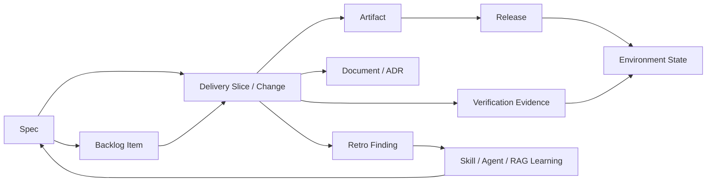
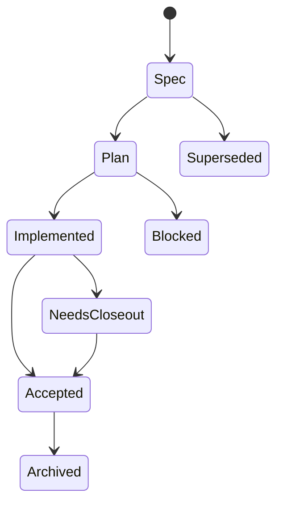
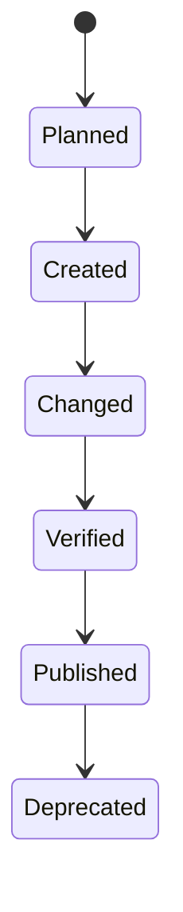
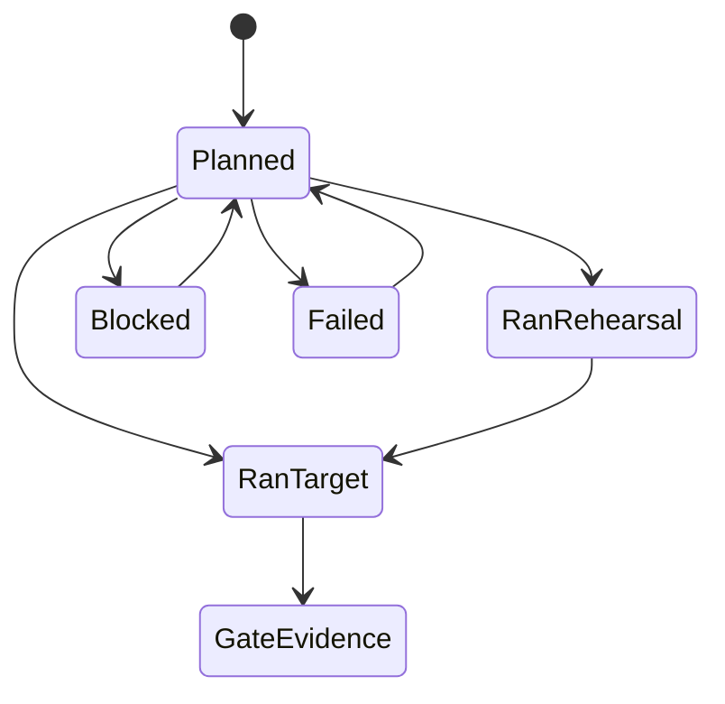
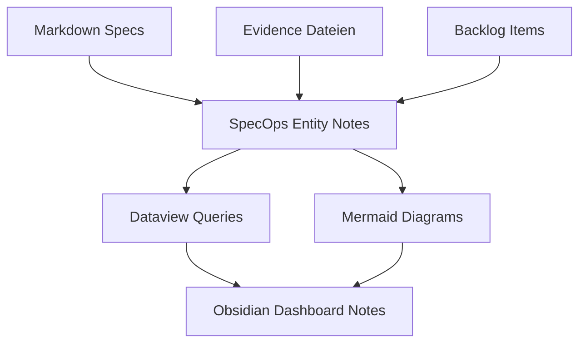
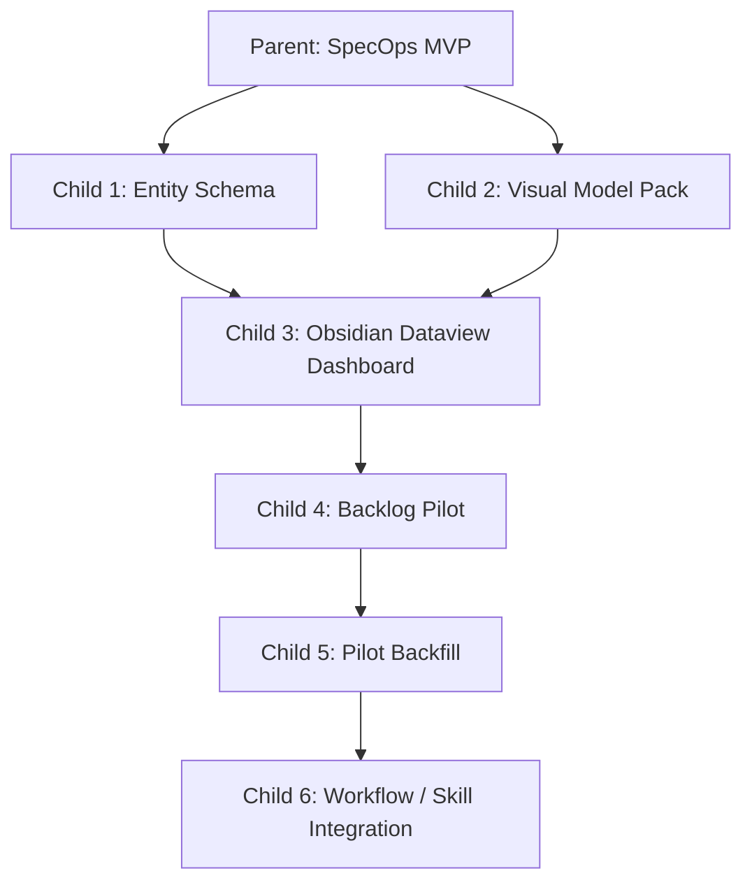

**Date:** 2026-05-04
**Status:** 🟡 Spec
**Scope:** Local-first SpecOps MVP fuer visuelle Spec-, Artefakt-, Release-, Environment- und Learning-Steuerung im DanielsVault mit Obsidian Dataview und Mermaid

---

## Kontext

Die bestehende Spec-Landschaft ist fachlich wertvoll, aber operativ schwer zu ueberblicken. Status, Projektbezug, Zielumgebung, Artefakte, Releases und Learnings liegen verteilt in Specs, Plans, OpenSpec-Artefakten, Evidence-Dateien, Skills und `docs/doc-workflow.md`.

Der vorhandene Workflow definiert bereits wichtige Gates und Status:

1. `🟡 Spec`
2. `🟠 Plan`
3. `🔵 Implemented`
4. `🟢 Accepted`

Diese Status reichen fuer einzelne Specs, aber nicht fuer die eigentliche Steuerungsfrage:

> Welche Specs fuehrten zu welchen Artefakten, auf welchem Environment stehen diese Artefakte, in welchem Release sind sie enthalten, und welche Skill-/Agent-Learnings ergeben sich daraus?

## Zielbild

Der MVP fuehrt eine lokale SpecOps-Control-Plane ein, die bestehende Markdown-Specs nicht ersetzt, sondern visuell und strukturiert auswertbar macht.

Die erste Version bleibt bewusst local-first:

1. Metadaten werden als Markdown-Entity-Notizen mit YAML-Frontmatter im Vault gepflegt.
2. Obsidian Dataview erzeugt Tabellen, Boards und Statuslisten.
3. Mermaid erzeugt Architektur-, Ablauf- und Relationship-Diagramme.
4. Bestehende Specs, Plans, Evidence und OpenSpec-Artefakte bleiben die narrativen Quellen.
5. Ein leichtgewichtiges SpecOps-Backlog verhindert, dass Folgethemen nach Accepted-Status unsichtbar werden.
6. Die Entity-Registry wird spaeter zur Grundlage fuer Skills, Custom Agents, RAG-Evals und ggf. ein Backstage- oder OpenProject-Frontend.

## Non-Goals

1. Kein neues Jira, OpenProject oder Backstage im MVP.
2. Kein automatisches Deployment- oder Release-Management im MVP.
3. Keine Migration aller historischen Specs in einem Schritt.
4. Keine Aenderung an `docs/doc-workflow.md` ohne spaetere dedizierte Child-Spec.
5. Keine Veraenderung der bestehenden Skill-Implementierungen im ersten Slice.
6. Kein Anspruch, Obsidian Dataview als langfristige Plattformgrenze festzuschreiben.

## Scope Pressure Check

[REVIEW Scope risk accepted for parent concept: Diese Parent-Spec beschreibt bewusst das Gesamtmodell und muss vor Umsetzung in kleinere Child-Specs zerlegt werden.]

Empfohlene Child-Specs:

1. **SpecOps Entity Schema**
   - Ziel: minimale Markdown-/Frontmatter-Struktur fuer Projects, Specs, Dokumente, Artefakte, Releases, Environments, Learnings und Backlog-Items.
   - Done-Signal: Beispiel-Entity-Notes validiert gegen reale DanielsVault-Specs.

2. **Obsidian Dataview Dashboard**
   - Ziel: Markdown-/Dataview-Views fuer Board, Matrix und offene Pflegepunkte.
   - Done-Signal: Obsidian zeigt nutzbare Tabellen/Boards aus Entity-Notes.

3. **Mermaid Visual Model Pack**
   - Ziel: Architektur-, Ablauf-, Datenmodell- und Statusdiagramme als Markdown-Doku.
   - Done-Signal: Diagramme rendern in Obsidian/GitHub-kompatibler Markdown-Ansicht.

4. **Backlog Pilot**
   - Ziel: offene Folgethemen aus dieser Parent-Spec als erste SpecOps-Backlog-Items erfassen.
   - Done-Signal: Dashboard zeigt mindestens drei Backlog-Items mit Trigger, Kontext, Ziel-Slice und Entscheidung "Backlog-Item vs Child-Spec".

5. **Backfill Pilot**
   - Ziel: 5-10 reale Specs aus Nebenkostenabrechnung, RAG und CheckBuild erfassen.
   - Done-Signal: Board beantwortet "welche Specs gehoeren zu welchem Projekt in welchem Status?"

6. **Workflow/Skill Integration**
   - Ziel: `doc-coauthoring`, `spec-change-delivery`, `spec-closeout`, `retro-plan` und `improve-skills` mit Entity-Note-Updates verbinden.
   - Done-Signal: Statuswechsel und Retro-Learnings erzeugen strukturierte Entity-Note-Deltas.

## Konzeptuelles Modell



## Statusachsen

Der MVP trennt bewusst mehrere Statusarten.

### Spec Lifecycle



### Artefakt Lifecycle



### Verification Lifecycle



## Backlog-Prinzip

Accepted Specs duerfen keine Sackgasse fuer Folgethemen sein. Alles, was nach einem Slice sichtbar wird, aber nicht in dessen Scope gehoert, wird als eigenes SpecOps-Backlog-Item erfasst.

Backlog-Items sind bewusst leichter als Specs. Sie halten Kontext und Trigger fest, ohne schon alle Anforderungen auszuformulieren.

### Statuserklaerung

| Status | Bedeutung | Typische naechste Aktion |
|---|---|---|
| `proposed` | Idee oder Folgethema wurde erfasst, aber noch nicht bewertet. | Kurz einsortieren: Projekt, Ursprung, naechste Aktion. |
| `triaged` | Thema ist verstanden und gehoert zu einem Projekt/Slice, ist aber noch nicht umsetzungsreif. | Entscheiden, ob leichtgewichtig oder Child-Spec. |
| `ready_for_spec` | Thema braucht eigene Spec oder Delivery-Slice. | Child-Spec oder Scope Contract erstellen. |
| `promoted` | Aus dem Backlog-Item existiert bereits eine Spec, ein Plan oder ein Delivery-Slice. | Umsetzung/Plan in der verlinkten Arbeit verfolgen. |
| `done` | Thema ist erledigt oder durch einen anderen Change abgedeckt. | Optional Evidence/Link ergaenzen. |
| `parked` | Thema ist bewusst zurueckgestellt. | Grund und Revisit-Bedingung festhalten. |

Ein Backlog-Item wird zu einer Child-Spec, wenn mindestens eine Bedingung zutrifft:

1. Es betrifft mehr als eine Datei oder ein Artefakttyp.
2. Es braucht eigene Akzeptanzkriterien oder Verification Commands.
3. Es veraendert Workflow-/Skill-Verhalten.
4. Es hat Environment-, Release- oder Migrationsauswirkung.
5. Es ist blockiert durch eine Entscheidung oder externe Abhaengigkeit.

Ein Backlog-Item bleibt leichtgewichtig, wenn es nur eine kleine Nachpflege, ein einzelnes Dashboard-Feld oder eine harmlose Taxonomie-Ergaenzung beschreibt.

Minimale Backlog-Status:

1. `proposed` - erfasst, aber noch nicht einsortiert.
2. `triaged` - Projekt, Ursprung und naechste Aktion sind klar.
3. `ready_for_spec` - soll in eine Child-Spec oder einen Delivery-Slice promoted werden.
4. `promoted` - eine Child-Spec, ein Plan oder ein Delivery-Slice existiert.
5. `done` - erledigt oder durch anderen Change uebernommen.
6. `parked` - bewusst zurueckgestellt, mit Grund.

Minimalfelder:

```yaml
type: backlog_item
id: specops-backlog-entity-notes-2026-05-04
title: Registry default auf Markdown Entity Notes umstellen
project: Shared AI Platform
status: proposed
origin_spec: specops-mvp-2026-05-04
trigger: Obsidian Dataview arbeitet nativer mit Frontmatter als mit zentraler YAML-Datei.
candidate_slice: SpecOps Entity Schema
promote_to_spec_when:
  - Dataview-MVP soll umgesetzt werden.
  - Entity-Schema wird verbindlich fuer Skills oder Backfill.
next_action: Child-Spec fuer Entity Schema erstellen.
```

## Update Authority

Damit das Board nicht veraltet, muss fuer jedes Ereignis klar sein, welche Entity aktualisiert wird.

| Ereignis | MVP-Update | Spaetere Automatisierung |
|---|---|---|
| Neue Spec entsteht | Spec Entity Note manuell/Codex anlegen | `doc-coauthoring` |
| Spec wird Plan | Spec-Status und ggf. Delivery-Slice aktualisieren | `refine-plan` / `spec-change-delivery` |
| Artefakt entsteht | Artifact-Feld oder Artifact Entity Note aktualisieren | Delivery Run |
| Verification laeuft | Evidence und Environment-Feld aktualisieren | `spec-change-delivery` / `spec-closeout` |
| Release wird gebildet | Release Entity Note manuell anlegen | Release-Workflow |
| Follow-up entsteht | Backlog Item anlegen | `retro-plan`, Review oder Closeout |
| Learning entsteht | Learning Item anlegen | `retro-plan` / `improve-skills` |

## MVP Datenstruktur

Die Entity-Registry soll fuer den MVP als Markdown-Entity-Notes mit YAML-Frontmatter starten:

`_shared/SpecOps/Entities/<entity-type>/<entity-id>.md`

Frontmatter ist der YAML-Block am Anfang einer Markdown-Datei. Obsidian Dataview kann diese Felder auslesen und daraus Tabellen, Listen und Boards erzeugen.

Beispiel:

```yaml
---
type: spec
id: rag-operating-model-2026-04-26
status: implemented
project: DanielsVault RAG
---
```

### Vorgeschlagene Pflichtfelder fuer den ersten Slice

| Feld | Bedeutung | Warum Pflicht |
|---|---|---|
| `type` | Entity-Art, z. B. `project`, `spec`, `document`, `artifact`, `release`, `backlog_item`. | Dataview muss wissen, welche Art Objekt angezeigt wird. |
| `id` | Stabiler maschinenlesbarer Identifier. | Links und Beziehungen duerfen nicht vom Dateinamen abhaengen. |
| `title` | Lesbarer Name. | Dashboard-Anzeige. |
| `project` | Zugehoeriges Projekt. | Projektboards und Portfolio-Map. |
| `status` | Status innerhalb der passenden Statusachse. | Board-Spalten und Triage. |
| `source` | Pfad zur narrativen Quelle, falls vorhanden. | Ruecksprung zur Spec/Evidence/Doku. |

### Nuetzliche optionale Felder

| Feld | Bedeutung |
|---|---|
| `created` | Erstellungsdatum der Entity oder rekonstruierte Spec-Datum. |
| `updated` | Letzte bewusste Entity-Pflege. |
| `lifecycle` | Workflow 1, Workflow 2, OpenSpec, legacy/direct. |
| `doc_type` | Dokumenttyp fuer `type: document`, z. B. `adr`, `runbook`, `guide`, `architecture`, `evidence`. |
| `decision_status` | ADR-/Entscheidungsstatus, z. B. `proposed`, `accepted`, `superseded`. |
| `parent` | Parent-Spec oder Parent-Entity. |
| `children` | Child-Specs oder Child-Entities. |
| `related_specs` | Specs, zu denen ein Dokument gehoert. |
| `related_artifacts` | Artefakte, zu denen ein Dokument gehoert. |
| `artifacts` | Erzeugte oder geaenderte Artefakte. |
| `releases` | Zugehoerige Releases. |
| `evidence` | Verifikations-/Closeout-Nachweise. |
| `environment_local` | Status im lokalen Kontext. |
| `environment_dev` | Status auf Dev. |
| `environment_staging` | Status auf Staging. |
| `environment_prod` | Status auf Prod. |
| `skill_impacts` | Betroffene Skills. |
| `custom_agent_candidates` | Kandidaten fuer Custom Agents. |
| `rag_eval_candidates` | Kandidaten fuer RAG-Eval-Erweiterung. |
| `metadata_quality` | `explicit`, `inferred`, `missing`, `conflict`. |

### Rekonstruktionsregeln fuer historische Specs

Beim Backfill duerfen Felder aus vorhandenen Informationen abgeleitet werden, muessen aber als solche markiert bleiben.

| Quelle | Ableitung |
|---|---|
| Header `**Date:**` | `created` |
| Header `**Status:**` | `status` |
| Header `**Scope:**` | Kurzbeschreibung oder `scope` |
| Pfad `_specs/Completed/` | `status: accepted` oder `status: historical_completed`, je nach Evidenz |
| Pfad `_plans/` | `type: plan`, Verknuepfung zur Spec falls erkennbar |
| Dateiname | Datum, Projektkandidat, Titelkandidat |
| Abschnitte `Verifikationskommandos`, `Evidence`, `Closeout` | `evidence`, Environment-/Verification-Hinweise |
| Projektpfade im Text | `project`, `target_repo`, Environment-Hinweise |

Wenn eine Ableitung unsicher ist, soll `metadata_quality: inferred` oder `metadata_quality: conflict` gesetzt werden und die Missing-Metadata-View soll das sichtbar machen.

### Dokumente und ADRs

ADRs, Runbooks, Architekturuebersichten und andere Projektdokumente sind keine Specs und werden nicht in Spec-Lifecycle-Spalten einsortiert.

Sie werden als `type: document` gefuehrt, damit SpecOps sie mit Specs, Artefakten, Releases und Entscheidungen verknuepfen kann.

Minimaler ADR-Entwurf:

```yaml
---
type: document
doc_type: adr
id: adr-example-2026-05-04
title: Beispiel ADR
project: Shared AI Platform
status: accepted
decision_status: accepted
source: path/to/adr.md
related_specs:
  - specops-mvp-2026-05-04
related_artifacts: []
metadata_quality: explicit
---
```

Minimaler Entwurf:

```yaml
---
type: spec
id: rag-operating-model-2026-04-26
title: DanielsVault RAG Operating Model
project: DanielsVault RAG
status: implemented
lifecycle: workflow-2
source: _specs/2026-04-26 DanielsVault RAG Operating Model rag-default qmd-optional.md
artifacts:
  - docs/rag/operating-model-rag-qmd.md
  - docs/rag/2026-04-26-rag-qmd-operating-model-delivery-evidence.md
releases:
  - rag-operating-model-2026-04-26
environment_local: verified
evidence:
  - docs/rag/2026-04-26-rag-qmd-operating-model-delivery-evidence.md
skill_impacts:
  - rag-documentation-research
  - spec-closeout
---

# DanielsVault RAG Operating Model

Kurzer menschenlesbarer Kontext fuer die Entity.
```

## Board Views

Der MVP soll mindestens diese Sichten liefern.

### 1. Portfolio Map

Frage:

> Welche Projekte existieren, wie haengen sie zusammen, und wo liegen ihre aktiven Spec-/Release-Schwerpunkte?

Diese Sicht ist die Einstiegsebene. Sie verhindert, dass ein globales Statusboard den Projektzusammenhang versteckt.

Darstellung:

1. Projektknoten mit Domain/Repo-Hinweis.
2. Parent-/Child-Beziehungen zwischen Projekten, wenn Specs projektuebergreifend wirken.
3. Aggregierter Projektstatus: offene Specs, aktive Changes, letzte Releases, blockierte Environments.
4. Links in projektlokale Boards.

### 2. Project Spec Boards

Frage:

> Welche Specs befinden sich innerhalb eines konkreten Projekts in welchem Status?

Der MVP soll nicht nur ein einziges globales Board erzeugen, sondern je Projekt eine gefilterte Board-Sicht.

Empfohlene Boards:

1. DanielsVault RAG Board
2. Nebenkostenabrechnung Board
3. NCG / CheckBuild Board
4. NCG Docs Board
5. JobApplicationSkill Board
6. Shared AI Platform Board

Spalten pro Project Board:

1. Spec
2. Plan
3. Implemented
4. Accepted
5. Blocked / Needs Review
6. Superseded / Archived

### 3. Global Spec Board

Frage:

> Welche Specs befinden sich projektuebergreifend in welchem Status?

Diese Sicht bleibt nuetzlich, ist aber nicht der Primaereinstieg. Sie dient vor allem fuer Querschnittsfragen wie "was ist insgesamt blockiert?" oder "welche Specs warten auf Closeout?".

Gruppierung:

1. nach Status
2. nach Projekt
3. nach Environment-Risiko
4. nach fehlenden Metadaten

### 4. Release Matrix

Frage:

> Welches Release basiert auf welchen Specs und steht auf welchem Environment?

Spalten:

1. Release
2. Specs
3. Artefakte
4. Local
5. Dev
6. Staging
7. Prod
8. Evidence

### 5. Artifact Trace View

Frage:

> Welches Artefakt wurde durch welche Spec erzeugt oder veraendert?

Kanten:

1. Spec -> Artifact
2. Artifact -> Release
3. Artifact -> Verification Evidence

### 6. Learning Queue

Frage:

> Welche Specs erzeugen Skill-, Custom-Agent- oder RAG-Learnings?

Spalten:

1. Retro Finding
2. Betroffene Skills
3. Kandidat fuer Custom Agent
4. Kandidat fuer RAG Eval
5. Status

### 7. SpecOps Backlog

Frage:

> Welche Folgethemen sind aus Specs, Retros oder Reviews entstanden, ohne schon als Child-Spec umgesetzt zu werden?

Spalten:

1. Backlog Item
2. Origin Spec / Release / Retro
3. Projekt
4. Status
5. Trigger
6. Promote-to-Spec-Bedingung
7. Naechste Aktion

## Empfohlener erster Umsetzungsslice

Der erste echte MVP-Slice sollte bewusst klein bleiben:

**RAG Project Board Pilot**

In scope:

1. Entity-Note-Schema fuer `project`, `spec`, `artifact`, `release` und `backlog_item`.
2. Drei bis fuenf reale RAG-nahe Entity Notes.
3. Portfolio-Map mit Link zum DanielsVault-RAG-Board.
4. Ein projektlokales RAG-Board.
5. Eine einfache SpecOps-Backlog-View mit mindestens einem Backlog-Item aus dieser Parent-Spec.
6. Eine Missing-Metadata-View.

Out of scope:

1. Vollstaendiger Backfill aller historischen Specs.
2. Automatische Skill-Updates.
3. Produktives Release-/Deployment-Tracking.
4. Backstage/OpenProject/GitHub Projects Integration.

Akzeptanzsignal:

1. Obsidian kann aus Entity Notes den RAG-Projektstatus anzeigen.
2. Ein Backlog-Item bleibt sichtbar, obwohl die Parent-Spec spaeter accepted werden kann.
3. Fehlende Metadaten werden als eigene Liste angezeigt.

## Obsidian-Dashboard-Prinzip

Die erste Version soll ohne eigene Web-App funktionieren.



## Decision Freeze Pack

### Zielbild und Scope

Der MVP liefert ein lokales, visuelles SpecOps-Dashboard fuer den DanielsVault. Es nutzt vorhandene Markdown-/Spec-Artefakte als Quellen, fuehrt aber strukturierte Markdown-Entity-Notes mit Frontmatter ein, damit Obsidian Dataview und Mermaid daraus Boards, Matrizen, Backlog und Traceability-Sichten erzeugen koennen.

### Betroffene Repositories

1. `/Users/dh/Documents/DanielsVault/_shared/shared-ai-docs`
2. DanielsVault Obsidian Vault als Anzeigeumgebung
3. Portabler Vault-Ordner `_shared/SpecOps/`, auf derselben Ebene wie `_shared/n8n`, `_shared/rag` und andere gemeinsame Plattformbausteine.

Entscheidung:

1. Das user-facing Dashboard soll als normale Markdown-Datei unter `_shared/SpecOps/Dashboard.md` liegen.
2. `_shared/SpecOps/` ist der portable Vault-facing Einstiegspunkt fuer Kundenvaults.
3. Projekt-Taxonomie, Beziehungstypen und Statusdefinitionen liegen unter `_shared/SpecOps/Reference/`.
4. Die SpecOps-internen Konzept-/Implementierungsdateien bleiben unter `shared-ai-docs/docs/specops/`, solange der MVP noch entsteht.

### Secret-/Config-Contract

Keine Secrets im MVP.

Entscheidung: Dataview ist im Ziel-Vault installiert und darf fuer den MVP verwendet werden.

### Datenmigration/Fallback

Kein Big-Bang-Backfill. Historische Specs werden in einem Pilot erfasst. Nicht erfasste Specs bleiben weiterhin ueber Dateisuche/RAG auffindbar. Offene Folgethemen werden nicht mehr nur als "Next Steps" in akzeptierten Specs belassen, sondern als Backlog-Items sichtbar gemacht.

### Externe Integrationsvertraege

Keine externen Integrationen im MVP. OpenProject, GitHub Projects oder Backstage bleiben spaetere Erweiterungsoptionen.

### Sicherheits-/Exposure-Entscheidungen

Alle Daten bleiben lokal im Vault/Repository. Es werden keine Spec-Metadaten an SaaS-Boards synchronisiert.

### Abnahmekriterien (Go/No-Go)

Go:

1. Eine dokumentierte Entity-Note-Struktur existiert.
2. Mindestens drei reale Specs sind exemplarisch als Entity Notes erfasst.
3. Eine Portfolio-Map zeigt Projektzusammenhaenge und fuehrt in projektlokale Boards.
4. Mindestens ein Obsidian-kompatibles Project Board zeigt Spec-Status innerhalb eines Projekts.
5. Eine projektuebergreifende Blocked-/Needs-Review-Sicht bleibt verfuegbar.
6. Eine Release-/Environment-Matrix ist als Markdown/Dataview-Sicht definiert.
7. Mindestens ein Mermaid-Diagramm zeigt den End-to-End-Flow von Spec zu Learning.
8. Ein SpecOps-Backlog zeigt Folgethemen, die noch keine Child-Spec sind.
9. Offene Metadatenluecken werden sichtbar angezeigt.

No-Go:

1. Status bleibt nur in Fliesstext verborgen.
2. Artefakte und Releases koennen nicht mit Specs verknuepft werden.
3. Folgethemen bleiben nur in akzeptierten Specs versteckt.
4. Environments werden mit Spec-Status vermischt.
5. Die Loesung erzwingt vor dem MVP eine Migration aller historischen Specs.

### Owner fuer offene Risiken

1. User: Entscheidung ueber Release-Records, Mixed-Backfill-Set und Taxonomie-/Beziehungslabels.
2. Codex: Entity-Schema-Entwurf, Dashboard-Entwurf, Backlog-Pilot, Pilot-Backfill.
3. Spaetere Child-Spec: Skill-Integration und Automatisierung.

### Nachweisformat

1. Parent-Spec: diese Datei.
2. Architektur-/Konzeptdoku: `docs/specops/mvp-architecture.md`.
3. Entity-Schema-Entwurf: spaetere Child-Spec.
4. Dashboard-Dateien: spaetere Child-Spec.

## Verifikationskommandos

Diese Parent-Spec ist noch nicht implementierungsreif. Fuer die spaetere Umsetzung muessen Child-Specs konkrete Verification Commands definieren.

Vorlaeufige Konzeptpruefung:

1. `test -f /Users/dh/Documents/DanielsVault/_shared/shared-ai-docs/_specs/2026-05-04\\ SpecOps\\ Control\\ Plane\\ MVP\\ Obsidian\\ Dataview\\ Mermaid.md`
2. `test -f /Users/dh/Documents/DanielsVault/_shared/shared-ai-docs/docs/specops/mvp-architecture.md`
3. `rg -n "SpecOps|Dataview|Mermaid|Release Matrix" /Users/dh/Documents/DanielsVault/_shared/shared-ai-docs/docs/specops /Users/dh/Documents/DanielsVault/_shared/shared-ai-docs/_specs`

## Offene Fragen

Keine blockierenden offenen Fragen fuer den ersten MVP-Slice.

Bereits entschieden:

1. Vorgeschlagene Pflichtfelder fuer Entity Notes sind fuer den ersten Slice akzeptiert.
2. Dataview ist installiert und fuer den MVP gesetzt.
3. Backlog-Status starten mit `proposed`, `triaged`, `ready_for_spec`, `promoted`, `done`, `parked`.
4. Projekt-Taxonomie, Beziehungstypen und Statusdefinitionen gehoeren in einen `Reference/`-Bereich statt lose ins Dashboard.
5. Dashboard und user-facing SpecOps-Struktur liegen unter `_shared/SpecOps/`.
6. Releases werden im MVP zuerst nur als Feld `releases` an Specs/Artifacts gefuehrt; explizite Release-Entities kommen spaeter.
7. Nach dem RAG-Pilot folgt ein kleines gemischtes Backfill-Set: Nebenkosten-Umbrella-Spec, Nebenkosten-Slice, CheckBuild-Spec.
8. Vorgeschlagene Projekt-Taxonomie und Beziehungstypen werden fuer den MVP uebernommen und nach dem Backfill bei Bedarf korrigiert.
9. ADRs und andere Projektdokumente werden leichtgewichtig als `type: document` mit `doc_type` modelliert, aber nicht als eigenes MVP-Board umgesetzt.

Backlog-Items aus dieser Konzeptphase:

1. `document-entity-support-for-adrs` - `type: document` fuer ADRs, Runbooks, Guides, Architektur- und Evidence-Dokumente im Entity-Schema konkretisieren.

## Empfohlene naechste Zerlegung



## History

| Date | Author | Change |
|------|--------|--------|
| 2026-05-04 | User | Wunsch nach visuellem SpecOps-MVP mit Obsidian Dataview und Mermaid formuliert. |
| 2026-05-04 | Codex | Parent-Spec mit Zielbild, Scope, Statusachsen, Views und Zerlegung erstellt. |
| 2026-05-04 | User + Codex | Board-Modell auf Portfolio-Map plus projektlokale Boards erweitert, damit Projektzusammenhaenge sichtbar bleiben. |
| 2026-05-04 | User + Codex | SpecOps-Backlog und Markdown-Entity-Notes als MVP-Grundlage ergaenzt, damit Folgethemen nach Accepted-Status sichtbar bleiben. |
| 2026-05-04 | Codex | Review-Findings autonom nachgeschaerft: Backlog-Status, Update Authority und RAG Project Board Pilot als erster Umsetzungsslice ergaenzt. |
| 2026-05-04 | User + Codex | Dashboard-Zielort zuerst in der Vault-Wurzel und Dataview als installierte MVP-Basis festgelegt; Frontmatter-Felder und Backfill-Rekonstruktionsregeln ergaenzt. |
| 2026-05-04 | User + Codex | Dashboard-Zielort auf portablen Vault-Ordner `SpecOps/` geaendert und `SpecOps/Reference/` fuer Taxonomie, Beziehungstypen und Statusdefinitionen festgelegt. |
| 2026-05-04 | User + Codex | Zielstruktur auf `_shared/SpecOps/` korrigiert, weil `n8n`, `rag` und SpecOps als gemeinsame Plattformbausteine unter `_shared` liegen sollen. |
| 2026-05-04 | User | Offene A/B-Entscheidungen fuer Release-Records, Mixed Backfill und Taxonomie mit `A, A, A` entschieden. |
| 2026-05-04 | User + Codex | ADRs und weitere Projektdokumente als leichte `document`-Entity in das Modell aufgenommen, ohne sie als Spec-Board-Bestandteil zu behandeln. |

SessionId: codex-desktop-current-thread
