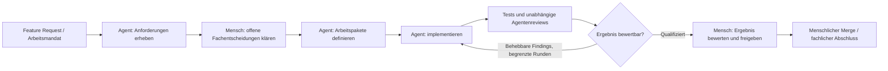

# Produktvision: Agent Control Plane

Stand: 2026-09-15. Grundlage ist Daniels beschriebenes Ziel einschließlich der ausdrücklichen Entscheidung, vorhandene Plattformen zu nutzen. [ADR 0015](../adr/0015-compose-existing-agent-platforms-for-use.md) hält diese Ausrichtung verbindlich fest. OpenSpec und die verlinkten Tickets dokumentieren die bisherigen Pilotanforderungen und Abnahmen.

## Ziel in einem Satz

Wir nutzen zentral betriebene Plattformdienste, die komplexe, langlebige Arbeitsprozesse über spezialisierte Agenten und Menschen hinweg ausführen, die freigegebene Verwendung von Skills und Kontext unterstützen und Beiträge, Ergebnisse und Entscheidungen unabhängig von einzelnen Sessions, Personen und Rechnern bewahren.

Der Entwicklungsprozess ist der erste Anwendungsfall. Das langfristige Ziel umfasst auch andere fachliche Prozesse. „Agent Control Plane“ bezeichnet hier die benötigte Funktion innerhalb der Gesamtarchitektur. **Work Package Control Plane** ist der bestehende Systemname des Piloten; eine ausgewählte Plattform muss weder diesen Namen noch dessen interne Architektur übernehmen.

**Vorhandene Plattformen nutzen ist die gewählte Richtung.** Gesucht ist eine Referenzarchitektur aus geeigneten Produkten, Workflow-Konfiguration und erforderlichen Integrationen. Eine eigene Plattform zu entwickeln und zu pflegen ist ausdrücklich kein Ziel. Bewertet werden die fachlichen Ergebnisse und der Aufwand für Nutzung und Betrieb; andere interne Architekturen oder Begriffe sind für sich keine Fähigkeitslücke.

## Welches Problem wir lösen

Ein komplexer Prozess überfordert eine einzige fortlaufende Agentensession: Sie müsste Anforderungen, Umsetzung, Tests, Reviews und Entscheidungen gleichzeitig im Kontext halten. Viele unabhängige Sessions lösen dieses Problem nur teilweise. Wenn ein Mensch jeden Übergang koordinieren, Kontext übertragen und die Qualität jedes Fachgebiets selbst beurteilen muss, bleibt er der Engpass und muss zu viele unterschiedliche Kompetenzen vereinen.

Die Plattform übernimmt die Koordination. Agenten erledigen abgegrenzte Arbeit mit passenden Fähigkeiten und einem auf die Aufgabe begrenzten Kontext. Menschen übernehmen die ihnen zugeordneten fachlichen Entscheidungen, Ergebnisbewertungen und Interventionen. Ein Wechsel der Person oder des Rechners darf den Prozess weder neu beginnen lassen noch seine Vorgeschichte verlieren.

## Das angestrebte Arbeitsmodell

1. **Ein Auftrag erhält einen nachvollziehbaren Ablauf.** Eine versionierte Workflow-Definition beschreibt Schritte, Übergänge, Abhängigkeiten, erwartete Eingaben und Ergebnisse sowie die beteiligten Agentenrollen und menschlichen Aufgaben.
2. **Die Ausführung läuft zentral weiter.** Ein angenommener Auftrag bleibt erreichbar und bearbeitbar, wenn Browser, lokale Agentensession oder Arbeitsplatz geschlossen werden. Wartezustände und Wiederaufnahme gehören zum Ablauf.
3. **Jede Tätigkeit erhält ihren passenden Kontext.** Ein Agent bekommt das Arbeitsmandat, die benötigten Quellen, relevante Vorgängerergebnisse und die für seine Rolle freigegebene Agent Definition. Die vollständige Historie bleibt gezielt abrufbar; sie wird nicht automatisch zum Modellkontext jedes Schritts.
4. **Menschen sind reguläre Beteiligte.** Geplante Ergebnisbewertung und Freigabe sind eigene Aufgaben. Davon zu unterscheiden sind Interventionsanfragen bei fehlenden Entscheidungen, Fehlern oder Blockaden. Nicht jeder Übergang benötigt menschliche Freigabe; das bestimmt der fachliche Workflow innerhalb seiner Governance.
5. **Alle Beiträge bleiben dem Auftrag zugeordnet.** Zentrale Agenten, lokale unterstützende Agenten und Menschen liefern Commands, Beobachtungen, Ergebnisse, Artefakte und Entscheidungen zurück. Andere Berechtigte können damit den Prozess nachvollziehen und fortsetzen.

### Beispiel: Entwicklungsprozess

Das ist eine Veranschaulichung des Zielbilds, keine zusätzliche feste Schrittfolge für die aktuellen Tickets. Im bestehenden Entwicklungspfad gelten weiterhin die konkreten Mandats-, Review-, Head- und Merge-Regeln. Eine neue Person soll an ihrem Schritt anhand von Auftrag, Ergebnis, Nachweisen und offenen Entscheidungen handeln können, ohne alle vorigen Sessions selbst durchgeführt zu haben.

## Zentrale Governance und klare Zuständigkeiten

| Bereich | Verantwortung im Zielbild | Bezug zur bestehenden Entscheidung |
| --- | --- | --- |
| Workflow-Definition | Legt fest, welche Arbeit wann, durch welche Rolle und mit welchen Ergebnissen ausgeführt wird; eine neue Definition verändert laufende Ausführungen nicht stillschweigend. | [ADR 0014](../adr/0014-evolve-control-plane-backend-with-versioned-workflows.md) |
| Agent Definition | Versioniert Prompts, Skills, Tools, Policies, Integrationen und Zugriffe einer Agentenrolle. | [ADR 0005](../adr/0005-separate-agent-definitions-from-work-package-orchestration.md) |
| Freigabe von Agent Definitions | Bestehende Repository Governance qualifiziert die Revision; die Control Plane verwendet und protokolliert das freigegebene Ergebnis. | [ADR 0006](../adr/0006-externalize-agent-definition-approval-to-repository-governance.md) |
| Kontextbereitstellung | Stellt rollen- und aufgabengerechte Quellen und Vorgängerergebnisse bereit; Herkunft und verwendete Fassungen sollen nachvollziehbar sein. Quellen können in ihren Fachsystemen bleiben. | [Pilot-PRD](../../.scratch/distributed-codex-work-package-control-plane/spec.md), [Domänenbegriffe](../../CONTEXT.md) |
| Ausführung und Steuerung | Koordiniert Tätigkeiten, hält Wartezustände, prüft berechtigte Commands und gleicht bereits eingetretene externe Wirkungen bei Wiederaufnahme ab. | [Produktvertrag](../../openspec/changes/separate-agent-framework-pilot-spec-and-spike/specs/distributed-work-package-control-plane/spec.md) |
| Operator Client / Workstation Client | Ermöglicht Beobachtung, menschliche Steuerung und gezielte lokale Unterstützung am selben zentralen Auftrag. | [ADR 0013](../adr/0013-deliver-handover-through-a-workstation-client.md) |

„Zentral verwaltet“ bedeutet damit eine verbindliche, nachvollziehbare Verwendung im Prozess. Es erfordert weder die Kopie aller Skills in eine neue Plattformdatenbank noch eine zweite Freigabeorganisation. Die pro Agentenaufruf tatsächlich verwendete Revision bleibt nachvollziehbar; eine später freigegebene Agent Definition kann gemäß ADR 0005 bei einem späteren Aufruf verwendet werden. Das ist von der Bindung der Workflow-Version zu unterscheiden.

## Was zentral erhalten bleibt

Die Beiträge von Menschen und Agenten umfassen verschiedene Arten von Information:

- **Commands** fordern eine Aktion an, etwa eine Aktivität zu starten, eine Intervention zu beantworten oder ein Ergebnis freizugeben. Ihre Annahme, Ablehnung und Verarbeitung müssen nachvollziehbar sein. Ein angenommener Command beweist noch keinen erfolgreichen externen Effekt.
- **Ereignisse und beobachtbare Agentenlogs** dokumentieren, was tatsächlich geschehen ist: Tätigkeit, Session, Nachricht, Toolaufruf und Ergebnis, Fehler, Zustandswechsel oder Verantwortungsübergabe. Gemeint sind beobachtbare Ausgaben, keine privaten Modellüberlegungen.
- **Artefakte und fachliche Ergebnisse** tragen die eigentliche Arbeit: Anforderungen, Analysen, Code, Testnachweise oder Bewertungen. Größere Inhalte können in einem eigenen Speicher liegen, wenn die zentrale Zuordnung und Verfügbarkeit nachvollziehbar bleiben.
- **Entscheidungen** halten fest, wer welches konkrete Ergebnis beziehungsweise welche Fassung bewertet oder freigegeben hat und welche Fortsetzung daraus folgt.

Im bestehenden Glossar ist **Control Command** enger definiert: eine vom steuernden Menschen initiierte Nachricht an eine aktive Agentenaktivität. Nicht jede Agentenlogzeile oder jeder Beitrag zum Workflow ist ein Control Command. Diese Unterscheidung verhindert, dass Logs versehentlich zu ausführbaren Anweisungen werden oder menschliche Freigaben durch Agentenausgaben ersetzt werden.

Zentrale Zuordnung umfasst insbesondere Auftrag/Einreichung, Workflow-Ausführung, Aktivität und Versuch, gegebenenfalls Session, Beteiligten und Rechner sowie die relevanten Definitionen, Quellen und Ergebnisfassungen. Bei lokalen Beiträgen müssen ausstehende Synchronisierung und fehlende Inhalte sichtbar bleiben. Die bestehende Run History wird unter den geltenden Redaktions- und Aufbewahrungsregeln geführt.

**Zentralität meint maßgebliche Zuständigkeit.** Technische Checkpoints, Sessionzustand, Artefaktinhalte und Telemetrie dürfen verschiedene Speicher nutzen. Im bisherigen Piloten besitzt PostgreSQL gemäß der [früheren ADR 0014](../adr/0014-evolve-control-plane-backend-with-versioned-workflows.md) den maßgeblichen Fachzustand, angenommene Commands und die kanonische Run History. In der Zielarchitektur kann die ausgewählte Plattform diese Verantwortung selbst tragen. Ein Dashboard oder Tracing-Dienst kann die Geschichte untersuchbar machen; die Architektur muss zusätzlich gültigen Ausführungsfortschritt und menschliche Entscheidungen zuordnen können.

## Wie die vorhandenen Tickets auf das Ziel einzahlen

Die folgende Bestandsaufnahme beruht auf Ticketstatus und gespeicherten Nachweisen vom 2026-09-15. Sie dient als Anforderungs- und Erfahrungsreferenz. Die offenen Tickets sind nach [ADR 0015](../adr/0015-compose-existing-agent-platforms-for-use.md) keine aktuelle Roadmap zum Ausbau einer eigenen Plattform; ihr Status dokumentiert den bisherigen Bearbeitungsstand.

| Beitrag zum Produktziel | Bestehende Arbeit | Nachweisstand |
| --- | --- | --- |
| Dauerhafte Identität, History, Berechtigungen, Wiederaufnahme | [MAF-Pilot-Tickets 02–05](../../.scratch/distributed-codex-work-package-control-plane/issues/README.md) | Als `resolved` geführt; begrenzte öffentliche Verhaltensnachweise dokumentiert. |
| Menschliche Unterstützung und Steuerungswechsel | [MAF 06](../../.scratch/distributed-codex-work-package-control-plane/issues/agent-framework-pilot/06-human-request-und-sessionfortsetzung-in-codex.md), [07](../../.scratch/distributed-codex-work-package-control-plane/issues/agent-framework-pilot/07-aktive-agentenoperation-gezielt-steuern.md), [08](../../.scratch/distributed-codex-work-package-control-plane/issues/agent-framework-pilot/08-steuerung-atomar-uebertragen-oder-uebernehmen.md), [09](../../.scratch/distributed-codex-work-package-control-plane/issues/agent-framework-pilot/09-nach-abbruch-sicher-reconnecten-und-run-exportieren.md) | Als `resolved` geführt; der Gesamtfall über drei Personen bleibt offen. |
| Reale Agentenarbeit, Evidence und qualifizierte Ergebnisse | [MAF 10–13](../../.scratch/distributed-codex-work-package-control-plane/issues/README.md) | Als `resolved` geführt; ersetzt keine Abnahme der durchgängigen zentralen Bearbeitung. |
| Tatsächliche Einreichung und erster unabhängiger Agentenschritt | [GUI 01/02](../../.scratch/agent-framework-operator-gui/README.md), [direkter Nachweis zu GUI 02](../../openspec/changes/archive/2026-09-14-add-agent-framework-background-start/issue-02-evidence.md) | Einreichung und erste Hintergrund-Anforderungsanalyse abgenommen; GUI 02 beweist noch nicht die gesamte Implementierungs-/Reviewkette. |
| Gemeinsam untersuchen und lokal helfen | [GUI 03–08](../../.scratch/agent-framework-operator-gui/README.md) | Offen: vertiefte Beobachtung, Workstation-Handover, Synchronisierung und GUI-Steuerung. |
| Selbstständige Bearbeitung bis zur menschlichen Bewertung | [GUI 09](../../.scratch/agent-framework-operator-gui/issues/09-eingereichtes-issue-unbeaufsichtigt-bis-intervention-oder-review-bearbeiten.md), [GUI 10](../../.scratch/agent-framework-operator-gui/issues/10-bereitschaft-zustellen-und-aktuellen-head-menschlich-freigeben.md) | Offen: vollständige Hintergrundkette und zugestellte menschliche Ergebnisfreigabe. |
| Mehrstufiges Mandat statt einzelner Session | [GUI 11–15](../../.scratch/agent-framework-operator-gui/README.md) | Offen: lokale Quelle, PRD-Zerlegung, Abhängigkeiten und gemeinsame Lebenszyklussicht. |
| Verteilte Zusammenarbeit als Gesamtsystem | [MAF 14](../../.scratch/distributed-codex-work-package-control-plane/issues/agent-framework-pilot/14-drei-identitaeten-und-koexistenz-ende-zu-ende-beweisen.md), [GUI 16](../../.scratch/agent-framework-operator-gui/issues/16-verteilten-gesamtfall-und-issue-14-gates-nachweisen.md) | Offen; Einzelbelege und eine erreichbare Azure-Aufnahmeoberfläche schließen diese Gates nicht. |

Der technische Rahmen ist ebenfalls differenziert: Das ursprüngliche OSS-Durability-Gate scheiterte für das geprüfte Paketset; danach wurde [Azure DTS ausdrücklich für den isolierten Piloten zugelassen](../../openspec/changes/accept-managed-dts-for-agent-framework-pilot/proposal.md). Daraus folgt keine generelle Freigabe beliebiger kostenpflichtiger Plattformen. Temporal bleibt gemäß bestehender Entscheidung ausgeschlossen; der LangGraph-Pilot bleibt eine unabhängige Referenz.

## Orientierung für Ausbau und Make-or-buy

Der eigentliche Produktnutzen liegt in der **verlässlichen Zusammenarbeit über Tätigkeiten, Sessions und Personen hinweg**. Auch die Orchestrierung dieses Zusammenspiels kann eine vorhandene Plattform übernehmen. Dass ein konkreter Prozess konfiguriert oder ein Fachsystem angebunden werden muss, begründet noch keine eigene Control Plane. Die [Plattformrecherche](../research/agent-control-plane-platform-comparison-2026-09-15.md) bewertet deshalb die Zielerfüllung mit Standardkonzepten und den verbleibenden Integrationsaufwand.

**Verbindliche Nutzungsentscheidung:** Die weitere Arbeit liefert Produktauswahl, Referenzarchitektur, Konfiguration und einen nachgewiesenen Beispielprozess auf vorhandenen Plattformen. Vorhandene Integrationen haben Vorrang; eine nötige kleine Anbindung bleibt auf die Verbindung der gewählten Produkte begrenzt. Eine Fähigkeitslücke führt zur Prüfung einer anderen Kombination oder eines angepassten Ablaufs. Der Aufbau einer eigenen Plattform wird dadurch nicht erneut zum Ziel. Die konkrete Produktauswahl und Migration sind noch offen.

Beispielsweise könnten zuständigkeitsgebundene menschliche Aufgaben das Ziel exklusiver Verantwortlichkeit anders erfüllen als eine runweite Control Lease. Eine neue Session mit adressiertem Kontext und abrufbarer Vorgeschichte könnte eine menschliche Diagnose ermöglichen, ohne die ursprüngliche Session lokal zu öffnen. Eine Plattform-Prozesshistorie könnte den verbindlichen fachlichen Verlauf tragen, ohne einen zweiten selbst entwickelten History-Dienst. Solche Varianten sind auf die benötigten Ergebnisse zu prüfen; sie sind keine Behauptung identischer Semantik. Wo sie bestehende Abnahmekriterien ändern, braucht die spätere Auswahl eine ausdrückliche Anpassung der Anforderungen.

Für die Referenzarchitektur helfen drei Fragen:

1. Welchen konkreten Übergang zwischen Agenten und Menschen macht er selbstständig, nachvollziehbar oder sicher wiederaufnehmbar?
2. Kann eine vorhandene Plattform dieses Ziel mit ihren eigenen Konzepten und vertretbarer Anpassung erfüllen?
3. Welche Kombination erreicht das Ziel mit dem geringsten eigenen Integrations-, Betriebs- und Pflegeaufwand?

**Empfohlene Messgrößen:** menschliche Koordinationszeit pro Auftrag, Anteil unbeaufsichtigt abgeschlossener Übergänge, Zeit bis ein neuer Beteiligter eine Entscheidung treffen kann, Qualität der bewertbaren Ergebnisse und erfolgreiche Wiederaufnahme ohne doppelte fachliche Wirkung. Anzahl der Agents, Traces oder GUI-Funktionen allein misst dieses Ziel nicht. Zielwerte müssen aus realen Abläufen abgeleitet werden.

Die Generalisierung auf andere Prozesse ist das Nutzungsziel. Weitere Workflows, passende Berechtigungen und nötige Modellierungs- oder Governance-Oberflächen werden über die ausgewählten Produkte abgebildet. Die aktuelle Aufgabe ist ihre Architektur und Nutzung; die bisherigen GUI-Tickets werden dadurch nicht zu einer neuen Implementierungsroadmap. Die Bewertung einer Plattform ist noch keine konkrete Migrationsentscheidung.

## Maßgebliche Anschlussdokumente

- [Nutzungsentscheidung: vorhandene Plattformen zusammensetzen](../adr/0015-compose-existing-agent-platforms-for-use.md)
- [Domänenbegriffe](../../CONTEXT.md)
- [Technologieunabhängige Pilot-PRD](../../.scratch/distributed-codex-work-package-control-plane/spec.md) und [zugehöriger OpenSpec-Change](../../openspec/changes/separate-agent-framework-pilot-spec-and-spike/proposal.md)
- [GUI-Anforderungen](../../openspec/changes/add-agent-framework-operator-gui/specs/agent-framework-operator-gui/spec.md) und [aktueller Lieferumfang](../../openspec/changes/add-agent-framework-operator-gui/tasks.md)
- [Frühere Pilotarchitektur mit versionierten Workflows](../adr/0014-evolve-control-plane-backend-with-versioned-workflows.md)
- [LangSmith, Microsoft und ergänzende Plattformen](../research/agent-control-plane-platform-comparison-2026-09-15.md)
