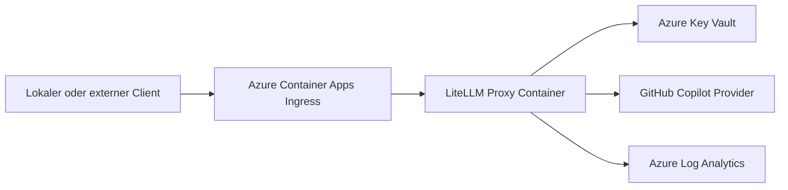

# LiteLLM API Gateway auf Azure

Siehe auch:

- [API Gateway Docs Index](/Users/dh/Documents/DanielsVault/_shared/shared-ai-docs/docs/api-gateway/index.md)
- [LiteLLM API Gateway](/Users/dh/Documents/DanielsVault/_shared/shared-ai-docs/docs/api-gateway/litellm-api-gateway.md)

## Zielbild

Das lokale LiteLLM-Gateway kann spaeter nach Azure ueberfuehrt werden, um einen dauerhaft erreichbaren, zentralen API-Endpunkt bereitzustellen.

Empfohlenes Ziel fuer dieses Setup:

- Azure Container Apps fuer den LiteLLM-Proxy
- Azure Key Vault fuer Secrets
- optional Azure Container Registry fuer eigene Images
- optional Log Analytics fuer Monitoring

## Warum Azure Container Apps

Fuer dieses Gateway ist Azure Container Apps meist die sinnvollste Zielplattform, weil sie zu einem einzelnen HTTP-Containerdienst mit wenigen Betriebsaufgaben passt.

Vorteile:

- einfacher als eigene VM
- guenstiger und leichtergewichtig als groessere Kubernetes-Setups
- native Secret-Verwaltung moeglich
- HTTP-Ingress fuer den Proxy
- spaetere Skalierung moeglich

## Zielarchitektur

## Offene Designentscheidung

Der lokale Stand nutzt GitHub-Copilot-Authentifizierung per Device Login. Fuer Azure ist das der schwaechste Teil der Gesamtloesung.

Vor einem Cloud-Deployment sollte geklaert werden:

- ob GitHub-Copilot-Zugriff fuer einen dauerhaft laufenden Cloud-Container organisatorisch und technisch gewuenscht ist
- wie Credential-Rotation und Besitzerwechsel gehandhabt werden
- ob stattdessen spaeter ein provider mit klassischem API-Key-Modell besser passt

## Empfohlener Aufbau

### Container

Das bestehende LiteLLM-Image kann unveraendert weiterverwendet werden.

Benötigt:

- `config.yaml`
- `LITELLM_MASTER_KEY`
- persistente oder anderweitig kontrollierte Ablage fuer Provider-Credentials, falls GitHub Copilot weiterverwendet wird

### Secrets

Nicht in Git speichern:

- `LITELLM_MASTER_KEY`
- eventuelle weitere Provider-Secrets
- Copilot-bezogene Zugangsdaten, falls ueberhaupt cloudseitig erlaubt

Empfehlung:

- Secrets in Azure Key Vault halten
- per Secret-Referenz in Azure Container Apps injizieren

### Netzwerk

Minimal:

- HTTPS-Ingress aktivieren
- Zugriff optional zunaechst nur fuer bekannte IPs oder intern begrenzen
- spaeter vorgelagerten Auth-Layer oder API-Management pruefen

## Betriebsmodell

### Lokale Entwicklung

- Entwicklung und Test lokal in Docker
- funktionierende `config.yaml` zuerst lokal validieren

### Cloud-Betrieb

- Container Image deployen
- Secrets aus Key Vault injizieren
- Health-Check und Logs aktivieren
- Zugriffsmodell fuer Clients festlegen

## Risiken und Hinweise

### GitHub Copilot in der Cloud

Das aktuelle Setup funktioniert lokal gut, weil der Device-Login manuell abgeschlossen werden kann und die Credentials im Volume liegen.

In Azure ist das heikler:

- Device Login ist fuer einen dauerhaft betriebenen Cloud-Dienst unkomfortabel
- Credential-Eigentum und Rotation muessen klar geregelt sein
- Recreate- und Recovery-Szenarien brauchen ein definiertes Auth-Verfahren

### Empfehlung

Wenn das Gateway langfristig in Azure betrieben werden soll, lohnt sich mittelfristig eine Bewertung, ob die Zielmodelle besser ueber Provider mit klassischem Secret-Modell betrieben werden.

## Minimaler Umsetzungsplan

1. lokales Setup stabil halten und dokumentieren
2. `config.yaml` auf benoetigte Modelle reduzieren
3. Azure Container App fuer LiteLLM anlegen
4. `LITELLM_MASTER_KEY` ueber Key Vault einspeisen
5. Logging und Zugriffsschutz definieren
6. Copilot-Auth-Konzept separat entscheiden

## Erfolgskriterien

Ein Azure-Betrieb ist erst dann sauber, wenn:

- das Gateway ueber HTTPS erreichbar ist
- Secrets nicht im Repo liegen
- Health und Logs beobachtbar sind
- ein reproduzierbares Verfahren fuer Provider-Authentifizierung existiert

## Weiterfuehrende Links

- [API Gateway Docs Index](/Users/dh/Documents/DanielsVault/_shared/shared-ai-docs/docs/api-gateway/index.md)
- [LiteLLM API Gateway](/Users/dh/Documents/DanielsVault/_shared/shared-ai-docs/docs/api-gateway/litellm-api-gateway.md)
