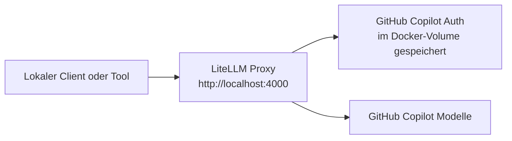

# LiteLLM API Gateway mit GitHub Copilot

Siehe auch:

- [API Gateway Docs Index](/Users/dh/Documents/DanielsVault/_shared/shared-ai-docs/docs/api-gateway/index.md)
- [LiteLLM API Gateway auf Azure](/Users/dh/Documents/DanielsVault/_shared/shared-ai-docs/docs/api-gateway/litellm-api-gateway-azure.md)

## Ziel

Dieses Setup stellt ein lokales API-Gateway fuer LLM-Aufrufe bereit. Das Gateway verwendet LiteLLM als OpenAI-kompatiblen Proxy und routet Anfragen an GitHub-Copilot-Modelle.

Es eignet sich fuer:

- einen stabilen lokalen API-Endpunkt fuer verschiedene Tools
- einheitliche Nutzung ueber `/v1/chat/completions` und `/v1/responses`
- spaetere Ueberfuehrung in ein Cloud-Deployment, z. B. Azure Container Apps

## Quellrepo

- Repo: `/Users/dh/Documents/Dev/ai-gateway`

Aktuell relevante Dateien im Repo:

- `config.yaml`
- `docker-compose.yml`
- `README.md`
- `.env`
- `.env.example`
- `.gitignore`

## Architektur



## Komponenten

### LiteLLM Proxy

LiteLLM stellt eine OpenAI-kompatible API bereit und mappt die konfigurierten Modelle auf den Provider `github_copilot/...`.

### Docker Compose

Der lokale Betrieb erfolgt ueber Docker Compose. Der Container exponiert Port `4000` und mountet die benoetigte Konfiguration sowie persistente Volumes.

### GitHub Copilot als Provider

Die Modelle werden ueber GitHub Copilot bezogen. Die Authentifizierung erfolgt beim ersten Start per Device Login.

## Konfiguration

### `config.yaml`

Die Datei definiert eine `model_list` mit den gewuenschten GitHub-Copilot-Modellen.

Beispiele:

- `copilot-gpt-4.1`
- `copilot-gpt-4o`
- `copilot-gpt-5`
- `copilot-gpt-5.1`
- `copilot-gpt-5.1-codex`
- `copilot-sonnet-4.5`

Ein Teil der Codex-Modelle ist zusaetzlich mit `model_info.mode: responses` markiert, damit sie sauber ueber die Responses API laufen.

Die lokale Zugriffssicherung erfolgt in derselben Datei:

```yaml
litellm_settings:
  master_key: "os.environ/LITELLM_MASTER_KEY"
```

### `.env`

Die `.env` enthaelt den lokalen Proxy-Key:

```bash
LITELLM_MASTER_KEY=sk-local-...
```

Die Datei darf nicht ins Repo committed werden und wird ueber `.gitignore` ausgeschlossen.

## Docker-Aufbau

### Container

Der Proxy laeuft als Docker-Container mit:

- Image `ghcr.io/berriai/litellm:main-stable`
- Port `4000:4000`
- eingebundener `config.yaml`
- `.env` als `env_file`

### Persistente Volumes

Zwei Volumes sind wichtig:

- `litellm-config:/root/.config/litellm`
- `litellm-data:/root/.local/share/litellm`

Der kritische Punkt ist `litellm-config`.

Dort speichert LiteLLM die GitHub-Copilot-Zugangsdaten:

- `/root/.config/litellm/github_copilot/access-token`
- `/root/.config/litellm/github_copilot/api-key.json`

Ohne dieses Volume geht die Copilot-Authentifizierung bei einem `docker compose up --force-recreate` verloren.

## Erstinbetriebnahme

### Voraussetzungen

- Docker Desktop laeuft lokal
- GitHub Copilot ist fuer den GitHub-Account verfuegbar
- das Repo ist lokal vorhanden unter `/Users/dh/Documents/Dev/ai-gateway`

### Start

```bash
cd "/Users/dh/Documents/Dev/ai-gateway"
docker compose up -d
```

Logs anzeigen:

```bash
docker compose logs -f
```

Stoppen:

```bash
docker compose down
```

Neu erzeugen:

```bash
docker compose up -d --force-recreate
```

## GitHub-Copilot-Authentifizierung

Beim ersten Start versucht LiteLLM, vorhandene Copilot-Credentials zu lesen. Wenn noch keine vorhanden sind, startet es einen Device-Login.

Typischer Ablauf:

1. `docker compose logs -f` oeffnen
2. den aktuellsten ausgegebenen Device-Code ablesen
3. `https://github.com/login/device` im Browser aufrufen
4. Code eingeben und bestaetigen
5. LiteLLM speichert danach die Credentials im Container-Volume

Wichtig:

- immer den aktuellsten Code aus den Logs verwenden
- nach erfolgreicher Authentifizierung bleiben die Daten durch `litellm-config` erhalten

## Nutzung

### Zugriffsschutz

Der Proxy ist lokal ueber einen `master_key` abgesichert.

Verhalten:

- ohne Bearer-Token: `401`
- mit Bearer-Token: Zugriff erlaubt

### Modelle auflisten

```bash
export LITELLM_MASTER_KEY=$(sed -n 's/^LITELLM_MASTER_KEY=//p' .env)

curl http://localhost:4000/v1/models \
  -H "Authorization: Bearer $LITELLM_MASTER_KEY"
```

### Chat Completions

```bash
curl http://localhost:4000/v1/chat/completions \
  -H "Authorization: Bearer $LITELLM_MASTER_KEY" \
  -H "Content-Type: application/json" \
  -d '{
    "model": "copilot-gpt-4.1",
    "messages": [
      {"role": "user", "content": "Sag kurz Hallo."}
    ]
  }'
```

### Responses API

```bash
curl http://localhost:4000/v1/responses \
  -H "Authorization: Bearer $LITELLM_MASTER_KEY" \
  -H "Content-Type: application/json" \
  -d '{
    "model": "copilot-gpt-5.1-codex",
    "input": "Antworte nur mit OK."
  }'
```

## Verifizierter Zustand

Das Setup wurde lokal erfolgreich getestet.

Verifiziert:

- `/v1/models` ohne Auth liefert `401`
- `/v1/models` mit Bearer-Token liefert `200`
- `/v1/chat/completions` funktioniert mit `copilot-gpt-4.1`
- `/v1/responses` funktioniert mit `copilot-gpt-5.1-codex`

## Bekannte Besonderheiten

- LiteLLM kann beim Start weitere Device-Codes in die Logs schreiben, auch wenn bereits gueltige Credentials vorhanden sind
- fuer die Betriebsfaehigkeit ist entscheidend, ob die Credential-Dateien unter `/root/.config/litellm/github_copilot/` vorhanden sind
- wenn nach einem Recreate ploetzlich wieder eine neue Anmeldung noetig ist, zuerst das Volume-Mounting fuer `litellm-config` pruefen

## Betriebshinweise

- Das Setup ist aktuell fuer lokale Nutzung gedacht
- Port `4000` ist lokal erreichbar und ueber den `master_key` geschuetzt
- fuer Team- oder Cloud-Betrieb sollten zusaetzlich Netzwerkzugriff, Secret-Management, Rotation und Observability geplant werden

## Naechste sinnvolle Schritte

- reduzierte Modellliste definieren, falls nicht alle Copilot-Modelle benoetigt werden
- Beispielclients fuer Python oder Node.js hinzufuegen
- Deployment nach Azure Container Apps vorbereiten


## Weiterfuehrende Links

- [API Gateway Docs Index](/Users/dh/Documents/DanielsVault/_shared/shared-ai-docs/docs/api-gateway/index.md)
- [LiteLLM API Gateway auf Azure](/Users/dh/Documents/DanielsVault/_shared/shared-ai-docs/docs/api-gateway/litellm-api-gateway-azure.md)
