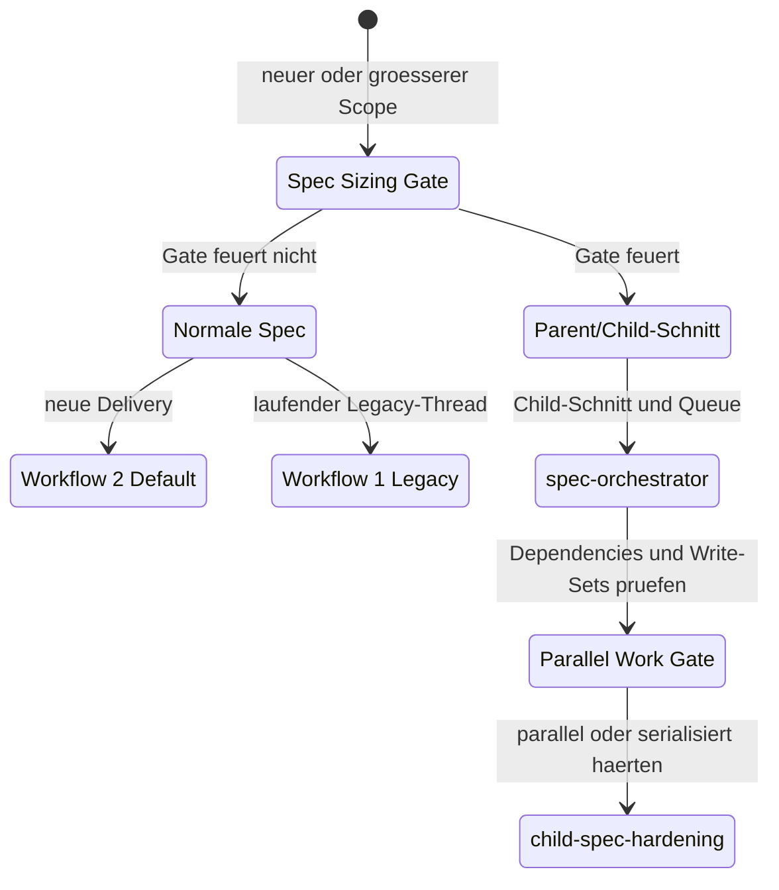
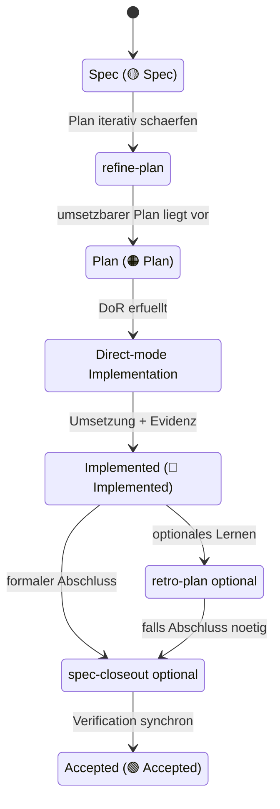
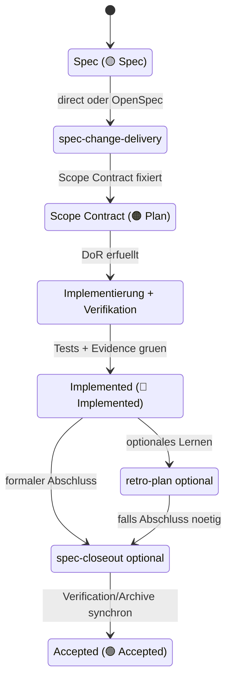
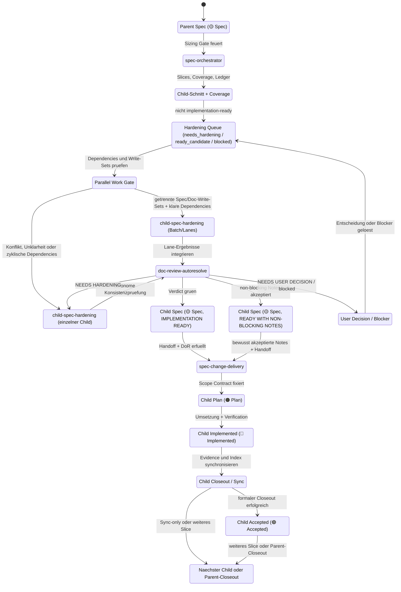
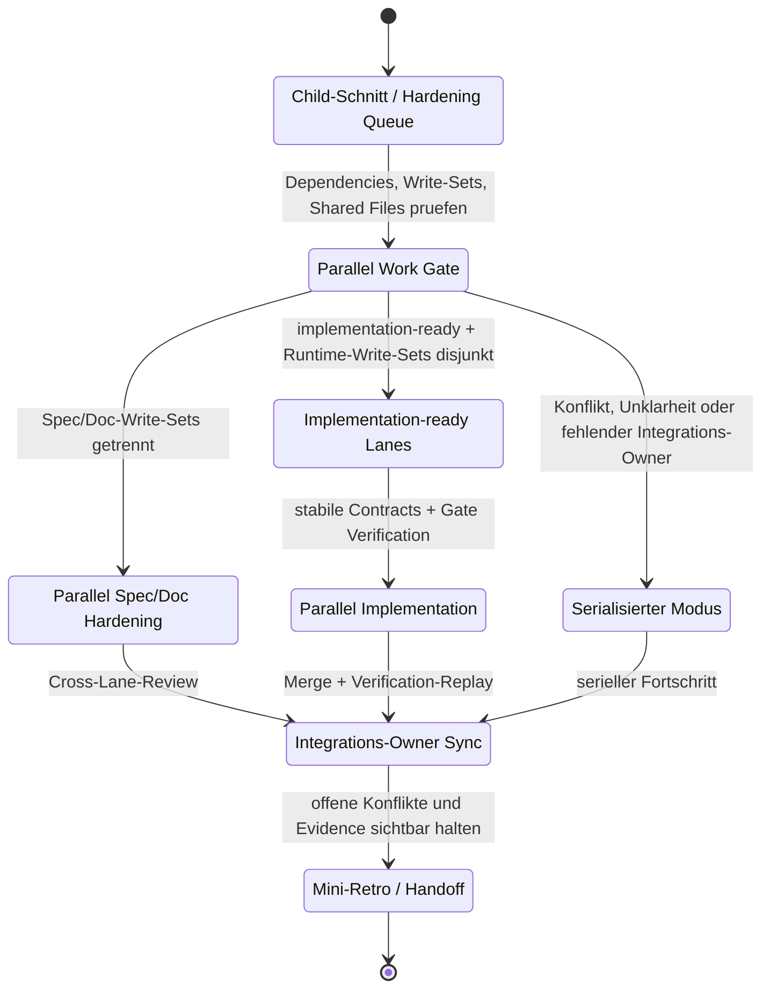

# Documentation & Planning Workflow

Dieser Workflow erweitert die bestehende Skill-Pipeline um klare Planungs- und Verifikations-Gates, um Nacharbeiten zu reduzieren.

## Ziel

1. Anforderungen sauber erfassen.
2. Entscheidungen vor Umsetzung einfrieren.
3. Umsetzung nur mit überprüfbaren Gates starten.
4. Abweichungen und Learnings systematisch in Skills/Workflow zurückführen.

## Shared Gate Source of Truth

Dieses Dokument ist die **kanonische Quelle** für die gemeinsamen Delivery-Gates in:
- `doc-coauthoring`
- `spec-orchestrator`
- `child-spec-hardening`
- `refine-plan`
- `spec-change-delivery`
- `spec-closeout`
- `doc-review-autoresolve`
- `retro-plan`

Hier werden die gemeinsamen Begriffe gepflegt:
- **Definition of Ready (DoR)**
- **Definition of Done (DoD)**
- **Decision Freeze Pack**
- **Session Briefing**
- **Active OpenSpec Scope**
- **Review Control Surface**
- **Parallel Work Control Surface**
- **Mini-Retro**
- **Spec Goldstandard**

Die Skills dürfen diese Begriffe lokal kurz restaten, sollen aber **keine abweichenden Definitionen** einführen. Änderungen an der gemeinsamen Bedeutung werden zuerst hier gepflegt.

Die ausfuehrliche Goldstandard-Definition fuer Specs lebt in
[`docs/spec-goldstandard.md`](spec-goldstandard.md). Dieses Workflow-Dokument bleibt die kanonische Gate-Quelle; die Goldstandard-Datei definiert Varianten, Mindestbestandteile, Anti-Patterns, Kandidatenbewertung und den Prozess, mit dem eine Spec zur Goldstandard-Referenz erhoben wird.

## Session Briefing Template (kurz)

Bei groesseren Arbeiten, neuen Sessions, Kontextkomprimierung oder Skill-Wechsel zuerst ein kurzes Briefing herstellen. Es darf aus dem vorhandenen Kontext abgeleitet werden; nur blockierende Luecken werden zurueckgefragt.

```md
## Session Briefing

- Modus/Skill:
- Source of Truth:
- Ziel:
- Nicht-Ziele:
- In Scope:
- Erwarteter Output:
- Verification/Review:
- Offene Entscheidungen:
```

Regeln:
1. `Modus/Skill` benennt den aktiven Workflow-Schritt, z. B. `doc-coauthoring`, `spec-orchestrator`, `child-spec-hardening`, `doc-review-autoresolve` oder `spec-change-delivery`.
2. `Source of Truth` nennt die fuehrenden Dateien/Specs/Artefakte; keine Hybrid-Steuerung ohne explizite Entscheidung.
3. `Ziel`, `Nicht-Ziele`, `In Scope` und `Erwarteter Output` muessen vor groesseren Edits oder Implementierung klar sein.
4. Ausgeschlossene Themen werden als Nicht-Ziele sichtbar gehalten, damit sie nicht nebenbei in den Scope rutschen.
5. Bei Review-/Spec-Arbeit wird zusaetzlich die `Review Control Surface` der betroffenen Spec geprueft oder angelegt.

## Active OpenSpec Scope

Agent Delivery nutzt standardmaessig keinen Session-Neustart als Scope-Kontrolle. Der aktive Implementierungskontext ist genau ein enger OpenSpec Change.

Regeln:
1. Bei grossem oder scope-sensiblem Agent-Delivery-Work startet Implementierung erst, wenn ein aktiver OpenSpec Change den aktuellen Slice fuehrt.
2. Parent-/Master-Specs, Research-Material und alte Workflow-Artefakte sind reference-only. Sie koennen Conformance und Coverage pruefen, aber sie erweitern den aktiven Scope nicht.
3. Es gibt keine separate Micro-Spec, Scope Capsule oder Handoff-Datei als Pflicht-Source-of-Truth. Eine kurze Active-Context-Ansicht darf aus dem OpenSpec Change abgeleitet werden, bleibt aber rein abgeleitet.
4. Default-Erfolg braucht OpenSpec-Artefakte, Diff-/Cleanup-Evidence und Verification. Child-Session-Launches, sichtbare Codex-App-Sessions, Controller-Evidence und Session-Archive sind legacy/debug-only.
5. Skills tragen keine langen Agent-Delivery-Regeltexte. Sie verweisen auf diese Quelle und auf die Validatoren.

Validatoren:

```sh
dotnet run skills-repo/tools/ValidateActiveOpenSpecScope.cs -- --change <change-name> [--parent <path>]
dotnet run skills-repo/tools/ValidateAgentDeliveryCleanup.cs -- --manifest openspec/changes/<change-name>/cleanup-manifest.json --root <repo-root>
dotnet run skills-repo/tools/ValidateSkillProseBudget.cs -- --root <repo-root>
tests/docworkflow-agent-delivery/scripts/run-active-openspec-e2e-checks.sh [--keep]
```

Abgeleitete Active-Context-Ansicht:

```md
- Active OpenSpec Change:
- Goal:
- In scope:
- Out of scope:
- Write-set / Impact:
- Verification:
- Parent/reference sources:
```

Wenn diese Ansicht dem OpenSpec Change widerspricht, gewinnt der OpenSpec Change.

Hinweis:
- Nicht mehr ausfuehrbare Legacy-Artefakte (alte Handoff-/Launcher-/Controller-/Archive-Mechanik) sind aus dem Default-Workflow entfernt. Historische Details bleiben nur in der Git-Historie nachvollziehbar.

## Mini-Retro Template (kurz)

Eine Mini-Retro ist ein leichtgewichtiges Kontrollritual gegen Kontextverlust und Rework. Sie ersetzt keine vollstaendige `retro-plan`-Analyse, sondern haelt den aktuellen Stand fest, bevor ein groesserer Arbeitsblock endet oder der naechste Schritt startet.

```md
## Mini-Retro

- Was wurde entschieden?
- Was wurde geaendert?
- Was bleibt offen?
- Welche Evidenz/Verification fehlt?
- Welche Skill-/Workflow-Reibung ist aufgefallen?
- Session-/Kontextzustand: weiterarbeiten oder neue Session starten?
```

Regeln:
1. Eine Mini-Retro entsteht nach groesseren Spec-, Review-, Hardening-, Delivery- oder Closeout-Schritten, wenn sonst relevanter Kontext verloren gehen koennte.
2. Eine Mini-Retro entsteht vor Session-Ende, Kontextkomprimierung, laengerem Pausieren, Handoff an einen anderen Skill oder Start des naechsten groesseren Workflow-Schritts.
3. Sie bleibt kurz: Stichpunkte reichen, keine Ursachenanalyse erzwingen, keine neue Methodik starten.
4. Offene Entscheidungen, fehlende Evidenz, Workflow-Reibung und Kontextqualitaet muessen sichtbar bleiben, damit sie im naechsten Schritt nicht neu entdeckt werden.
5. Wenn die Mini-Retro echte Planungsfehler, wiederkehrende Rework-Muster oder Skill-Luecken zeigt, kann daraus eine vollstaendige `retro-plan`-Retro oder ein `improve-skills`-Kandidat werden.

## Agent Delivery Meta-Review

Ein Agent Delivery Meta-Review ist das lernende Kontrollritual fuer Parent/Child-Arbeit. Es rekonstruiert nicht die Produktimplementierung, sondern bewertet, ob der Workflow selbst waehrend Orchestration, Hardening, Delivery, Closeout und Handoff funktioniert hat.

Trigger:
1. Nach Abschluss oder Abbruch eines Parent/Child-Arbeitsblocks, wenn mehrere Child-Sessions beteiligt waren.
2. Nach einem Child-Closeout, wenn Rework, stale Handoffs, command-contract repairs, Kontextverlust oder unklare Next Actions sichtbar wurden.
3. Vor dem Start eines groesseren Folge-Childs, wenn der bisherige Parent/Child-Ablauf als Lernsignal genutzt werden soll.
4. Wenn der User nach Workflow-Selbstoptimierung, Prozessreview, "was lernen wir daraus" oder aehnlichen Meta-Fragen fragt.

Vorgehen:
1. Fuehrende Parent Spec, Child Index, Child Specs, Handoffs, OpenSpec-Artefakte, Evidence und Session-Logs identifizieren.
2. Den tatsaechlichen Ablauf rekonstruieren: Parent/Scope -> Orchestrator -> Hardening -> Delivery -> Closeout -> naechstes Handoff.
3. Findings-first bewerten, mit Prioritaet `P0` bis `P3` und konkreten Artefakt-/Dateireferenzen.
4. Verbesserungsvorschlaege trennen in `sofort patchbar`, `braucht Entscheidung`, `spaeterer Testsuite-Ausbau` und `Automatisierung/Validator`.
5. Kleine, evidence-backed Workflow-/Skill-/Template-Haertungen duerfen direkt umgesetzt werden, wenn der User das Review als Optimierungsauftrag formuliert hat. Breite Refactors, Runtime-Implementierung und Original-Produkt-Spec-Aenderungen bleiben ausserhalb des Meta-Reviews.

Persistierter Skill:
- Nutze `agent-delivery-retro-review`, wenn ein Parent/Child-Prozess selbst reviewed und in Workflow-Verbesserungen rueckgekoppelt werden soll.

## Unterstützte Workflows

Beide Workflows sind offiziell unterstützt. Workflow 2 ist der aktuelle Default, Workflow 1 bleibt kompatibel nutzbar.

Status in den Diagrammen meint den Spec-Header-Status (`🟡 Spec`, `🟠 Plan`, `🔵 Implemented`, `🟢 Accepted`). Readiness-Verdicts wie `needs_hardening`, `ready_candidate`, `IMPLEMENTATION READY` oder `READY WITH NON-BLOCKING NOTES` sind Gate-/Kontrollflaechenwerte und ersetzen den Header-Status nicht.

## Spec Sizing Gate (vor Workflow-Auswahl)

Vor groesseren Spec-, Plan- oder Delivery-Schritten wird geprueft, ob die Arbeit in einer robusten Session als normaler Scope bearbeitbar ist oder wegen Kontextdruck in Parent/Child Specs geschnitten werden muss.

Eine Spec gilt als "zu gross", wenn mehrere dieser Signale zusammenkommen:

1. Mehrere Capability-Domains muessen in einem Change verstanden und umgesetzt werden.
2. Mehrere Repos, Systeme, Runtime-Umgebungen oder externe Abhaengigkeiten sind beteiligt.
3. Mehrere getrennte Verification-Zyklen waeren noetig, bevor ein belastbares Done-Signal entsteht.
4. Der Scope zerfaellt natuerlich in mehrere Delivery Slices mit eigenen Done-Signalen.
5. Es sind mehrere offene Produkt-, Architektur-, Security-, Daten- oder Betriebsentscheidungen zu erwarten.
6. Die Arbeit ist so langlaufend, dass Kontextkomprimierung oder Session-Wechsel die Ergebnisqualitaet sichtbar gefaehrden wuerden.

Routing-Regel:

1. Wenn das Sizing Gate nicht feuert, bleibt die Spec eine normale Spec. Es wird keine Parent-/Child-Struktur erzeugt.
2. Wenn das Sizing Gate feuert, wird Parent/Child automatisch angelegt: Parent Spec als Kontrollschicht, Child Specs oder Child-Skeletons als Delivery-Slices, Child-Index/Coverage/Hardening Queue als Steuerflaeche.
3. Nach automatischem Parent/Child-Schnitt startet der Workflow mit `spec-orchestrator` und anschliessendem `child-spec-hardening` fuer die naechsten umsetzbaren Child Specs.
4. Zielbild fuer grosse Vorhaben: Jeder implementation-ready Child ist so vollstaendig, dass eine neue Session nur mit Parent-Verweis, Child Spec, Handoff/Mini-Retro und relevanter Evidence starten kann.



### Workflow 1 (Legacy-kompatibel)



### Workflow 2 (Current)



### Large Spec / Child Spec Pipeline

For Parent-/Master-Specs that trigger the Spec Sizing Gate:



`spec-orchestrator` and `child-spec-hardening` normally keep specs in `🟡 Spec`; `spec-change-delivery` owns the transition to `🟠 Plan` once the implementation scope contract is locked.

## Workflow Selection (ohne Zwangsumstellung)

1. Wenn der User explizit Workflow 1 oder Workflow 2 nennt, diesem Pfad folgen.
2. Wenn ein bestehendes Artefakt bereits klar einen Pfad nutzt, auf demselben Pfad bleiben.
3. Ohne klare Vorgabe:
   - zuerst das Spec Sizing Gate anwenden,
   - bei zu grossem Scope automatisch Parent/Child nutzen,
   - für neue Deliveries Workflow 2 bevorzugen,
   - für laufende ältere Threads Workflow 1 beibehalten.
4. Ein Wechsel ist nur bei expliziter User-Entscheidung sinnvoll.

## Spec Header Contract (verpflichtend)

Jede Spec muss mit diesem Header starten:

```md
**Date:** 2026-03-03  
**Status:** 🟡 Spec
**Scope:** Automated deployment validation and self-healing for NCG backend on Hetzner infrastructure

---
```

Regeln:
1. `Date` im Format `YYYY-MM-DD` (Erstellungsdatum der Spec).
2. `Scope` als prägnanter Einzeiler.
3. `Status` nur aus dieser Liste:
   - `🟡 Spec` - Spec wird erstellt/verfeinert (`doc-coauthoring`)
   - `🟠 Plan` - umsetzbarer Plan existiert (aus `refine-plan` oder `spec-change-delivery`)
   - `🔵 Implemented` - Umsetzung plus Artefakte/Evidenz liegt vor
   - `🟢 Accepted` - formaler Abschluss erfolgt (typisch via `spec-closeout`)

## Review Control Surface (verpflichtend fuer Specs)

Jede Spec, Parent Spec und Child Spec muss direkt nach Header/Einleitung eine kurze Kontrollflaeche haben, die ein schnelles Review ermoeglicht. Sie ersetzt keine Detailsektionen, sondern spiegelt deren wichtigste Aussagen.

```md
## Review Control Surface

- Spec-Variante:
- Goldstandard Status:
- Ziel:
- In Scope:
- Out of Scope:
- Wichtigste Test-/Harness-Cases:
- Wichtigste Verification Commands:
- Offene Entscheidungen:
- Readiness Status:
```

Regeln:
1. `Spec-Variante` verwendet eine der Varianten aus `docs/spec-goldstandard.md`, z. B. `Parent/Master Spec`, `implementation-ready Child Spec`, `contract-heavy Spec`, `vertical spike Spec` oder `output/report/data-artifact Spec`.
2. `Goldstandard Status` beschreibt die Referenzklassifizierung der Spec und ist getrennt vom Workflow-`Status` im Header. Erlaubte Werte sind `none`, `candidate` und `reference`. Fuer normale Specs ist `none` ausreichend; Referenz-Specs muessen `candidate` oder `reference` sichtbar tragen.
3. `Ziel` beschreibt die konkrete Verhaltens- oder Dokumentationsaenderung, nicht nur den Projektnamen.
4. `In Scope` und `Out of Scope` muessen die Delivery-Grenze ohne Detaillekture verstaendlich machen.
5. Test-/Harness-Cases und Verification Commands listen die wichtigsten Proof Points, inklusive Negativ-, Fehler- oder Secret-/Redaction-Cases, wenn relevant.
6. `Offene Entscheidungen` nennt blockierende `[MISSING ...]`, `[DECISION ...]` oder blockierende `[REVIEW ...]` Marker; wenn keine offen sind, explizit `Keine blockierenden Entscheidungen`.
7. `Readiness Status` verwendet das passende Skill-Verdict, z. B. `NOT READY`, `READY FOR ORCHESTRATION`, `READY FOR PLANNING`, `IMPLEMENTATION READY`, `READY WITH NON-BLOCKING NOTES`, `NEEDS USER DECISION`, `NEEDS PARENT/ORCHESTRATOR SYNC` oder `NEEDS HARDENING`.
8. Wenn Detailsektionen geaendert werden, muss die Kontrollflaeche mitgezogen werden. Widerspruch zwischen Kontrollflaeche und Detailvertrag ist ein blockierendes Review-Finding.

Legacy-Regel:
- Bereits akzeptierte Legacy-Specs werden nicht nachtraeglich an der Review Control Surface oder am Goldstandard gemessen. Sie bleiben als umgesetzte Historie unveraendert. Goldstandard-Regeln gelten fuer neue Specs, aktive Kandidaten und Specs, die explizit fuer eine Referenz-Erhebung geoeffnet werden.

## Parallel Work Control Surface (bei paralleler Arbeit verpflichtend)

Parallel Work hat zwei unterschiedliche Modi:

1. **Parallel Spec/Doc Hardening**: mehrere Child Specs oder Plan-/Doc-Arbeitsbloecke werden parallel bis zur Umsetzungsreife geschaerft.
2. **Parallel Implementation**: mehrere umsetzungsreife Specs werden parallel in Runtime-/Produktcode umgesetzt.

Parallel Spec/Doc Hardening ist normalerweise unproblematisch parallelisierbar, sobald Dependencies und Schreibdateien klar sind. Parallel Implementation ist strenger und darf nur starten, wenn zusaetzlich die Runtime-/Code-Write-Sets disjunkt sind, Contracts stabil sind und die Integration seriell gesteuert wird.

In beiden Modi darf Parallel Work erst starten, wenn ein Parent-/Child-Schnitt oder Arbeitsblock-Schnitt existiert und die betroffenen Lanes explizit getrennte Write-Sets, Shared-File-Regeln, Verification Commands und eine Merge-/Sync-Reihenfolge haben.

Praktisch heisst das: Nach `spec-orchestrator` wird Parallel Work aktiv als naheliegender Modus geprueft. Wenn die Lane-Gates erfuellt sind, laeuft Child-Spec-/Doc-Hardening parallel als Batch oder mehrere Lanes; wenn nicht, wird serialisiert.



Minimale Kontrollflaeche:

| Child/Arbeitsblock | Modus | Owner/Agent | Erlaubte Write-Sets | Shared Files / Read-only Files | Abhaengigkeiten | Verification Commands | Integrations-Owner | Merge-/Sync-Reihenfolge |
|---|---|---|---|---|---|---|---|---|

Regeln:
1. Parallel Spec/Doc Hardening ist erlaubt, wenn jede Lane ihr eigenes Child-/Doc-/Plan-Artefakt schreibt, Dependencies sichtbar sind und Parent Spec, Child-Spec-Index, Slice-Plan, Backlog und gemeinsame Contracts fuer die Lane read-only bleiben.
2. Parallel Implementation ist nur erlaubt, wenn die betroffenen Specs implementation-ready sind, die erlaubten Runtime-/Code-Write-Sets disjunkt sind und jede editierende Lane in einem isolierten Branch/Worktree/OpenSpec Change oder in eindeutig getrennten Dateien arbeitet.
3. Shared Files sind fuer einzelne Lanes read-only, ausser die Lane ist ausdruecklich als Integrations-Owner fuer genau diese Datei benannt.
4. Parent Spec, Child-Spec-Index, Slice-Plan, Backlog, gemeinsame Contracts, gemeinsame Helpers und gemeinsame Verification-Skripte brauchen genau einen Integrations-Owner.
5. Contract-, Schema-, Harness- oder Shared-Helper-Aenderungen, die mehrere Lanes betreffen, duerfen in einzelnen Child Specs vorbereitet werden; ihre Uebernahme in Shared Files oder Runtime-Code ist ein serialer Integrations-/Prerequisite-Schritt.
6. Jede Lane braucht eigene Verification Commands. Bei Hardening koennen das Review-/Section-/Consistency-Checks sein; bei Implementation muessen es die gate-relevanten Runtime-/Test-Commands der Spec sein.
7. Der Integrations-Owner verantwortet Cross-Lane-Review, Parent-/Index-Sync, Merge-/Sync-Reihenfolge und gemeinsame Verification-Replay.
8. Parallel Work ist nicht erlaubt, wenn Write-Sets ueberlappen, Shared Files unklar sind, Abhaengigkeiten zyklisch/ungeklaert sind oder kein Integrations-Owner benannt ist. Fuer Parallel Implementation blockieren zusaetzlich instabile Contracts oder Verification, die erst nach Gesamtmerge sinnvoll pruefbar ist.
9. Mini-Retro/Handoff muss offene Lane-Konflikte, fehlende Verification und den Session-/Kontextzustand sichtbar halten, bevor weitere Lanes oder Integration starten.

## Status Ownership by Workflow

1. In beiden Workflows:
   - `doc-coauthoring` erstellt Header (falls fehlend) und setzt `🟡 Spec`.
2. Workflow 1:
   - `refine-plan` kann auf `🟠 Plan` setzen, sobald ein umsetzbarer Plan vorliegt.
   - der ausführende Implementierungs-Run (direct mode) setzt auf `🔵 Implemented`, sobald Evidenz vorliegt.
   - `spec-closeout` ist optional; bei erfolgreichem formalem Abschluss wird `🟢 Accepted` gesetzt.
3. Workflow 2:
   - `spec-change-delivery` setzt auf `🟠 Plan` (Scope Contract fixiert) und später auf `🔵 Implemented` (Umsetzung + Evidenz).
   - `spec-closeout` setzt auf `🟢 Accepted`, wenn Verifikation/Closeout vollständig erfolgreich sind.

## Skills und Verantwortung

### `doc-coauthoring`

Purpose: Anforderungen, Scope, Constraints, Akzeptanzkriterien.

Lieferobjekt:
- belastbare Spec mit `[MISSING ...]`, `[DECISION ...]`, `[REVIEW ...]`
- klare Non-Goals
- Review Control Surface mit Ziel, Scope, Non-Goals, wichtigsten Cases/Commands, offenen Entscheidungen und Readiness

### `rag-documentation-research`

Purpose: Quellenorientierte Dokumentationssuche vor Plan/Umsetzung mit `rag` als Standard und optionalem `qmd`-Discovery-Zusatz.

Lieferobjekt:
- priorisierte Quellenpfade fuer die aktuelle Frage
- nachvollziehbare Trefferbegruendung pro Quelle
- explizite Kennzeichnung, ob Treffer aus `rag`, `qmd` oder kombiniert stammen

Trigger (beispielhaft):
- "durchsuche die dokumentation"
- "durchsuche docs"
- "research the documentation"
- "search the documentation"
- "find relevant docs"
- "welche dokumente sind relevant"

Routing-Regel:
- Bei solchen Suchanfragen zuerst `rag-documentation-research`, danach mit den Quellen im jeweiligen Workflow (`doc-coauthoring`, `refine-plan`, `spec-change-delivery`, `spec-closeout`) fortfahren.

### `refine-plan`

Purpose: Aus Spec einen ausführbaren Plan machen.

Lieferobjekt:
- status-bearing actions (`[DONE]`, `[PENDING]`, `[BLOCKED]`)
- konkrete Verification Cases pro Teilbereich
- offene Spec-Lücken explizit als `[MISSING SPEC ...]`/`[DECISION SPEC ...]`
- primärer Plan-Track für Workflow 1 (iterativ)

### `spec-orchestrator`

Purpose: Große Parent-/Master-Specs schneller in Child-Delivery-Packs, Coverage-Kontrolle und Hardening Queue übersetzen.

Lieferobjekt:
- Parent-/Child-Inventar und Coverage-Matrix
- Review Control Surface fuer Parent/Child-Set oder fehlende Control-Surface-Patches
- Child-Readiness-Matrix mit fehlenden Delivery-Pack-/Hardening-Bestandteilen
- Parallel Work Control Surface mit Write-Sets, Shared-File-Regeln, Integrations-Owner und Merge-/Sync-Reihenfolge
- empfohlene nächste Slices plus Closeout-Sync-Checkliste
- Hardening Queue fuer Child Specs, die noch nicht implementation-ready sind

Routing-Regel:
- Nach `doc-coauthoring` nutzen, sobald ein Parent-Draft, eine Master-Spec, ein Slice-Plan oder Child Specs existieren und mehrere Slices orchestriert werden muessen.
- Vor `child-spec-hardening` nutzen, wenn mehrere Child Specs, ein großer Parent-Scope oder die Frage nach Parallelisierung/Nächstem Slice im Raum steht.
- Nicht als ersten Schritt fuer einen leeren Initialprompt nutzen; dafuer bleibt `doc-coauthoring` der Startpunkt.
- Nicht versuchen, alle Child Specs selbst bis zur vollen Vertragstiefe auszuarbeiten; dafuer `child-spec-hardening` nutzen.

### `child-spec-hardening`

Purpose: Aus Child-Spec-Drafts oder Orchestrator-Hardening-Queue-Eintraegen implementierungsreife Delivery Specs herstellen.

Lieferobjekt:
- aktualisierte Review Control Surface im Child
- Parent-/Master-Coverage und Parent-Scope-Conformance je Child
- Normative Contract mit Feldern, Statuswerten, Artefakten, Fehlerfaellen, Security-/Redaction-Regeln und Beispielen/Fixtures, soweit fuer den Child-Scope relevant
- konkrete Harness-/Verification-Cases mit Inputs, erwarteten Exit-/Statuswerten, Artefakten und Negativ-/Secret-Assertions
- Verification Commands im Stil akzeptierter Vorgaenger-Slices inklusive Execution Context, Preflight, Gate Verification, Runtime-Readiness und Anti-Loop-Regel
- Definition of Ready fuer Umsetzung und Definition of Done/Closeout Evidence
- Auto-Resolve-/Content-Quality-Review-Loop mit finalem Readiness Verdict

Routing-Regel:
- Nach `spec-orchestrator` nutzen, wenn ein Child `needs_hardening`, `ready_candidate` oder eine Hardening Queue hat.
- Direkt nutzen, wenn ein einzelner Child-Spec-Draft existiert und implementation-ready gemacht werden soll.
- Intern die Schreibprinzipien von `doc-coauthoring` und den Review-/Fix-Zyklus von `doc-review-autoresolve` anwenden.
- Stoppen, wenn echte Produkt-, Scope-, Architektur-, Security-, Legal- oder Data-Contract-Entscheidungen fehlen.
- Erst nach `IMPLEMENTATION READY` an `spec-change-delivery` uebergeben.

### `spec-change-delivery`

Purpose: Einen klar abgegrenzten Change aus der Spec implementieren und verifizieren.

Lieferobjekt:
- Scope Contract (direct oder OpenSpec)
- umgesetzte Artefakte + Verifikationsnachweise
- primärer Delivery-Track für Workflow 2 inkl. Spec-Statusupdate auf `🟠 Plan` und später `🔵 Implemented`

### `spec-closeout`

Purpose: Akzeptierten Change formal abschließen und dokumentarisch synchronisieren.

Lieferobjekt:
- vollständiger Verifikations-Checklist-Report
- OpenSpec Close/Archivierung (falls genutzt)
- Spec-Statusupdate auf `🟢 Accepted`
- RAG-basierte Quellensuche fuer relevante Doku-Updates (RAG-first, `qmd` optional)

### `doc-review-autoresolve`

Purpose: Review-Findings in Specs/Dokus autonom auflösen und direkt gegenprüfen, um Rework-Schleifen zu verkürzen.

Lieferobjekt:
- Findings-first Review mit file/line Referenzen
- automatische Behebung aller sicher entscheidbaren Inkonsistenzen im selben Run
- unmittelbarer Re-Review nach Edits (Loop bis stabil)
- Kontrolle, dass die Review Control Surface mit Detailsektionen, Findings und Readiness-Verdict konsistent ist
- strenger inhaltlicher Review des gesamten Vorhabens: Korrektheit, Scope, Vollstaendigkeit, Konsistenz, Eindeutigkeit, Machbarkeit, Testbarkeit, Traceability, Abstraktionsniveau, operative/lifecycle-relevante Punkte sowie Daten-/Artefaktvertraege
- automatischer Readiness-Status nach Spec-Änderungen (`IMPLEMENTATION READY`, `READY WITH NON-BLOCKING NOTES`, `NOT IMPLEMENTATION READY`)
- Eskalation nur für echte Entscheidungs-/Informationslücken (`[MISSING ...]`, `[DECISION ...]`, blockierende `[REVIEW ...]`)

Zusammenspiel mit `doc-coauthoring`:
- `doc-coauthoring` erstellt und ergänzt Inhalte, Anforderungen, Testfälle und Verification Commands.
- `doc-review-autoresolve` darf direkt danach laufen, um Inkonsistenzen, Drift, Dopplungen, fehlende Querverweise und sicher inferierbare Vertragslücken zu bereinigen.
- `doc-review-autoresolve` trifft keine neuen Produkt-/Scope-/Architektur-/Security-/Legal-/Data-Contract-Entscheidungen. Bei solchen Lücken stoppt der Loop mit Entscheidungsmarker.

### `retro-plan`

Purpose: Ergebnis gegen Plan prüfen und Deltas erfassen.

Lieferobjekt:
- Mini-Retro nach groesseren Arbeitsbloecken oder vor Kontextwechseln
- Root-Cause-Analyse
- Follow-up-Deltas für Spec/Plan/Umsetzung

### `improve-skills`

Purpose: wiederkehrende Reibungsmuster identifizieren und dauerhaft reduzieren.

Im Kontext dieses Workflows:
- wiederholte Nacharbeiten klassifizieren
- fehlende/unklare Entscheidungspunkte dokumentieren
- Workflow-/Skill-Anpassungen ableiten

## OpenSpec Nutzung

OpenSpec ist nach Scope-Modus geregelt:

1. **Normale Specs / kleine Changes**: OpenSpec ist optional und wird vom User entschieden. Ohne explizite OpenSpec-Vorgabe reicht direct Workflow 2.
2. **Parent-/Child-Vorhaben nach Spec Sizing Gate**: OpenSpec ist der Default-Ledger. Es wird nicht erneut beim User nachgefragt, ausser der User fordert direct mode explizit oder das Zielrepo hat keinen sinnvollen OpenSpec-Kontext.

OpenSpec ist besonders hilfreich bei:

1. größeren oder mehrstufigen Vorhaben,
2. mehreren beteiligten Teams/Repos,
3. Bedarf nach formalen Artefakten und Audit-Trace,
4. länger laufenden Changes mit Blockern und Teilfortschritt.

Für kleinere oder klar abgegrenzte Änderungen reicht oft der direkte Plan-Track ohne OpenSpec. Bei Parent-/Child-Vorhaben ersetzt OpenSpec nicht Parent/Child: OpenSpec haelt formale Change-/Audit-Artefakte, Parent/Child haelt Scope-Schnitt, Coverage, Hardening Queue und Session-Handoffs.

## One Delivery Ledger

Ein Delivery-Vorhaben braucht genau eine fuehrende Fortschritts- und Evidenzflaeche:

1. **Direct Workflow 2**: Spec + `spec-change-delivery` Scope Contract + Evidence sind fuehrend.
2. **OpenSpec Workflow 2**: OpenSpec Change-Artefakte sind der formale Delivery-Ledger; Spec/Parent/Child bleiben Scope- und Readiness-Quelle.
3. **Workflow 1**: `refine-plan`-Plan ist der fuehrende Plan-Ledger.

Kein Change soll denselben Fortschritt parallel in `refine-plan`, OpenSpec `tasks.md`, Child Index und Hardening Queue pflegen. Child Index und Hardening Queue duerfen Slices steuern, aber nicht die fein granularen OpenSpec-/Plan-Tasks duplizieren.

## Scope Slicing Guidance

Wenn eine Spec wegen Scope-Druck in mehrere Slices zerlegt wird, bleibt die Regel fuer die Umsetzung unveraendert:
1. Pro Implementierungsrun gibt es genau einen aktiven, engen OpenSpec Change.
2. Parent-/Master-Specs und Research bleiben reference-only.
3. Jeder Slice braucht klare In-/Out-of-Scope-Grenzen, Write-set/Impact und Verification.
4. Der naechste Slice startet erst, wenn der aktuelle Slice verifiziert und dokumentiert ist.

## Definition of Ready (vor Implementierung)

Implementierung startet erst, wenn alle Punkte erfüllt sind:

1. Scope in 1-2 Sätzen fixiert.
2. Non-Goals explizit dokumentiert.
3. Review Control Surface aktuell und konsistent mit Detailsektionen.
4. Decision Freeze Pack ausgefüllt (siehe unten).
5. Referenz-Baseline benannt (**falls relevant**).
6. Testfälle/Abnahmeszenarien vorab definiert, die den späteren DoD nachweisbar machen.
7. Verifikationskommandos vorab definiert:
   - Unit/Integration Tests
   - Runtime/Compose Start
   - Health/Smoke Checks
   - Plattform-/Shell-Contract der Kommandos (z. B. macOS vs Linux) ist explizit.
   - Readiness-Strategie für timing-sensitive Runtime-Checks ist explizit (Poll/Retry/Wait).
   - Scope-Guard-Baseline ist explizit (Branch-History vs Working-Tree) inklusive Verhalten auf long-lived branches.
   - Risk-based Verification Preflight ist definiert (nur High-Risk-Kommandos; getrennte Statuslogik).
   - High-Risk-Kommandos wurden als Command-Vertrag rehearsed, soweit das ohne Implementierung oder externe Seiteneffekte moeglich ist. Dazu gehoeren besonders SDK-/Runtime-Auswahl, absolute Pfade, Container-/Compose-Kommandos, Testhost-Flags wie `--no-build`/`--no-restore`, Branch-/Diff-Guards, Health-Polls, Credentials-/Secret-Guards und Befehle, die durch Parent-`global.json`, CWD oder Shell-Unterschiede beeinflusst werden koennen.
   - Anti-Loop-Regel ist definiert: kein rekursives "Verifikation der Verifikation".
   - Vereinfachungen/Anpassungen von Verification Commands sind als Vorschlagspfad mit User-Freigabe geregelt.
8. Offene Risiken, Abhängigkeiten und Blocker sind dokumentiert.
9. Bei Child Specs liegt ein dokumentiertes Hardening Verdict vor (`IMPLEMENTATION READY` oder bewusst akzeptierte `READY WITH NON-BLOCKING NOTES`). Implizite Reife ohne Verdict blockiert Implementierung.
10. Wenn parallele Implementation geplant ist, liegt die Parallel Work Control Surface mit expliziten Runtime-/Code-Write-Sets, Shared-File-Regeln, Integrations-Owner und Merge-/Sync-Reihenfolge vor.

## Decision Freeze Pack (kontextabhängige Checkliste)

Vor der Implementierung die **relevanten** Punkte fixieren:

1. Zielbild und Scope in 1-2 Sätzen.
2. betroffene Umgebungen/Branches (**falls relevant**).
3. Secret-/Config-Contract (**falls relevant**).
4. Datenmigration/Fallback (**falls relevant**).
5. externe Integrationsverträge zu anderen Systemen/Repos (**falls relevant**).
6. Sicherheits-/Exposure-Entscheidungen (**falls relevant**).
7. Abnahmekriterien (Go/No-Go).
8. Owner für offene Abhängigkeiten/Risiken.
9. Nachweisformat (welche Evidenzdatei, welche Kommandos).

## OpenSpec Artifact Contract (nur wenn OpenSpec aktiv)

Mindestens diese Artefakte müssen konsistent sein:

1. `proposal.md` - Why/What/Impact
2. `design.md` - Entscheidungen und Trade-offs
3. `tasks.md` - nur echte, überprüfbare Tasks; Blocker explizit offen lassen
4. `specs/*/spec.md` - Requirements + Scenarios
5. `acceptance-criteria-matrix.md` - `pass/fail/blocked`
6. `implementation-evidence.md` - konkrete Kommandos + Resultate

Regel:
- **`[BLOCKED]` ist nicht `done`**
- Teilweise Umsetzung nicht als abgeschlossen markieren

## Definition of Done (Release Gate)

Ein Change ist erst "done", wenn:

1. relevante Findings und Risiken geklärt, mitigiert oder explizit akzeptiert sind.
2. die in DoR definierten Testfälle ausgeführt und dokumentiert sind.
3. definierte Tests erfolgreich sind.
4. Runtime-Validierung erfolgreich ist (z. B. `docker compose up` + Health).
5. offene Blocker klar dokumentiert sind (inkl. Impact/Nächster Schritt).
6. Akzeptanzkriterien mit Evidenz belegt sind.
7. Specs/Plan/OpenSpec-Artefakte synchron sind (kein Drift).

### Verification Command Contract Repair

Wenn ein definierter Verification Command waehrend Delivery oder Closeout nicht wegen Produkt-/Implementierungsfehlern scheitert, sondern weil der Command-Vertrag selbst in der Zielumgebung fragil, stale oder falsch formuliert ist, darf der Fehler nicht still als bestanden ersetzt werden.

Regeln:
1. Der fehlgeschlagene Originalcommand wird als Command-Contract-Finding dokumentiert, inklusive Exit/Fehlerbild und Ursache, soweit erkennbar.
2. Ein Ersatzcommand darf nur als gate-relevant gelten, wenn Spec, Child Spec, Child Index/Handoff und OpenSpec/Evidence vorher auf den neuen Command synchronisiert wurden oder ein explizit dokumentierter Sync-Patch Teil desselben Integrations-/Closeout-Runs ist.
3. Nach der Sync-Aenderung muss der korrigierte Command frisch ausgefuehrt werden. Ein frueherer Rehearsal-Lauf ersetzt das nicht.
4. Wenn die Sync-Aenderung nicht im aktuellen Scope erlaubt ist oder eine echte Entscheidung braucht, bleibt das Ergebnis `NOT READY` und wird an `child-spec-hardening`, `spec-change-delivery` oder den Integrations-Owner zurueckgegeben.
5. Evidence muss Originalfehler und korrigierten Lauf unterscheiden. Der Originalfehler darf nicht als `ran/pass` umetikettiert werden.
6. Commands, die nur vor einem OpenSpec-Archive sinnvoll sind, werden als `Pre-Archive Closeout` markiert. Nach Archive ersetzt ein `Post-Archive / Current Replay` die aktive Change-Validierung durch Archive-Presence plus canonical spec validation.
7. Gemeinsame `.NET` file-based Validatoren werden aus einem neutralen CWD gestartet, damit kein Zielrepo-`global.json` oder Projekt-CWD den Lauf verfälscht, z. B. `(cd /tmp && dotnet run /absolute/path/to/<validator>.cs -- --args ...)`.

### Risk-Based Command Contract Rehearsal

Vor `READY FOR PLANNING`, `IMPLEMENTATION READY` oder `READY WITH NON-BLOCKING NOTES` muessen riskante Verification Commands nicht nur beschrieben, sondern als Command-Vertrag geprueft werden, soweit das in der aktuellen Umgebung ohne Umsetzung oder externe Seiteneffekte sicher moeglich ist.

Regeln:
1. High-Risk-Kommandos sind alle Commands, deren Erfolg stark von SDK-/Runtime-Auswahl, absolutem Pfad, CWD, Shell, Container-Daemon, Compose/Service-Readiness, Testhost-Flags, Vorbuild-Artefakten, Branch-Historie, Credentials oder Netzwerk-/Infrastrukturverfuegbarkeit abhaengt.
2. Die Rehearsal prueft nur den Command-Vertrag: richtige Runtime/SDK-Auswahl, erreichbare Tools, gueltige Pfade, plausible Flags, erwartete Vorbedingungen und fehlende Seiteneffekte. Sie ist keine Ersatz-Verifikation fuer die spaetere Implementierung.
3. Wenn eine Rehearsal sicher nicht moeglich ist, muss die Spec das explizit markieren, inklusive Grund und wer/was den Command-Vertrag spaeter validiert.
4. Ein High-Risk-Command mit fehlender, fehlgeschlagener oder nicht erklaerter Rehearsal blockiert Implementation-Ready. Verwende `NEEDS HARDENING`, `[MISSING command contract rehearsal]` oder `[REVIEW command contract not rehearsed: <reason>]`.
5. Bei Parent/Child-Arbeit muss das Rehearsal-Ergebnis in Child Spec, Child Index/Handoff oder Evidence sichtbar sein, damit eine frische Session den Command nicht erneut blind vertraut.

## Anti-Rework Guardrails

1. Keine Umsetzung starten, solange zentrale Entscheidungen noch "im Fluss" sind.
2. Größere Vorhaben in mehrere Changes/Arbeitspakete splitten (z. B. nach Themenclustern oder Risiko).
3. Referenz-Implementierung/Baseline früh festlegen und diffen (**falls relevant**).
4. Jede Arbeitsphase endet mit:
   - Was wurde entschieden?
   - Was wurde geaendert?
   - Was bleibt offen?
   - Welche Evidenz fehlt noch?
   - Welche Skill-/Workflow-Reibung ist aufgefallen?
   - Session-/Kontextzustand: weiterarbeiten oder neue Session starten?
5. Keine "Hybrid-Steuerung": entweder OpenSpec ist als Ledger aktiv (Default bei Parent/Child) oder der Change laeuft bewusst ohne OpenSpec.
6. Review-Findings werden standardmäßig per `doc-review-autoresolve` erst **autonom behoben**, dann **erneut reviewed**; Rückfrage nur bei echten Entscheidungs-/Missing-Blockern.
7. Orchestrierung und Hardening nicht vermischen: `spec-orchestrator` schneidet und priorisiert; `child-spec-hardening` erzeugt die Vertragstiefe.
8. Keine parallele Umsetzung starten, solange Write-Sets, Shared Files, Integrations-Owner und Merge-/Verification-Reihenfolge nur implizit sind.

## Marker System

| Marker | Bedeutung | Verwendung |
|--------|-----------|-----------|
| `[MISSING ...]` | Fehlende Information | Spec/Plan |
| `[DECISION ...]` | Offene Wahl | Spec/Plan |
| `[REVIEW ...]` | Prüfen/Validieren | Spec |
| `[MISSING SPEC ...]` | Spezifikationslücke | Plan |
| `[DECISION SPEC ...]` | Spezifikationsentscheidung offen | Plan |
| `[BLOCKED ...]` | Externer Blocker | Plan/OpenSpec Tasks |

## Review-Findings Auto-Resolution Policy

Default bei Review-Arbeit:
1. Findings erfassen.
2. Alle sicher entscheidbaren Findings ohne Zusatzfreigabe direkt beheben.
3. Im gleichen Run re-reviewen.
4. Inhaltlichen Review ausführen: nicht nur Abschnitts-/DoR-Check, sondern strenge fachliche Prüfung des gesamten Vorhabens.
5. Nach jeder Spec-Änderung automatisch Readiness-Status melden; der User soll nicht separat fragen müssen, ob die Spec implementation-ready ist.
6. Wiederholen, bis keine autonomen Findings mehr offen sind.

Findings muessen fuer den tatsaechlichen Review-Stil des Users formuliert sein. Der User liest typischerweise zuerst Ziel, In Scope, Out of Scope, Verification Commands und Test-/Harness-Cases; er hat den mittleren Vertrags-/Detailteil oft nur ueberflogen. Deshalb muss jedes nicht-triviale Finding auch ohne vollstaendige Detaillekture verstaendlich sein.

Finding-Format fuer nicht-triviale Punkte:

1. Kurzbefund in Alltagssprache.
2. Warum das wichtig ist: welcher Implementierungs-/Review-Fehler sonst passieren kann.
3. Wo der User es pruefen soll: Ziel/Scope/Verification/Test-Cases nennen, nicht nur die tiefe Vertragsstelle.
4. Konkretes Beispiel: fehlendes Artefakt, Statuswert, Fixture, Kommando, Testfall oder Verhalten.
5. Noetige Aktion: autonomer Fix oder konkrete User-Entscheidung.

Terse technische Labels reichen nicht. Statt "Canonical Examples/Fixtures decision missing" erklaeren: "Diese Spec definiert ein Manifest. Damit der Implementierer nicht raet, braucht es entweder ein kleines Beispiel in der Spec oder benannte Fixture-Dateien, die die Harness spaeter ausfuehrt."

Inhaltliche Review-Fragen orientieren sich an etablierten Requirements-Qualitaetskriterien:

- Ist das beschriebene Verhalten fachlich korrekt fuer Problem, Nutzer und Kontext?
- Ist jede Anforderung notwendig und im Scope, oder versteckt sie Scope Creep bzw. ein Non-Goal?
- Sind Normalpfad, Edge Cases, Fehlerpfade, Abhaengigkeiten, Constraints und Annahmen ausreichend vollstaendig?
- Sind Anforderungen, Beispiele, Begriffe, Statuswerte, Parent-/Child-Scope, Akzeptanzkriterien und Verification Commands konsistent?
- Ist die Aussage eindeutig genug, dass keine materiell unterschiedlichen Implementierungen plausibel sind?
- Ist die Anforderung in der Zielumgebung machbar?
- Ist sie testbar/verifizierbar durch Test, Inspection, Analyse, Demonstration oder konkrete Abnahme-Evidenz?
- Ist sie traceable zu Intent, Parent Scope, Akzeptanzkriterien, Verification Commands und nachgelagerten Artefakten?
- Ist sie atomar und auf dem richtigen Abstraktionsniveau?
- Sind operative/lifecycle-relevante Themen wie Migration, Fallback, Rollback, Observability, Kompatibilitaet, Ownership und Closeout-Evidenz abgedeckt, falls relevant?

Inhaltliche P1-Beispiele:

- Datenartefakte ohne die fuer den eigenen nachgelagerten Flow notwendige Identitaet, Provenance oder Kontextbindung.
- Hash-/Signaturvertrag ohne kanonische Serialisierung.
- Manifest oder Run-Status ohne erlaubte Werte, Fehlerstatus oder Provenance.
- Akzeptanzkriterium kann formal grün werden, obwohl der intendierte Kontrollfluss übersprungen wurde.
- Anforderung ist mehrdeutig, fachlich widerspruechlich, technisch unmachbar oder nicht testbar.
- Wichtiger Fehler-/Edge-Case fehlt, obwohl die Implementierung ohne ihn nicht sicher oder sinnvoll abgeschlossen werden kann.

Use-Case-spezifische Beispiele sind keine globalen Pflichtfelder. Ein Survey braucht z. B. nur dann Frage-IDs im Antwortvertrag, wenn die Spec spaetere Interpretation nach Frage vorsieht.

Eskalation an den User nur wenn:
- mehrere fachlich unterschiedliche Lösungen möglich sind,
- Sicherheits-/Policy-Entscheidungen betroffen sind,
- oder Marker-basierte Entscheidungslücken bestehen (`[MISSING ...]`, `[DECISION ...]`, blockierende `[REVIEW ...]`).

## History und SessionId (verpflichtend)

History und SessionId bleiben verpflichtend, aber ohne Iterationssystem.

1. Jede Spec hat am Dateiende eine append-only History-Tabelle im Format:
   - `| Date | Author | Change |`
2. Jede History-Zeile beschreibt die jeweilige Anpassung in genau einem kurzen Satz.
3. Keine Iterationsspalte und keine Iterationsnummern verwenden.
4. Vorhandene Iterations-History bei Berührung auf das 3-Spalten-Format migrieren.
5. `SessionId` am Dateiende beibehalten; falls fehlend, ergänzen als `SessionId: <session-id>`.
6. Statuswechsel (`🟡 Spec` / `🟠 Plan` / `🔵 Implemented` / `🟢 Accepted`) müssen jeweils mit einer passenden neuen History-Zeile dokumentiert werden.

Bei Parent/Child-Handoffs zusaetzlich erfassen, wenn verfuegbar:
- echte Codex-Session-ID oder semantische Session-ID,
- Session-Log-Pfad (`.codex/sessions/**` oder `.codex/archived_sessions/**`),
- fuehrender Skill des Runs,
- Input-Handoff und Output-/Evidence-Pfade.

Wenn die echte Session-ID noch nicht bekannt oder nicht persistiert ist, wird die Luecke explizit als `Session log not yet persisted` markiert statt durch eine scheinbar echte ID ersetzt.

Hinweis:
- Diese History-Regel gilt für **Spec-Dateien**.
- Iterative History in **Plan-Dateien** (z. B. `refine-plan`) bleibt davon unberührt.

## File Conventions

| Typ | Ort | Muster |
|-----|-----|--------|
| Spezifikation (ohne OpenSpec) | `_specs/` | `YYYY-MM-DD <Titel>.md` |
| Plan | neben Spec oder Projektordner | `<name>-plan.md` |
| OpenSpec Change (optional) | `openspec/changes/<change>/` | Standard-Artefakte |
| Retro/Mini-Retro | inline im Plan/Spec/Handoff oder eigene Datei | `<name>-retro.md` |

## Übergänge

### Spec -> Plan
Workflow 1: `refine-plan` iterativ; bei implementierungsreifem Plan Status `🟠 Plan`.
Workflow 2: `spec-change-delivery` setzt Status `🟠 Plan`, sobald der Scope Contract fixiert ist.

### Plan -> Umsetzung
Nur bei erfüllter Definition of Ready. Nach ausgeführter Umsetzung mit Artefakten: Status `🔵 Implemented`.

### Umsetzung -> Accepted
In beiden Workflows optional über `spec-closeout`: Status `🟢 Accepted`, wenn Verifikation vollständig grün ist und (falls aktiv) OpenSpec archiviert wurde. Bei Parent/Child-Vorhaben unterscheidet Closeout zwischen Child-Sync (Parent Coverage, Index, Backlog, OpenSpec/Evidence) und Parent-Closeout (breiter Projekt-Dokumentations-Sync).

### Arbeitsblock -> Mini-Retro / Retro
Mini-Retro nach signifikanten Spec-, Review-, Delivery- oder Closeout-Bloecken sowie vor Session-Ende, Kontextwechsel oder Skill-Handoff. "retro the plan" nach signifikanten Meilensteinen, wenn Ursachenanalyse oder Planverbesserung noetig ist; "final retro the plan" vor Abschluss.

### Review Findings -> Auto-Resolve
Bei Findings aus Review-Runden zuerst `doc-review-autoresolve` ausführen (fix + re-review loop). Erst verbleibende Entscheidungs- oder Missing-Blocker an den User eskalieren.

### Retro -> Improve Skills
Wiederkehrende Probleme als `improve-skills`-Kandidaten erfassen und in Workflow/Skills einarbeiten.

## Lightweight Checkliste vor Umsetzung

1. Sind Modus/Skill und Source of Truth klar?
2. Sind Ziel, Nicht-Ziele, In Scope und erwarteter Output klar?
3. Ist die Review Control Surface aktuell?
4. Ist der Scope klar abgegrenzt?
5. Sind Entscheidungen eingefroren (Decision Freeze Pack)?
6. Sind Test- und Runtime-Gates vorab definiert?
7. Ist eine Referenz-Baseline nötig und benannt (falls relevant)?
8. Sind externe Abhängigkeiten/Owner dokumentiert?
9. Falls parallel gearbeitet wird: sind Write-Sets, Shared Files, Integrations-Owner und Merge-/Sync-Reihenfolge explizit?
10. Ist klar, was "done" konkret bedeutet?
