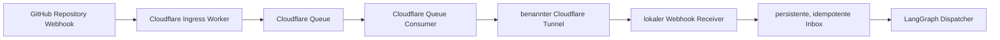
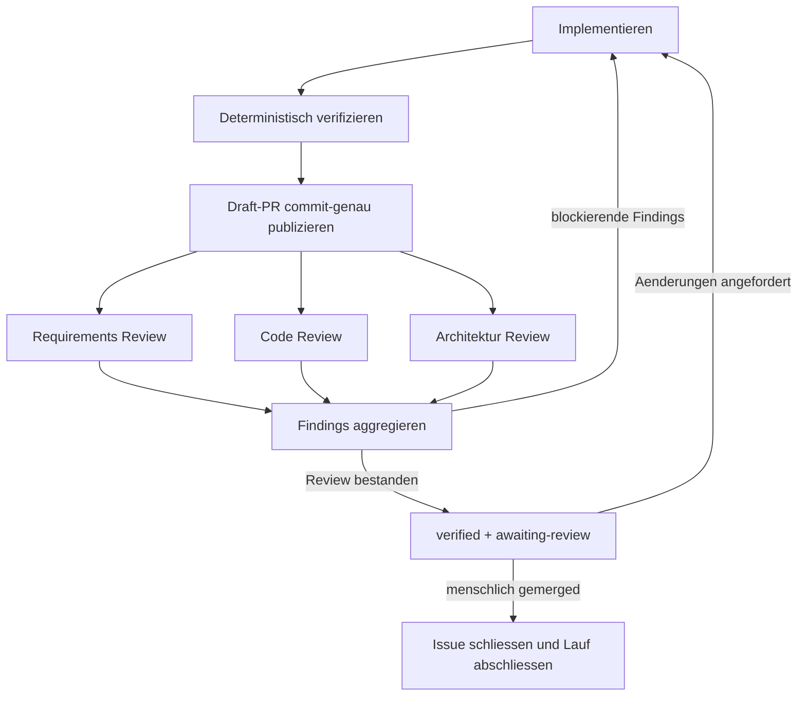

# LangGraph GitHub Issue Implementation Pilot

Status: Entscheidungsgrundlage abgeschlossen; lokale Claim-, Implementierungs-, Draft-PR- und unabhaengige Review-Slices umgesetzt

## Ziel

Ein lokaler LangGraph-Workflow bearbeitet GitHub Issues bis zu einem verifizierten Pull Request. Merge und Deployment bleiben menschliche Entscheidungen.

## Bestaetigte Entscheidungen

- Das erste Pilot-Repository ist `probare-crm`.
- Der Pilot nimmt alle Issues auf; Issue-Typen und Risikoklassen werden nicht pauschal ausgeschlossen.
- GitHub-Webhooks sind im Normalbetrieb der alleinige Ereigniseingang des lokalen Piloten. Es gibt kein periodisches Polling.
- Gueltige Webhook-Ereignisse werden in einer dauerhaften Cloudflare Queue zwischengespeichert und nach lokaler Nichterreichbarkeit automatisch erneut zugestellt.
- Der Pilot bleibt im kostenlosen Cloudflare-Tarif. Das garantierte Queue- und Offline-Fenster betraegt deshalb 24 Stunden.
- War der lokale Orchestrator mindestens 24 Stunden nicht aktiv, fuehrt er beim naechsten Mac-Start genau einen GitHub-Reconciliation-Lauf aus, um moeglicherweise abgelaufene Webhook-Deliveries zu kompensieren.
- Der lokale Stack startet nach Daniels macOS-Anmeldung automatisch als `launchd`-LaunchAgent und wird bei Prozessfehlern neu gestartet.
- `ready-for-agent` ist zugleich Reifezustand und ausdrueckliche Implementierungsfreigabe; ein zweites Startlabel ist nicht erforderlich.
- Ein Agent darf `ready-for-agent` selbst setzen, wenn das Issue nachweisbar aus einem menschlich angestossenen Issue, PRD oder vergleichbaren Arbeitsmandat abgeleitet wurde.
- Agentisch abgeleitete Issues duerfen den geerbten Scope verfeinern oder schneiden, aber nicht eigenmaechtig erweitern.
- Bestehende Parent-/Child- und PRD-Verlinkungen bilden die Herkunftskette ab. Der Pilot fuehrt dafuer keinen zusaetzlichen Pflichtabschnitt ein.
- Ein eigenstaendiges, von Daniel angestossenes Issue ist sein eigenes Arbeitsmandat.
- Pro Repository darf hoechstens ein Implementierungslauf aktiv sein.
- Ein Issue mit offenen `Blocked by`-Abhaengigkeiten bleibt in der Warteschlange.
- Ein Folge-Issue startet erst, nachdem der vorgelagerte Pull Request gemerged und das blockierende Issue geschlossen wurde.
- Gestapelte Pull Requests gehoeren nicht zum ersten Pilot.
- Ein erfolgreicher automatischer Implementierungslauf endet mit einem verifizierten Pull Request.
- Die automatische Pruefung umfasst Requirements Review, Code Review und Architektur Review.
- Requirements-, Code- und Architekturreview werden als drei feste, unabhaengige Reviewer-Agents umgesetzt.
- Nach dem Oeffnen des Pull Requests bleibt der Lauf im Zustand `awaiting-review`.
- Menschliche Aenderungswuensche starten im selben Lauf eine neue Implementierungs-, Verifikations- und Review-Runde.
- Der Workflow merged oder deployt nicht.
- Der Pilot ergaenzt die Workflow-Qualifier `agent-running`, `verified` und `awaiting-review`.
- `verified` gilt nur fuer den aktuellen Pull-Request-Head; jeder neue Commit entfernt `verified` und `awaiting-review`, setzt `agent-running` und erzwingt eine vollstaendige neue Verifikations- und Review-Runde.
- Der Pull-Request-Body ist das kanonische Delivery-Evidence-Paket; das Issue erhaelt nur einen kompakten Status und den PR-Link.
- Der Pull-Request-Body bettet kuratierte Evidence soweit technisch moeglich direkt ein; er verweist nicht primaer auf einen separaten GitHub-Datei-Viewer.
- `verified` verlangt Verhaltensnachweise fuer die Akzeptanzkriterien und darf nicht allein aus Build-, Start- oder Health-Checks abgeleitet werden.

## Sichtbare GitHub-Zustaende

| Situation | Triage-Zustand | Workflow-Qualifier |
| --- | --- | --- |
| Freigegeben und noch nicht gestartet | `ready-for-agent` | keine |
| Implementierung oder Findings-Bearbeitung aktiv | `ready-for-agent` | `agent-running` |
| Verifizierter Pull Request wartet auf Daniel | `ready-for-agent` | `verified`, `awaiting-review` |
| Fachliche Information fehlt | `needs-info` | keine aktiven Lauf-Qualifier |
| Arbeit kann nicht agentisch abgeschlossen werden | `ready-for-human` | keine aktiven Lauf-Qualifier |
| Pull Request gemerged | Issue geschlossen | Lauf-Qualifier koennen als Historie bestehen bleiben |

Die Labels sind eine sichtbare Projektion. Der persistierte LangGraph-Zustand bleibt die technische Quelle fuer Checkpoints, Versuche und Wiederaufnahme.

## Webhook-Ingress

Der Pilot wird ausschliesslich durch GitHub-Webhooks angestossen. Fuer `probare-crm` reicht zunaechst ein Repository-Webhook; die Ingress-Schnittstelle bleibt so geschnitten, dass sie spaeter ohne Aenderung am LangGraph-Workflow hinter eine GitHub App verschoben werden kann.

Ein Cloudflare Worker nimmt den GitHub-Webhook am festen oeffentlichen HTTPS-Endpunkt an. Er prueft die GitHub-Signatur am unveraenderten Request-Body, validiert Repository, Event und Action und schreibt die gueltige Delivery erst danach in eine Cloudflare Queue. Erst eine erfolgreiche Queue-Schreiboperation wird GitHub mit `2xx` bestaetigt.

Ein Queue-Consumer stellt die Delivery ueber einen benannten Cloudflare Tunnel an genau einen lokalen Webhook-Pfad zu. `cloudflared` baut die Verbindung ausgehend auf; am lokalen Rechner werden keine eingehenden Ports am Router geoeffnet. Cloudflare Access liegt nicht vor dem GitHub-Pfad, weil GitHub beziehungsweise der Queue-Consumer keinen interaktiven Access-Login ausfuehren kann. Ingress Worker und lokaler Receiver verwenden stattdessen kryptografische Request-Signaturen und getrennt gespeicherte Secrets.

Der lokale Receiver:

1. akzeptiert nur den vorgesehenen `POST`-Pfad und begrenzt die Request-Groesse,
2. validiert je nach exklusiv konfiguriertem Authentifizierungsmodus entweder `X-Hub-Signature-256` ueber dem unveraenderten Body oder `X-Pilot-Signature-256` ueber Delivery-ID, Event und unveraendertem Body, bevor das JSON interpretiert wird,
3. akzeptiert nur einen registrierten, versionskompatiblen `RepositoryAdapter`; Repository, Labels sowie unterstuetzte Event-/Action-Kombinationen gehoeren dem Adapter,
4. persistiert die Delivery atomar unter der eindeutigen `X-GitHub-Delivery`-ID,
5. antwortet nach erfolgreicher Persistierung unmittelbar mit `2xx`,
6. und laesst die eigentliche Verarbeitung asynchron durch den LangGraph-Dispatcher ausfuehren.

Cloudflare Queues liefert mindestens einmal. `X-GitHub-Delivery` bleibt deshalb vom Ingress bis zum LangGraph-Checkpoint der fachliche Idempotenzschluessel. Eine erneut zugestellte oder doppelt empfangene Delivery erhaelt eine erfolgreiche Antwort, startet aber keinen zweiten Lauf. Der Queue-Consumer bestaetigt eine Nachricht erst, nachdem die lokale Inbox sie persistent angenommen hat. Timeout, Nichterreichbarkeit und temporaere `5xx`-Antworten werden mit Backoff erneut versucht; dauerhaft fehlgeschlagene Nachrichten wechseln nach dem konfigurierten Versuchslimit in eine Dead-Letter-Queue und erzeugen einen sichtbaren Betriebsalarm.

Webhook-Secrets, Worker-Secrets, Tunnel-Credentials und andere Zugangsdaten liegen weder im Repository noch in der gespeicherten Evidence.

Fuer den Pilot sind mindestens die Ereignisse fuer Issue- und Labelaenderungen, Pull-Request-Aenderungen, Pull-Request-Reviews, Inline-Review-Kommentare und allgemeine PR-/Issue-Kommentare relevant. Der Receiver filtert danach auf die Aktionen, die tatsaechlich einen Zustandsuebergang ausloesen, beispielsweise `ready-for-agent`, neue menschliche Aenderungswuensche, einen neuen PR-Head oder einen menschlich gemergten Pull Request.

Die Queue-Retention und damit das garantierte Offline-Fenster des lokalen Rechners betraegt im kostenlosen Cloudflare-Tarif 24 Stunden. Innerhalb dieses Fensters wird die Zustellung automatisch erneut versucht. Bleibt der lokale Ingress laenger nicht erreichbar, ist die automatische Verarbeitung nicht mehr garantiert; der Betriebszustand muss sichtbar werden und die betroffene GitHub-Delivery kann manuell erneut zugestellt werden muessen. Der Pilot verspricht fuer diesen bewusst akzeptierten Fall keine unterbrechungsfreie Zustellung ueber 24 Stunden hinaus.

### Einmaliger Startup-Reconciliation-Lauf

Die lokale Control Plane schreibt regelmaessig nur einen internen `last_alive_at`-Zeitpunkt; dies ist kein GitHub-Polling. Beim Start vergleicht sie diesen Wert mit der aktuellen Zeit. Liegt die letzte lokale Aktivitaet mindestens 24 Stunden zurueck, startet sie einmalig einen Reconciliation-Lauf. Eine persistierte Mac-Boot-Session-ID verhindert, dass Prozessneustarts innerhalb desselben Systemstarts den Abgleich wiederholen.

Der Reconciliation-Lauf liest den aktuellen GitHub-Zustand fuer `probare-crm`:

- alle offenen Issues mit `ready-for-agent`,
- Issues mit aktiven Workflow-Qualifiern wie `agent-running`, `verified` oder `awaiting-review`,
- die zugehoerigen offenen oder seit der letzten lokalen Aktivitaet geschlossenen Pull Requests,
- sowie den aktuellen Merge-, Review- und Head-SHA-Zustand dieser Pull Requests.

Er vergleicht diese Daten mit der lokalen Inbox und den persistierten LangGraph-Checkpoints. Fehlende Arbeitsauftraege oder Zustandsuebergaenge werden als synthetische, idempotente `startup-reconciliation`-Kommandos in dieselbe lokale Inbox gelegt, die auch Webhooks verwendet. Bereits bekannte Issues, Pull Requests, Head-SHAs oder abgeschlossene Transitionen erzeugen keinen zweiten Lauf. Treffen parallel noch Queue-Deliveries ein, entscheidet derselbe Idempotenz- und Zustandsvertrag; die Reihenfolge darf keine Doppelverarbeitung verursachen.

Dieser Recovery-Pfad ist die einzige Polling-Ausnahme. Er laeuft hoechstens einmal pro Mac-Start und nur nach einer lokalen Inaktivitaet von mindestens 24 Stunden; danach arbeitet der Pilot wieder ausschliesslich ereignisgetrieben.

## Evidence-Vertrag

Vor der Implementierung erstellt der Workflow eine Evidence-Matrix. Jedes Akzeptanzkriterium wird mindestens einem Beweis ueber die direkteste oeffentliche Schnittstelle zugeordnet. Nach der Implementierung wird die Matrix mit beobachteten Ergebnissen und Artefakten vervollstaendigt.

Jeder Eintrag enthaelt mindestens:

- Referenz und Wortlaut des Akzeptanzkriteriums,
- verwendete oeffentliche Schnittstelle,
- reproduzierbaren Aufruf oder Interaktionsablauf,
- relevante Eingabe- und Ausgangsbedingungen,
- erwartetes fachliches Ergebnis,
- tatsaechlich beobachtetes fachliches Ergebnis,
- Commit-SHA und Zeitpunkt,
- Links oder Pfade zu redigierten Evidence-Artefakten,
- Verdict `proven` oder `not_proven` mit Begruendung.

Geeignete Evidence haengt vom Verhalten ab:

- **REST/API:** exakter Request, redigierter Payload, Status, relevante Response-Struktur und anschliessender Read-back oder beobachtbare Zustandsaenderung.
- **Web-UI:** ausgefuehrte Interaktion, Screenshots der entscheidenden Zustaende sowie bei Bedarf DOM-, Netzwerk- oder Konsolenbelege. Ein statischer Screenshot allein beweist keine Interaktion.
- **Persistenz und Recovery:** Zustand erzeugen, Prozess neu starten und denselben fachlichen Zustand ueber die oeffentliche Schnittstelle erneut beobachten.
- **Idempotenz:** denselben erlaubten Aufruf wiederholen und beweisen, dass kein zweites fachliches Ergebnis oder Ereignis entsteht.
- **Negative Regeln und Quality Gates:** den verbotenen oder unvollstaendigen Fall ausloesen und die fachliche Sperre samt konkreter Begruendung beobachten.
- **Hintergrundarbeit:** Auftrag ueber die oeffentliche Schnittstelle ausloesen und das erwartete fachliche Endergebnis oder die persistierte Aufgabe beobachten.
- **Logs:** redigierte, korrelierte Logzeilen duerfen den Ablauf stuetzen, ersetzen aber nicht das beobachtbare fachliche Ergebnis.

Nicht ausreichende Evidence:

- Container oder Anwendung startet ohne Fehler,
- Prozess bleibt am Leben,
- Health-Endpoint liefert `200`,
- REST-Aufruf liefert `2xx`, aber Inhalt und Zustandswirkung werden nicht geprueft,
- Testkommando endet erfolgreich, ohne dass klar ist, welches Akzeptanzkriterium es beweist,
- Logmeldung behauptet Erfolg, ohne korrelierbares Ergebnis an der oeffentlichen Schnittstelle,
- Screenshot zeigt nur eine geladene Seite oder einen statischen Ausgangszustand.

Der Requirements Reviewer prueft nicht nur den Diff, sondern auch die Evidence-Matrix. Ein Akzeptanzkriterium ohne belastbaren Verhaltensnachweis erzwingt `fail`, selbst wenn Build, Tests und Health-Checks gruen sind. Evidence muss Secrets, Tokens, personenbezogene Daten und andere nicht fuer den Beweis erforderliche Inhalte vor der Ablage redigieren.

### Darstellung im Pull-Request-Body

Der Pull-Request-Body ist die primaere Review-Oberflaeche und zeigt die entscheidende Evidence ohne Wechsel in den GitHub-Datei-Viewer:

- Eine kompakte Tabelle ordnet jedes Akzeptanzkriterium dem Verdict `proven` oder `not_proven` zu.
- Entscheidende UI-Zustaende werden als Bilder direkt im Body gerendert, mit aussagekraeftigem Alt-Text und kurzer Erklaerung dessen, was sichtbar bewiesen wird.
- REST-Aufrufe zeigen Methode, Route, redigierten Request, relevanten Response-Ausschnitt und den fachlichen Read-back direkt in Codebloecken.
- Relevante Logzeilen erscheinen als kurze, redigierte und korrelierte Ausschnitte direkt beim zugehoerigen Kriterium.
- Laengere Detailbelege werden in GitHub-`details`-Bloecken organisiert; Zusammenfassung und Verdict bleiben ohne Aufklappen sichtbar.
- Links oder Attachments sind nur Fallback fuer zu grosse, binaere oder nicht sinnvoll einbettbare Rohartefakte.

Damit automatisch eingebettete Screenshots dauerhaft und commit-genau rendern koennen, duerfen kuratierte Bilder im PR-Branch liegen und ueber eine auf den verifizierten Commit fixierte Raw-Darstellung eingebettet werden. Umfangreiche Rohdaten bleiben ausserhalb des Branches.

## Review-Architektur

Die drei Review-Perspektiven laufen nach Implementierung, deterministischer Verifikation und commit-genauer Draft-PR-Publikation unabhaengig gegen denselben Head. Ein Aggregator fuehrt ihre strukturierten Ergebnisse zusammen. Nur der Implementierungsagent darf den Branch veraendern; Reviewer liefern Findings.

Jede Review-Perspektive wird als eigener fester, nur lesender Agent/Subgraph umgesetzt. Ein `fail` auf einer beliebigen Achse blockiert die Reviewfreigabe.

Jeder Reviewer liefert einen strukturierten Verdict `pass`, `fail` oder `not_applicable` mit Begruendung und Findings. Das Requirements Review ist immer anwendbar. Code- und Architekturreview duerfen beispielsweise bei reinen Dokumentaenderungen `not_applicable` melden. Ein `fail` auf einer beliebigen Achse startet eine neue Implementierungs- und Verifikationsrunde; keine Achse kann eine andere ueberstimmen.

Pro initialem Review-Batch oder neuem menschlichem Feedback-Batch sind hoechstens drei automatische Behebungsrunden erlaubt. Eine Runde umfasst Findings-Bearbeitung, deterministische Verifikation und alle drei Reviewer. Neues menschliches Feedback startet einen neuen Batch mit eigenem Zaehler; ein unveraendertes Agent-Finding oder ein technischer Retry setzt den Zaehler nicht zurueck.

Sind nach der dritten Runde Findings offen, erstellt oder aktualisiert der Workflow einen Draft-PR mit dem aktuellen Stand, allen ausgefuehrten Versuchen und den verbleibenden Findings. Bei fehlender oder widerspruechlicher Anforderung wechselt das Issue zu `needs-info`; bei einem nicht agentisch loesbaren Implementierungs- oder Reviewkonflikt zu `ready-for-human`. In beiden Faellen werden `agent-running`, `verified` und `awaiting-review` entfernt und der LangGraph-Lauf pausiert.

## Interrupt-Policy

Der Pilot unterbricht den Lauf nur, wenn:

- Requirements, PRD, Issue oder ADR bei einer fachlichen Produktentscheidung widerspruechlich oder unvollstaendig sind,
- eine Umsetzung den geerbten Scope materiell erweitern muesste,
- Zugangsdaten oder eine ausschliesslich menschlich bedienbare externe Oberflaeche fehlen,
- ein manueller Schritt fuer einen geforderten Verhaltensnachweis unvermeidbar ist,
- oder drei automatische Behebungsrunden ohne Reviewfreigabe ausgeschoepft sind.

Eine Produktentscheidung betrifft fachliches Verhalten, Akzeptanzkriterien, Domaenenregeln, Datenlebenszyklus, Sicherheits- oder Datenschutzgrenzen oder irreversible externe Wirkungen. Kleinere reversible Implementierungs- oder Darstellungsdetails loesen keinen Interrupt aus. Der Agent entscheidet sie anhand von Requirements, Domaenensprache, Repository-Standards, Barrierefreiheit und vorhandenem Designsystem. Wenn etwa Farbe, Text oder Anordnung die Bedeutung einer Warnung, Einwilligung, Freigabe oder fachlichen Aktion veraendert, ist es kein blosses Darstellungsdetail mehr.

Merge, Deployment, Releases und Produktionsaenderungen fuehrt der Pilot grundsaetzlich nicht aus. Lokale Aenderungen, Tests, Container, Worktrees, Commits, Pushes, Labels, Kommentare und Pull-Request-Aktualisierungen benoetigen keinen zusaetzlichen Interrupt.

## Matt-Pocock-Skill-Routing

Der Pilot nutzt die vendorten Skills unter `skills-repo/vendor/mattpocock/.agents/skills/`. LangGraph entscheidet den Ablauf; die Skills liefern den Arbeitsvertrag fuer den jeweiligen Agent-Node.

| Workflow-Aufgabe | Agent-Node | Matt-Pocock-Skills | Anwendung |
| --- | --- | --- | --- |
| Neues oder unreifes Issue klaeren | Triage | `triage`, bei Bedarf `grill-with-docs` und `domain-modeling` | Claim verifizieren, Begriffe schaerfen und einen agentenfaehigen Auftrag herstellen |
| PRD oder grosses Issue schneiden | Ticket Slicer | `to-tickets` | Vertikale Issues und ihre `Blocked by`-Kanten erzeugen; `ready-for-agent` darf direkt gesetzt werden |
| Feature oder Maintenance implementieren | Implementer | `implement`, `tdd`, bei Interface-Fragen `codebase-design` | Zielbranch sichern und in verhaltensbasierten Red-Green-Slices arbeiten |
| Bug implementieren | Implementer | `diagnosing-bugs`, danach `tdd` und `implement` | Erst einen engen roten Repro-Loop herstellen, dann Regressionstest und Fix |
| Requirements pruefen | Requirements Reviewer | Spec-Achse aus `code-review` | Fehlende, teilweise oder falsche Anforderungen sowie Scope Creep getrennt melden |
| Code pruefen | Code Reviewer | Standards-Achse aus `code-review` | Repository-Standards und Matt Pococks Fowler-Smell-Baseline getrennt pruefen |
| Architektur pruefen | Architecture Reviewer | `codebase-design`, `domain-modeling` | ADRs, Domänensprache, Module, Interfaces, Seams, Adapter, Depth und Testoberflaechen pruefen |
| Findings beheben | Implementer | issue-abhaengige Implementierungs-Skills, danach erneut `code-review` | Nur der Implementer schreibt; alle drei Reviewer werden danach mit frischem Kontext erneut ausgefuehrt |

Die zwei Achsen des `code-review`-Skills werden direkt durch zwei LangGraph-Nodes repraesentiert. Es wird kein weiterer Supervisor-Agent innerhalb dieser Nodes gestartet. Der Aggregator bewahrt die getrennten Achsen und entscheidet nicht eigenmaechtig, dass ein Erfolg auf einer Achse einen Fehler auf einer anderen kompensiert.

## Worker-Runtime

LangGraph ist die persistente Control Plane; Codex CLI ist der Agent-Worker. Jeder agentische Node startet einen nicht-interaktiven `codex exec`-Prozess im fuer das Issue isolierten Worktree.

- Der Implementer erhaelt Schreibzugriff auf den Worktree.
- Requirements-, Code- und Architekturreview laufen read-only und jeweils mit frischem Kontext.
- Node-Ergebnisse muessen einem festen JSON-Schema entsprechen; JSONL-Events werden fuer Diagnose und Laufprotokoll erfasst.
- LangGraph uebergibt Issue-, Requirements-, Diff-, Evidence- und Finding-Kontext explizit. Der LangGraph-Checkpoint, Git und GitHub bleiben die dauerhaften Quellen; eine Codex-Session ist nicht die Workflow-Persistenz.
- Die vendorten Matt-Pocock-Skills sind ueber die vorhandenen globalen Symlinks auffindbar. Der Lauf zeichnet die verwendeten Skill-Versionen oder Content-Hashes auf.
- Der Pilot nutzt weder den experimentellen Codex `app-server` noch `exec-server`.
- LangGraph kapselt Codex CLI hinter einem Worker-Adapter, damit die Runtime spaeter austauschbar bleibt.

### Umgesetzte lokale Delivery-Slices

Das Paket `langgraph-github-issue-pilot/` setzt den Worker-Vertrag inzwischen ausfuehrbar um:

- Der bestehende persistente Claim-Lauf erstellt aus Issue, Checkbox-Anforderungen, explizit konfiguriertem Repository-Kontext, Evidence-Matrix und Findings einen schema-validierten Auftrag.
- Ein Git-Adapter legt pro Run einen eigenen `codex/run-<run-id>`-Branch in einem disjunkten Worktree-Root an.
- Die versionierte Node-Policy und das versionierte Skill-Routing waehlen Modell, Reasoning, Rechte und Matt-Pocock-Skills fail-closed; Skill-Inhalte werden per SHA-256 festgehalten.
- Der austauschbare Worker-Port besitzt einen produktiven `codex exec`-Adapter mit `workspace-write`, explizitem Worktree, JSONL-Diagnose und JSON-Schema fuer das Endergebnis.
- Auftrag, Worktree, Policy, Skills, Rechteprofil, Diagnose und valides Ergebnis oder redigierter Fehler bleiben in SQLite mit dem LangGraph-Run verbunden und sind ueber das bestehende Workflow-Read-Model beobachtbar.
- Qualifizierte criterion-level Evidence wird an einen gepushten Commit gebunden und als kanonischer Body genau eines Draft-PR veroeffentlicht; unzureichende oder sensible Evidence scheitert vor verbotenen Source-/PR-Wirkungen.
- Requirements-, Code- und Architekturreview starten danach als drei frische `codex exec`-Prozesse mit `read-only`, Terra/`xhigh`, getrennten Skill-Achsen und demselben PR-Head.
- Jeder Verdict wird schema-validiert und mit Achse, Begruendung, Findings, Modell-, Reasoning- und Skill-Provenance separat persistiert. Requirements ist immer anwendbar.
- Ein `fail`, ein ungueltiges oder fehlendes Ergebnis oder ein inzwischen veraenderter PR-Head blockiert fail-closed. Nur alle erfolgreichen anwendbaren Achsen projizieren `verified` und `awaiting-review` und entfernen `agent-running`.

Die direkten Verhaltensnachweise verwenden die signierte HTTP-Schnittstelle mit realer SQLite-/LangGraph-Persistenz, einen echten temporaeren Git-Worktree-Vertrag, separate Fake-Prozesse fuer Implementierung und Reviews sowie einen kontrollierten GitHub-Transport. Dadurch beweisen die Tests Fail-Closed-Aggregation, Head-Bindung, Labelprojektion und Restart-Read-back, ohne Codex-App- oder Server-Schnittstellen vorauszusetzen.

## Modell- und Reasoning-Policy

Deterministische Control-Plane-Arbeit verwendet kein Sprachmodell. Die regulaeren fachlichen Agent-Nodes laufen mit Terra und `reasoning=xhigh`; Luna bleibt fuer rein darstellende Arbeit auf `medium`, waehrend Sol nur fuer schwierige Eskalationen ebenfalls mit `xhigh` eingesetzt wird.

| Aufgabe | Modell | Reasoning |
| --- | --- | --- |
| Webhook-Verarbeitung, Startup-Reconciliation, Labelwechsel, Abhaengigkeiten, Retry-Zaehler, Verdict-Aggregation | kein Modell | n/a |
| Rein darstellende Zusammenfassungen, Statuskommentare und Evidence-Formatierung ohne Verdict | `gpt-5.6-luna` | `medium` |
| Triage und Ticket-Slicing | `gpt-5.6-terra` | `xhigh` |
| Implementierung und Findings-Bearbeitung | `gpt-5.6-terra` | `xhigh` |
| Requirements- und Code-Review | `gpt-5.6-terra` | `xhigh` |
| Architekturreview | `gpt-5.6-terra` | `xhigh` |
| Schwierige Eskalation | `gpt-5.6-sol` | `xhigh` |

Sol wird nicht als genereller Default verwendet. Nur die betroffenen Nodes werden auf Sol eskaliert, wenn:

- Architektur-, Persistenz-, Sicherheits- oder Datenmigrationsgrenzen materiell betroffen sind,
- ein Agent im strukturierten Ergebnis `escalate` meldet,
- oder nach zwei erfolglosen Behebungsrunden die dritte und letzte Runde beginnt.

Der Lauf zeichnet Modell und Reasoning-Effort pro Node auf. `xhigh` ist die feste Reasoning-Stufe der Terra-Nodes und der Sol-Eskalation; der separate Pro-Modus gehoert nicht automatisch zu dieser Policy.

## Aktueller Repository-Stand

- `probare-crm` hat 13 offene, voneinander abhaengige MVP-Issues.
- Alle 13 Issues tragen derzeit `ready-for-agent`.
- Das Repository dokumentiert die Triage-Zustaende `needs-triage`, `needs-info`, `ready-for-agent`, `ready-for-human` und `wontfix`.
- Workflow-Qualifier fuer laufende Bearbeitung, Verifikation und Review fehlen noch.
- Requirements und Architektur liegen derzeit im MVP-PRD und in ADRs; ein OpenSpec-Verzeichnis existiert nicht.
- Die Repository-Anweisungen verlangen vor Scaffolding oder Implementierung eine ausdrueckliche Autorisierung.

## Abschluss des Entscheidungs-Loops

Fuer den Pilot sind keine weiteren Produkt- oder Freigabeentscheidungen offen. Pilotumfang, Arbeitsmandat, Human-in-the-loop-Grenze, Review-Gate, Evidence-Qualitaet, Interrupts, Modellstufung, Ereigniseingang, Offline-Verhalten und lokaler Startzeitpunkt sind festgelegt.

Die folgenden Punkte werden in der Umsetzungsplanung als reversible technische Defaults entschieden und erfordern keine vorgelagerte Produktentscheidung:

- konkrete Ports, Prozessgrenzen und Paketstruktur,
- persistentes Schema fuer Inbox, Checkpoints und Boot-Session,
- Retry-Intervalle, Backoff und Dead-Letter-Alarmierung innerhalb der festgelegten 24-Stunden-Grenze,
- konkrete GitHub-REST- oder GraphQL-Abfragen fuer den Startup-Abgleich,
- genaue `launchd`-Plists, Logrotation und lokale Healthchecks,
- sowie Testaufbau, Fixtures und Observability-Felder.

Der Entscheidungs-Loop wird nur wieder geoeffnet, wenn die Umsetzung eine echte Produktentscheidung im Sinne der Interrupt-Policy aufdeckt. Technische Detailfragen, die innerhalb der bestaetigten Grenzen reversibel geloest werden koennen, unterbrechen die Umsetzung nicht.
