# SpecOps Control Plane MVP Architecture

## Zweck

Diese Doku beschreibt das Zielbild fuer den ersten lokalen SpecOps-MVP im DanielsVault. Sie ist bewusst visuell aufgebaut, damit die naechsten Entscheidungen anhand von Fluss, Beziehungen und Views getroffen werden koennen.

Der MVP ersetzt keine bestehenden Specs. Er legt eine strukturierte Sicht darueber.

## System Context

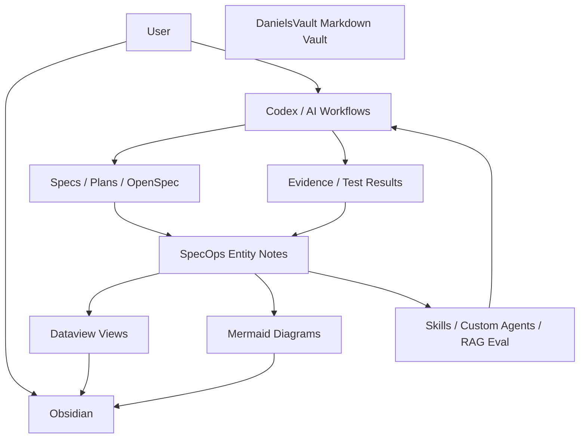

## Warum ein Entity-Layer

Freitext-Specs bleiben gut fuer Begruendung, Kontext und Entscheidungen. Ein Board braucht aber stabile Felder.

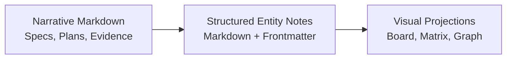

Ohne Entity-Layer muessten Dataview und Mermaid Status aus Prosa erraten. Das ist fuer Uebersicht und Statusuebergaenge zu fragil.

## Core Entities

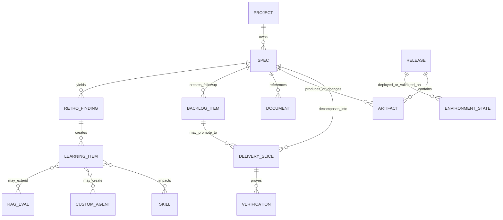

## End-to-End Flow

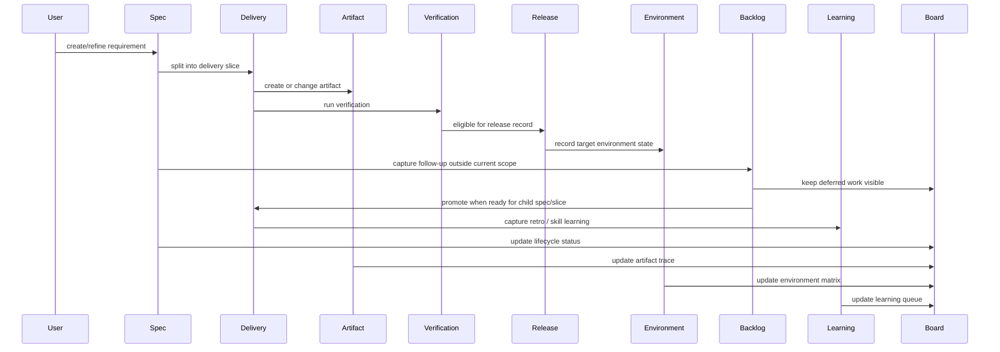

## Board Model

### Portfolio First Navigation

The dashboard should start with project topology, not with a global status board. This keeps project relationships visible before the user drills into lifecycle columns.

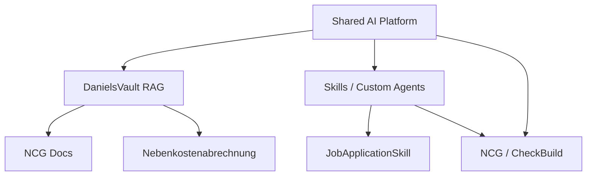

The portfolio view should show:

1. projects,
2. owning repositories or vault areas,
3. active specs per project,
4. latest release or accepted change,
5. blocked environments,
6. links to project-local boards.

### Project Spec Boards

Each project gets the same lifecycle columns, filtered to that project. The global board becomes a secondary cross-project triage view.

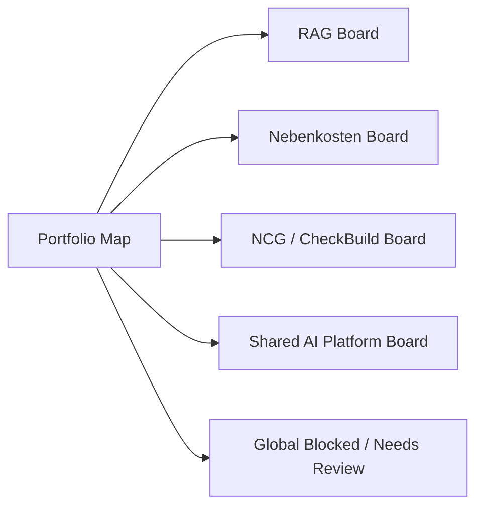

### Project Board Template

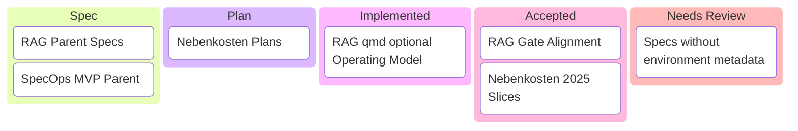

In Obsidian/Dataview, this should be implemented as one reusable query template with a project filter, not as six manually divergent boards.

Example board set:

| Board | Filter | Purpose |
|---|---|---|
| Portfolio Map | all projects | Orientation and project relationships |
| DanielsVault RAG | `project = "DanielsVault RAG"` | RAG specs, runtime, eval and workflow changes |
| Nebenkostenabrechnung | `project = "Nebenkostenabrechnung"` | Domain specs, input/output artifacts, calculation releases |
| NCG / CheckBuild | `project = "NCG / CheckBuild"` | CI/build watcher specs, dev environment evidence |
| Shared AI Platform | `project = "Shared AI Platform"` | Cross-cutting workflow, skill and SpecOps work |
| Global Triage | `status in blocked/review` | Cross-project blockers and metadata gaps |

### Release / Environment Matrix

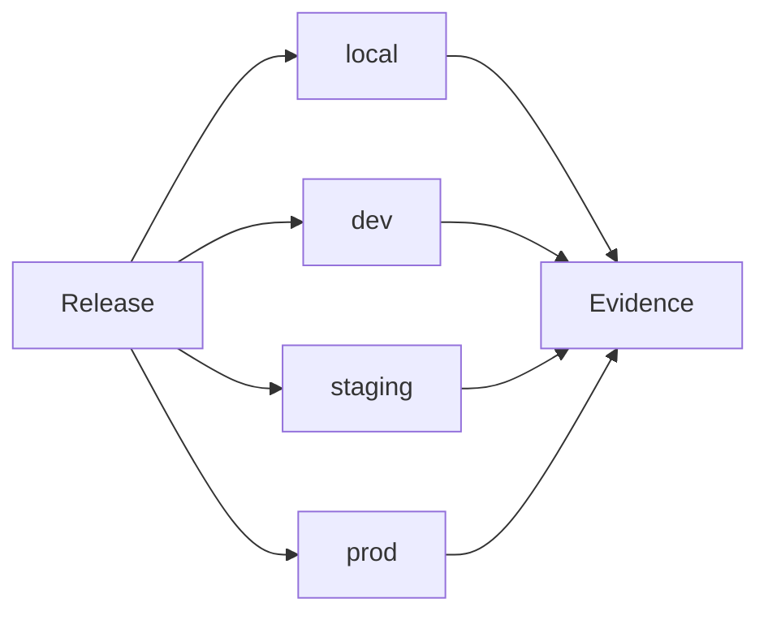

The Dataview version of this view should look like a table:

| Release | Specs | Artifacts | Local | Dev | Staging | Prod | Evidence |
|---|---|---|---|---|---|---|---|
| rag-operating-model-2026-04-26 | RAG Operating Model | operating-model doc, evidence | verified | n/a | n/a | n/a | linked |
| nk-2025-closeout | Nebenkosten 2025 Slices | input/output/test artifacts | verified | n/a | n/a | n/a | linked |

## Suggested File Layout

```text
_shared/
      SpecOps/
        Dashboard.md
        Reference/
          project-taxonomy.md
      relationship-types.md
      status-definitions.md
      field-reference.md
        Entities/
          projects/
          specs/
          documents/
          artifacts/
      releases/
      environments/
      backlog/
      learnings/
    Dashboards/
      portfolio-map.md
      project-board-template.md
      projects/
        danielsvault-rag.md
        nebenkostenabrechnung.md
        ncg-checkbuild.md
        shared-ai-platform.md
      global-triage.md
      release-environment-matrix.md
      artifact-trace.md
      specops-backlog.md
      learning-queue.md
    Examples/
      entity-note.example.md
```

The same structure should be reusable in customer vaults. Implementation notes and historical design docs may remain in `shared-ai-docs/docs/specops/`, but the user-facing operating surface should live under `_shared/SpecOps/`.

## Entity Note Shape

Entity Notes are normal Markdown files with YAML frontmatter. Obsidian Dataview reads the frontmatter fields and turns them into tables, lists and board-like views.

```yaml
---
type: spec
id: specops-mvp-2026-05-04
title: SpecOps Control Plane MVP
project: shared-ai-platform
status: spec
source: _specs/2026-05-04 SpecOps Control Plane MVP Obsidian Dataview Mermaid.md
artifacts:
  - docs/specops/mvp-architecture.md
releases: []
environment_local: concept
skill_impacts: []
custom_agent_candidates: []
rag_eval_candidates: []
---
```

Minimal first-slice fields:

| Field | Meaning |
|---|---|
| `type` | Entity kind: `project`, `spec`, `document`, `artifact`, `release`, `backlog_item`, `learning_item`. |
| `id` | Stable machine-readable id. |
| `title` | Human-readable label. |
| `project` | Project grouping for portfolio and project boards. |
| `status` | Lifecycle/status value for board columns. |
| `source` | Narrative source path, when one exists. |

Document entities cover ADRs and other project documentation:

```yaml
---
type: document
doc_type: adr
id: adr-example-2026-05-04
title: Example ADR
project: shared-ai-platform
status: accepted
decision_status: accepted
source: path/to/adr.md
related_specs:
  - specops-mvp-2026-05-04
related_artifacts: []
---
```

ADRs should appear in document/decision trace views, not in Spec lifecycle board columns.

Backlog items use the same pattern:

```yaml
---
type: backlog_item
id: specops-backlog-pilot-2026-05-04
title: Build first SpecOps backlog view
project: shared-ai-platform
status: proposed
origin_spec: specops-mvp-2026-05-04
candidate_slice: Backlog Pilot
promote_to_spec_when:
  - Backlog statuses are accepted.
  - Dataview entity-note structure is ready.
next_action: Draft child spec for backlog pilot.
---
```

## Update Authority

The MVP starts with manual/Codex-maintained entity notes, but each update must already have an obvious future owner.

| Event | Entity update in MVP | Later workflow owner |
|---|---|---|
| Spec created | Create `type: spec` entity note | `doc-coauthoring` |
| Spec planned | Update spec status and delivery link | `refine-plan` / `spec-change-delivery` |
| Artifact created | Add artifact link or artifact entity | Delivery run |
| Verification recorded | Add evidence and environment status | `spec-change-delivery` / `spec-closeout` |
| Release assembled | Create `type: release` entity note | release workflow |
| Follow-up found | Create `type: backlog_item` entity note | review / retro / closeout |
| Learning found | Create `type: learning_item` entity note | `retro-plan` / `improve-skills` |

## Terms

### Project Taxonomy

Project taxonomy means the controlled list of project names used by dashboards. Without it, the same project could appear as `RAG`, `DanielsVault RAG`, `danielsvault-rag` and `Local RAG`.

In the vault, this belongs in `_shared/SpecOps/Reference/project-taxonomy.md`.

Initial taxonomy proposal:

1. `Shared AI Platform`
2. `DanielsVault RAG`
3. `Nebenkostenabrechnung`
4. `NCG / CheckBuild`
5. `NCG Docs`
6. `JobApplicationSkill`

### Cross-Project Relationship Types

Relationship types describe why projects are connected in the portfolio map.

In the vault, this belongs in `_shared/SpecOps/Reference/relationship-types.md`.

Initial relationship labels:

| Label | Meaning |
|---|---|
| `depends_on` | One project needs another project/runtime/doc source. |
| `documents` | One project documents or indexes another. |
| `uses_skill` | A project relies on a skill/workflow. |
| `produces_learning_for` | A project creates skill/agent/RAG learning for another. |
| `shares_artifact_with` | Projects share generated artifacts or evidence. |

### Mixed Backfill

Backfill means creating Entity Notes for existing historical specs. Mixed backfill means doing this across more than one project after the RAG pilot, so the model proves it can represent different kinds of work.

What the user needs to choose later: which representative old specs should be converted after the RAG pilot. This is not a product strategy decision; it is a test-data selection for validating the model across different project shapes.

Example mixed backfill set:

1. one RAG spec,
2. one Nebenkosten umbrella spec,
3. one Nebenkosten child slice,
4. one CheckBuild skill spec,
5. one JobApplicationSkill or NCG Docs spec.

## MVP View Set

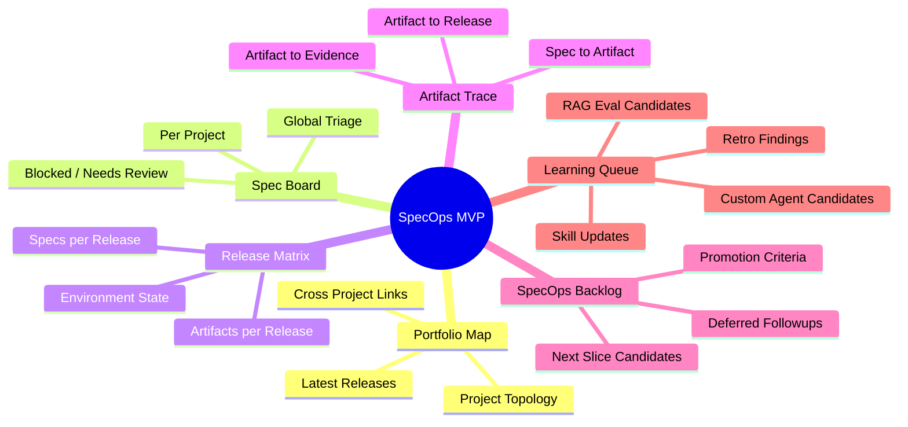

## Status Separation

The core guardrail is that status types must not collapse into one field.

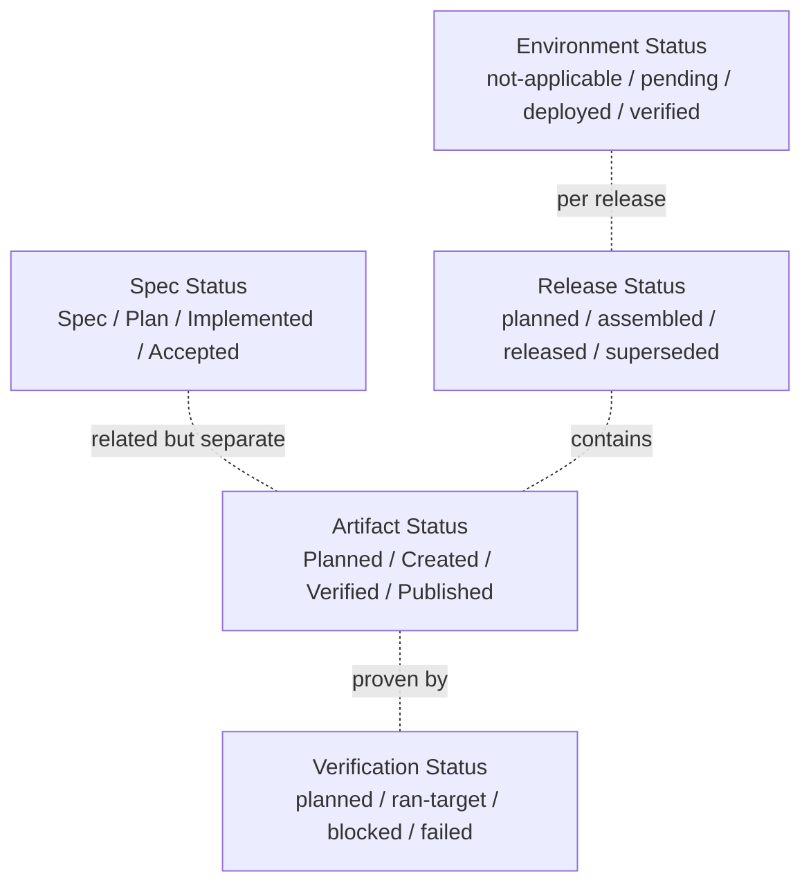

## Backlog Promotion Rule

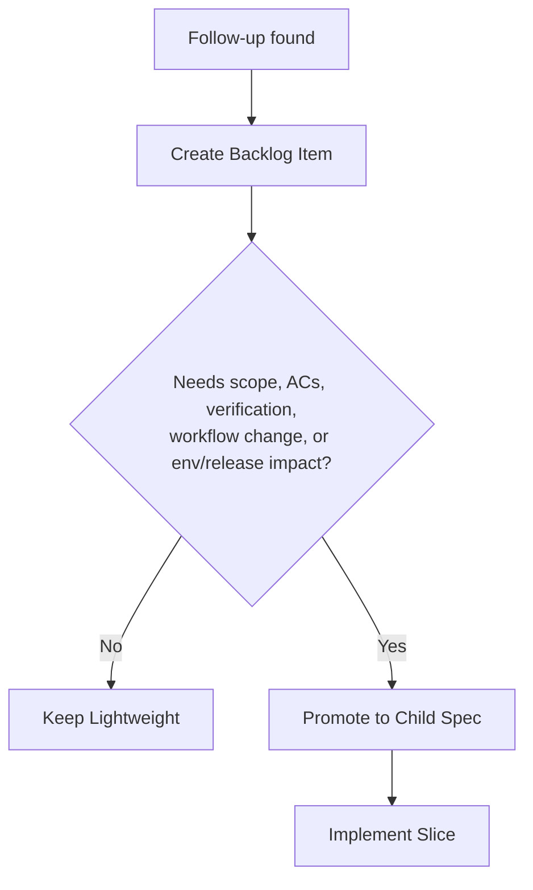

## Recommended First Slice

The first implementation slice should prove the model with one real project instead of trying to build every view at once.

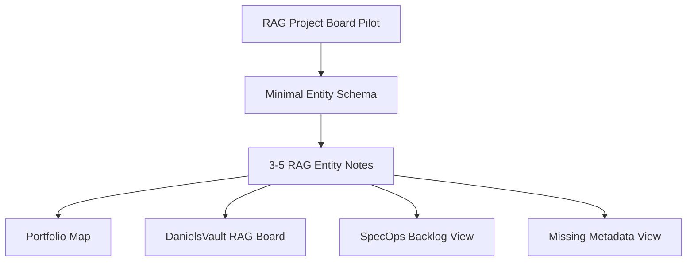

Acceptance signal:

1. The RAG board renders from entity-note frontmatter.
2. At least one backlog item remains visible independently of parent-spec status.
3. Missing metadata is visible as a work queue.

## Later Mixed Backfill Candidates

After the RAG Project Board Pilot proves the model, a mixed backfill should test cross-project value.

| Candidate | Reason |
|---|---|
| RAG Operating Model | Recent, structured, clear evidence file |
| RAG Gate Alignment OpenSpec Archive | Tests OpenSpec/canonical-spec relationship |
| Nebenkosten 2025 Umbrella Spec | Tests parent/child and many artifacts |
| One Nebenkosten 2025 Slice | Tests concrete child spec and evidence |
| CheckBuild Skill | Tests skill/agent learning connection |

## Decision Points For User Review

1. Where should the user-facing Obsidian dashboard live?
2. Which fields are required vs optional in first-slice entity notes?
3. Which mixed backfill set should follow the RAG Project Board Pilot?
4. Should release records be explicit from day one?
5. Which status labels should be German-facing in the dashboard while keeping machine values stable?

## Next Implementation Slices

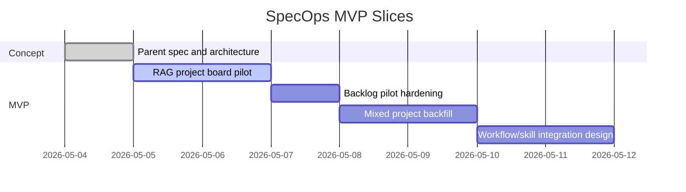
